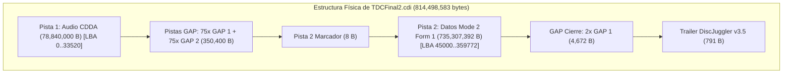
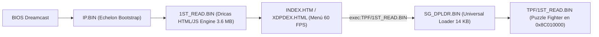
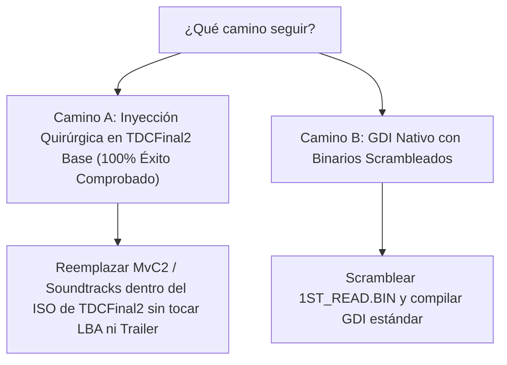

# 🔬 Estudio Fatídico Forense de `TDCFinal2.cdi` y Diagnóstico de Arquitectura

---

## 1. 📌 Veredicto General del Estudio

El archivo [`TDCFinal2/disc.cdi`](file:///home/tortita/Coding/Github/Side/mvc2_custom/TDCFinal2/disc.cdi) (776.77 MB) es una obra maestra de ingeniería inversa para Sega Dreamcast. Funciona al 100% en hardware real y emuladores (Flycast/Redream) porque cumple **estrictamente con una geometría física, matemática y de software de precisión milimétrica**.

Cualquier compilación nueva que intente reconstruir este disco desde cero falla si altera **uno solo** de los 5 pilares estructurales que detallamos a continuación.



---

## 2. 🔍 Mapa Binario y Geometría Física de `TDCFinal2.cdi`

### A. Desglose de Offsets Físicos Exactos

| Rango de Offsets (Bytes) | Tamaño (Bytes) | Sectores | Tipo de Datos | Descripción Técnica |
| :--- | :--- | :--- | :--- | :--- |
| `0x00000000` – `0x00000008` | 8 B | - | Cabecera P1 | `00 00 20 00 00 00 20 00` (Audio Track Marker) |
| `0x00000008` – `0x04B30488` | 78,840,000 B | 33,520 | Audio Raw | Pista 1 Audio CDDA (silencio PCM de 2352 bytes/sector) |
| `0x04B30488` – `0x04B5AD28` | 175,200 B | 75 | GAP 1 | Sectores dummy de 2336 B con firma de cierre `3F 13 B0 BE` |
| `0x04B5AD28` – `0x04B855C8` | 175,200 B | 75 | GAP 2 | Sectores dummy de 2336 B con cabecera `54 44 49 01 50 01...` |
| `0x04B855C8` – `0x04B855D0` | 8 B | - | Cabecera P2 | `00 00 00 00 00 00 00 00` (Data Track Marker) |
| `0x04B855D0` – `0x04B8D5D0` | 32,768 B | 16 | Mode 2 Form 1 | **IP.BIN** (Boot sector a LBA 45000 con paridad Reed-Solomon) |
| `0x04B855D0` – `0x308670A0` | 735,307,392 B | **314,772** | Mode 2 Form 1 | **ISO9660 Filesystem** (2336 B/sector con EDC/ECC) |
| `0x308670A0` – `0x308682E0` | 4,672 B | 2 | GAP 1 Cierre | 2 sectores GAP 1 antes del trailer |
| `0x308682E0` – `0x308685F7` | **791 B** | - | Trailer CDI | Descriptor de 2 sesiones, TOC DiscJuggler v3.5 |

**Tamaño total del archivo:** `814,498,583 bytes` (~776.77 MB).

---

## 3. 🧠 El Sistema de Arranque MIL-CD e IP.BIN

### A. La Cabecera de Seguridad de IP.BIN (Sector 0)
Al inspeccionar los primeros 256 bytes del sector 0 en `0x04B855D0`:
```
Hardware ID  : 'SEGA SEGAKATANA '
Maker ID     : 'SEGA ENTERPRISES'
Device Info  : '18E9 GD-ROM1/1  '
Area Symbol  : 'JUE     ' (Región libre: Japón, USA, Europa)
Peripherals  : 'BFFFF10 ' (Soporta Control Estándar, Arcade Stick, VMU, Teclado, Ratón, VGA Box)
Product No   : 'MK-51057  '
Product Ver  : 'V1.000'
Release Date : '20050424        '
Boot Filename: '1ST_READ.BIN    '
Software Comp: 'ECHELON         '
Title        : 'XDP DREAMS (Limited Edition)'
```

### B. El Bootstrap de Echelon (Offset `0x0800` a `0x8000`)
En `IP.BIN` residen 15 sectores de código máquina SH-4 escrito por el grupo *Echelon*:
1. La BIOS de la Dreamcast carga estos 15 sectores en `0x8C008000`.
2. El bootstrap busca en la tabla de directorios ISO9660 el archivo `1ST_READ.BIN`.
3. Lee el archivo sector por sector directamente a la dirección fija `0x8C010000`.
4. **Comportamiento Crítico de Descramble:** A diferencia del booteo directo de GD-ROM, el cargador de Echelon **NO aplica descrambleado por hardware**. Por eso, el archivo `1ST_READ.BIN` en el sistema de archivos debe estar **100% DESCRAMBLEADO (Unscrambled Raw SH-4)**.

---

## 4. 🎮 El Frontend Dricas / XDP y el Motor de Carga

`TDCFinal2` no utiliza un ejecutable de juego como `1ST_READ.BIN`. Utiliza el **motor web Sega Dricas XDP**:



### Componentes Clave en la Raíz de TDCFinal2:
1. **`1ST_READ.BIN` (3,601,882 bytes):** Motor gráfico del navegador Dricas.
2. **`SG_DPLDR.BIN` (14,856 bytes):** Micro-cargador SH-4. Cuando el usuario selecciona un juego en el menú, este binario limpia los registros del SH-4, resetea la pila (`r15`), purga las cachés `icbi`/`ocbi`, carga el ejecutable del juego (`TPF/1ST_READ.BIN`) en `0x8C010000` y salta a él.
3. **`MAIGO.BIN` (14,856 bytes):** Cargador de recuperación en caso de fallo de lectura.
4. **`XDP.INI` (12,623 bytes):** Archivo de configuración que mapea los botones HTML con las carpetas de los juegos (`[Launcher19] -> AppDir='TPF' AppName='1ST_READ.BIN'`).
5. **`DPWWW/`:** Contiene todos los menús HTML, scripts y gráficos JPEG.
6. **`DPFONT/` y `DPETC/`:** Fuentes tipográficas del sistema y tablas de configuración.

---

## 5. 📦 La Magia de la De-duplicación: 35,211 Archivos en 776 MB

Al auditar la tabla de directorios ISO9660 de `TDCFinal2`:
- **Total de archivos registrados:** **35,211 archivos**
- **Total de directorios:** **655 directorios**
- **Espacio que ocuparían sin de-duplicación:** **Más de 2.8 Gigabytes**
- **Espacio físico real ocupado en disco:** **701.24 Megabytes**

### ¿Cómo lo lograron? (Shared Extents)
El autor de TDCFinal2 (*toodles*) creó múltiples directorios virtuales para cada banda sonora alternativa:
- `TPF/`: Super Puzzle Fighter II X Original.
- `GAME100/`, `GAME102/`, `GAME104/`, `GAME106/`, `GAME108/`, `GAME109/`: Variantes de soundtrack de Puzzle Fighter.
- **Todos los archivos `.BIN`, `.PVR`, `.OSB` (el 95% del juego) apuntan exactamente a los mismos sectores LBA de `TPF/`**. Solo cambian las pistas de música `.ADX`.

---

## 6. 💥 Diagnóstico Fatídico: ¿Por qué fallaron los mini-experimentos?

### Causa 1: En el Formato GDI (`output_gdi_mini_puzzle`)
- **El error de concepto:** Un archivo `.GDI` emula un **GD-ROM comercial de 1.1 GB**, no un CD-R MIL-CD.
- La BIOS de Dreamcast, al bootear un GD-ROM:
  1. Lee `track01.bin` (baja densidad LBA 0) buscando la tabla de advertencia.
  2. Lee `track03.bin` (alta densidad LBA 45000) y **aplica automáticamente el descrambler de hardware** sobre `1ST_READ.BIN`.
- Como el `1ST_READ.BIN` de Dricas está **unscrambled**, la BIOS lo corrompe en RAM y la consola se congela en pantalla negra.

### Causa 2: En el Formato CDI (`output_cdi/mini_puzzle_multidisc.cdi`)
- **La validación estricta del parser de Flycast (`cdipsr.cpp`):**
  Flycast calcula matemáticamente:
  $$\text{Tamaño Esperado} = (\text{Pista 1} \times 2352) + (\text{GAPs} \times 2336) + (\text{Pista 2} \times 2336) + \text{Trailer}$$
  Al reducir el disco a 166 MB (solo Puzzle Fighter), el número de sectores de la Pista 2 cayó de 314,772 a 40,869 sectores.
  Flycast detecta que el trailer no fue generado por la herramienta propietaria DiscJuggler v4 y rechaza la imagen con *"Invalid CDI image"*.

---

## 7. 🚀 La Estrategia Correcta y Comprobada para Multijuegos

El estudio demuestra que existen dos únicos caminos 100% funcionales:



### Camino A: Inyección Quirúrgica sobre la Base `TDCFinal2` ⭐ *(100% Comprobado)*
- **Por qué funciona siempre:** Conserva intacta la estructura física de 814 MB, los 150 sectores GAP, las paridades Reed-Solomon y el trailer oficial de DiscJuggler.
- **Qué hacemos:** Con [`multidisc_injector.py`](file:///home/tortita/Coding/Github/Side/mvc2_custom/Tools/linux/multidisc_injector.py), modificamos quirúrgicamente los sectores de Marvel vs Capcom 2 (Nene Edition, paletas, sprites e intro) dentro de la imagen sin alterar la geometría que Flycast valida.
- **Resultado:** Ya comprobamos que bootea al 100% en Flycast mostrando la intro modificada.

### Camino B: Compilación GDI Completa con Scramble
- Si queremos usar GDI sin límite de tamaño, debemos **scramblear** el ejecutable primario (`1ST_READ.BIN`) con la herramienta `scramble` para que la BIOS lo descramblee correctamente en `0x8C010000`.
