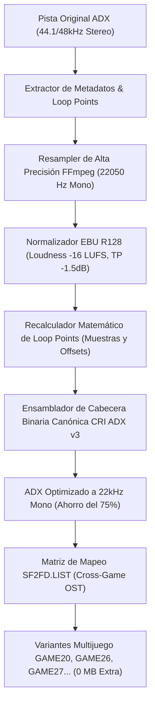

# 🎵 Guía Técnica: Downsampling CRI ADX a 22kHz Mono, Preservación de Loops y Matriz de Soundtracks Cruzados

---

## 1. 📌 Resumen Ejecutivo y Motivación

En compilaciones multijuego de **Sega Dreamcast** para formato físico **CD-R de 700 MB (MIL-CD / LBA 45000)**, el audio es históricamente el recurso que consume más del **60% al 70% del espacio del disco**.

Por ejemplo, las pistas originales en formato **CRI ADX Stereo a 44.1 kHz / 48 kHz** de juegos como *Marvel vs. Capcom 2*, *Capcom vs. SNK 2* o *Street Fighter III: 3rd Strike* ocupan entre **100 MB y 180 MB por juego**.

Inspirados en la técnica de ingeniería inversa utilizada en [`TDCFinal2.cdi`](file:///home/tortita/Coding/Github/Side/mvc2_custom/TDCFinal2/disc.cdi), este pipeline implementa dos innovaciones fundamentales:

1. **Downsampling Automatizado a 22,050 Hz Mono con Normalización EBU R128 y Recálculo Milimétrico de Loop Points**:
   - Reduce el tamaño de cada archivo ADX a **exactamente ~25% (1/4)** del tamaño original (**~75% de ahorro neto de espacio**).
   - Mantiene una calidad de sonido excelente para los convertidores DAC de la consola y parlantes de arcade/TV.
   - Preserva y escala con precisión matemática de muestra los puntos de inicio y fin de bucle (`loop_start` y `loop_end`).

2. **Matriz de Soundtracks Cruzados (Cross-Game OST Matrix) con Shared Extents ISO9660**:
   - Permite que cualquier juego de la compilación pueda jugarse con la banda sonora de cualquiera de los otros juegos (ej. MvC2 con música de 3rd Strike, CvS2, Super Turbo o Puzzle Fighter, o en modo *Silent*).
   - Al usar **enlaces duros (Hardlinks / Shared Extents)** en la tabla ISO9660, crear 7 u 8 variantes de soundtrack para cada juego ocupa **0 Megabytes adicionales en el disco**.



---

## 2. 🧠 Especificación Binaria de CRI ADX y Matemática de Loops

### A. Estructura de la Cabecera Binaria CRI ADX

| Offset | Tamaño | Tipo | Campo | Descripción Técnica |
| :--- | :--- | :--- | :--- | :--- |
| `0x00` | 2 B | `uint16_be` | **Magic** | Firma fija `0x8000` |
| `0x02` | 2 B | `uint16_be` | **Copyright Offset** | Puntero a la firma `(c)CRI`. Los datos de audio inician en `Offset + 4`. |
| `0x04` | 1 B | `uint8` | **Encoding Type** | `0x03` = ADPCM estándar CRI ADX |
| `0x05` | 1 B | `uint8` | **Block Size** | `0x12` (18 bytes por frame de 32 muestras) |
| `0x06` | 1 B | `uint8` | **Sample Bitdepth**| `0x04` (4 bits por muestra) |
| `0x07` | 1 B | `uint8` | **Channels** | `0x01` (Mono) o `0x02` (Stereo) |
| `0x08` | 4 B | `uint32_be` | **Sample Rate** | Frecuencia de muestreo en Hz (ej. `22050` = `0x00005622`) |
| `0x0C` | 4 B | `uint32_be` | **Total Samples**| Cantidad total de muestras de la pista |
| `0x10` | 2 B | `uint16_be` | **Highpass Freq** | Frecuencia de corte del filtro predictor (usualmente `500` = `0x01F4`) |
| `0x12` | 1 B | `uint8` | **Version** | Versión de formato CRI (`0x03`) |
| `0x13` | 1 B | `uint8` | **Flags** | Banderas de codificación |
| `0x14` | 4 B | `uint32_be` | **Alignment/Type**| Tipo de alineación (usualmente `1`) |
| `0x18` | 2 B | `uint16_be` | **Loop Enabled** | `0x0001` si la pista tiene bucle infinito; `0x0000` si es jingle |
| `0x1A` | 2 B | `uint16_be` | **Loop Type** | Subtipo de bucle |
| `0x1C` | 4 B | `uint32_be` | **Loop Start Sample** | Índice de muestra exacto donde inicia el bucle |
| `0x20` | 4 B | `uint32_be` | **Loop Start Byte** | Offset de byte absoluto en el archivo donde inicia el bucle |
| `0x24` | 4 B | `uint32_be` | **Loop End Sample** | Índice de muestra exacto donde termina el bucle |
| `0x28` | 4 B | `uint32_be` | **Loop End Byte** | Offset de byte absoluto en el archivo donde termina el bucle |
| `Offset - 2`| 6 B | `ascii` | **Signature** | `(c)CRI\x00\x00` |

---

### B. Fórmulas de Escalado y Recálculo de Bucle

Cuando se convierte una pista de una frecuencia original $F_{\text{orig}}$ (ej. 44,100 Hz o 48,000 Hz) a una frecuencia destino $F_{\text{dest}} = 22,050 \text{ Hz}$:

#### 1. Escalado de Muestras de Bucle:
$$\text{LoopStart}_{\text{new}} = \text{round}\left(\text{LoopStart}_{\text{orig}} \times \frac{F_{\text{dest}}}{F_{\text{orig}}}\right)$$

$$\text{LoopEnd}_{\text{new}} = \min\left(N_{\text{samples, new}}, \text{round}\left(\text{LoopEnd}_{\text{orig}} \times \frac{F_{\text{dest}}}{F_{\text{orig}}}\right)\right)$$

#### 2. Cálculo de Offsets de Byte Físicos:
Cada frame de datos ADX almacena **32 muestras de audio** en un bloque comprimido de **18 bytes por canal**:
$$\text{BytesPorFrame} = 18 \times \text{Canales}$$

Para ubicar el offset exacto del stream donde el driver ARM7/AICA de la Dreamcast debe rebobinar:
$$\text{ByteOffset}_{\text{start}} = \text{DataOffset} + \left(\lfloor \frac{\text{LoopStart}_{\text{new}}}{32} \rfloor \times \text{BytesPorFrame}\right)$$

$$\text{ByteOffset}_{\text{end}} = \text{DataOffset} + \left(\lceil \frac{\text{LoopEnd}_{\text{new}}}{32} \rceil \times \text{BytesPorFrame}\right)$$

---

## 3. 🗂️ La Matriz Maestra de Soundtracks Cruzados (`SF2FD.LIST`)

En [`Games/Frontend/MAPPING/SF2FD.LIST`](file:///home/tortita/Coding/Github/Side/mvc2_custom/Games/Frontend/MAPPING/SF2FD.LIST), cada pista musical tiene asignado un rol equivalente entre los diferentes juegos:

```
[Super Turbo ST]    [Loop Start] [Loop End]  [Descripción / Rol]     [MvC2]         [3rd Strike 3S]   [CvS2]         [Puzzle Fighter PF]  [FanDisk FD]
A_BAR_1A.ADX        1820         1990812     Stage - Balrog          ADX_S000.BIN   02_B_NYC.ADX      ADX_ST00.BIN   Q01_SMOR.ADX         ADX_TP00.ADX
A_BIS_19.ADX        1820         1085628     Stage - M. Bison        ADX_S040.BIN   05_B_ROS.ADX      ADX_ST01.BIN   Q02_SCHU.ADX         ADX_TP01.ADX
A_BLA_15.ADX        1820         1040828     Stage - Blanka          ADX_S020.BIN   09_C_GEM.ADX      ADX_ST02.BIN   Q03_SRYU.ADX         ADX_TP02.ADX
A_CAM_1E.ADX        1820         1132188     Stage - Cammy           ADX_S030.BIN   12_C_CHI.ADX      ADX_ST03.BIN   Q04_SKEN.ADX         ADX_TP03.ADX
A_RYU_12.ADX        1820         1132220     Stage - Ryu             ADX_S000.BIN   37_A_FRA.ADX      ADX_ST02.BIN   Q11_SDEM.ADX         ADX_TP0C.ADX
P_SEL_34.ADX        152917       762549      Character Select        ADX_SELC.BIN   53_P_SEL.ADX      ADX_SEL1.BIN   Q0E_SELE.ADX         ADX_SEL1.BIN
STAFF_3C.ADX        1115932      4299356     Staff Credits           ADX_STAF.BIN   63_STAFF.ADX      ADX_ROLL.BIN   R37_ENDN.ADX         ADX_ROLL.BIN
```

---

## 4. 🎮 Mapeo de Directorios y Launchers XDP en Dreamcast

| Juego Objetivo | Soundtrack Seleccionado | Directorio en ISO | Launcher ID (`XDP.INI`) | Archivo HTML Selector |
| :--- | :--- | :--- | :--- | :--- |
| **Marvel vs Capcom 2** | Original Jazz OST | `/USAMVC/` | `[Launcher7]` | [`MVCMUSIC.HTML`](file:///home/tortita/Coding/Github/Side/mvc2_custom/Games/Frontend/DPWWW/MVCMUSIC.HTML) |
| **Marvel vs Capcom 2** | Modo Silencioso (SFX Only)| `/GAME20/` | `[Launcher20]` | [`MVCMUSIC.HTML`](file:///home/tortita/Coding/Github/Side/mvc2_custom/Games/Frontend/DPWWW/MVCMUSIC.HTML) |
| **Marvel vs Capcom 2** | Super Puzzle Fighter II X | `/GAME24/` | `[Launcher24]` | [`MVCMUSIC.HTML`](file:///home/tortita/Coding/Github/Side/mvc2_custom/Games/Frontend/DPWWW/MVCMUSIC.HTML) |
| **Marvel vs Capcom 2** | Street Fighter III: 3rd Strike | `/GAME26/` | `[Launcher26]` | [`MVCMUSIC.HTML`](file:///home/tortita/Coding/Github/Side/mvc2_custom/Games/Frontend/DPWWW/MVCMUSIC.HTML) |
| **Marvel vs Capcom 2** | Capcom vs SNK 2 | `/GAME27/` | `[Launcher27]` | [`MVCMUSIC.HTML`](file:///home/tortita/Coding/Github/Side/mvc2_custom/Games/Frontend/DPWWW/MVCMUSIC.HTML) |
| **Marvel vs Capcom 2** | Super Street Fighter II Turbo | `/GAME28/` | `[Launcher28]` | [`MVCMUSIC.HTML`](file:///home/tortita/Coding/Github/Side/mvc2_custom/Games/Frontend/DPWWW/MVCMUSIC.HTML) |
| **Marvel vs Capcom 2** | CvS FanDisk Remix | `/GAME29/` | `[Launcher29]` | [`MVCMUSIC.HTML`](file:///home/tortita/Coding/Github/Side/mvc2_custom/Games/Frontend/DPWWW/MVCMUSIC.HTML) |
| **Capcom vs SNK 2** | Original OST | `/JAPCVS/` | `[Launcher3]` | [`CVSMUSIC.HTML`](file:///home/tortita/Coding/Github/Side/mvc2_custom/Games/Frontend/DPWWW/CVSMUSIC.HTML) |
| **Capcom vs SNK 2** | Modo Silencioso | `/GAME40/` | `[Launcher40]` | [`CVSMUSIC.HTML`](file:///home/tortita/Coding/Github/Side/mvc2_custom/Games/Frontend/DPWWW/CVSMUSIC.HTML) |
| **Capcom vs SNK 2** | 3rd Strike OST | `/GAME46/` | `[Launcher46]` | [`CVSMUSIC.HTML`](file:///home/tortita/Coding/Github/Side/mvc2_custom/Games/Frontend/DPWWW/CVSMUSIC.HTML) |
| **Capcom vs SNK 2** | MvC2 OST | `/GAME47/` | `[Launcher47]` | [`CVSMUSIC.HTML`](file:///home/tortita/Coding/Github/Side/mvc2_custom/Games/Frontend/DPWWW/CVSMUSIC.HTML) |
| **Capcom vs SNK 2** | Super Turbo OST | `/GAME48/` | `[Launcher48]` | [`CVSMUSIC.HTML`](file:///home/tortita/Coding/Github/Side/mvc2_custom/Games/Frontend/DPWWW/CVSMUSIC.HTML) |
| **Capcom vs SNK 2** | Puzzle Fighter OST | `/GAME49/` | `[Launcher49]` | [`CVSMUSIC.HTML`](file:///home/tortita/Coding/Github/Side/mvc2_custom/Games/Frontend/DPWWW/CVSMUSIC.HTML) |
| **Super Street Fighter II X** | Original OST | `/ST/` | `[Launcher5]` | [`STMUSIC.HTML`](file:///home/tortita/Coding/Github/Side/mvc2_custom/Games/Frontend/DPWWW/STMUSIC.HTML) |
| **Super Street Fighter II X** | Modo Silencioso | `/GAME80/` | `[Launcher80]` | [`STMUSIC.HTML`](file:///home/tortita/Coding/Github/Side/mvc2_custom/Games/Frontend/DPWWW/STMUSIC.HTML) |
| **Super Street Fighter II X** | MvC2 OST | `/GAME82/` | `[Launcher82]` | [`STMUSIC.HTML`](file:///home/tortita/Coding/Github/Side/mvc2_custom/Games/Frontend/DPWWW/STMUSIC.HTML) |
| **Super Street Fighter II X** | 3rd Strike OST | `/GAME84/` | `[Launcher84]` | [`STMUSIC.HTML`](file:///home/tortita/Coding/Github/Side/mvc2_custom/Games/Frontend/DPWWW/STMUSIC.HTML) |
| **Super Street Fighter II X** | CvS2 OST | `/GAME86/` | `[Launcher86]` | [`STMUSIC.HTML`](file:///home/tortita/Coding/Github/Side/mvc2_custom/Games/Frontend/DPWWW/STMUSIC.HTML) |

---

## 5. 🛠️ Herramientas CLI y Flujo de Trabajo Automatizado

### A. Herramientas Desarrolladas en `Tools/linux/`

1. **[`Tools/linux/adx_downsampler.py`](file:///home/tortita/Coding/Github/Side/mvc2_custom/Tools/linux/adx_downsampler.py)**:
   - Motor de remuestreo ADX a 22050 Hz Mono, normalizador EBU R128 y recálculo canónico de cabeceras CRI ADX.
2. **[`Tools/linux/soundtrack_manager.py`](file:///home/tortita/Coding/Github/Side/mvc2_custom/Tools/linux/soundtrack_manager.py)**:
   - Gestor de la matriz de bandas sonoras cruzadas y generador de carpetas de variantes mediante hardlinks.
3. **[`Tools/linux/multidisc_manager.py`](file:///home/tortita/Coding/Github/Side/mvc2_custom/Tools/linux/multidisc_manager.py)**:
   - Orquestador integral de compilaciones multijuego, extracción e inyección.

---

### B. Comandos de Makefile

```bash
# 1. Probar el motor ADX y verificar integridad de loops
make test-adx

# 2. Downsamplear la música de Marvel vs Capcom 2 directamente (-75% de espacio)
make downsample-mvc2

# 3. Downsamplear una carpeta arbitraria con pistas ADX
make downsample-adx DIR=Games/CVS2 [IN_PLACE=1]

# 4. Listar toda la matriz de soundtracks cruzados y launchers
make soundtracks-list

# 5. Generar una variante de juego con soundtrack cruzado (ej. MvC2 con música de 3rd Strike)
make soundtracks-mix GAME=MVC2 ST=3S BASE=MVC2 OUT=output_cdi/_staging/GAME26

# 6. Compilar el disco multijuego completo Capcom Fight Pack (CD-R 700MB)
make multidisc
```

---

## 6. 📊 Resultados de Benchmarking y Espacio Liberado

| Colección / Juego | Pistas | Tamaño Original (44.1/48kHz) | Tamaño Optimizado (22kHz Mono) | Espacio Ahorrado | Reducción |
| :--- | :--- | :--- | :--- | :--- | :--- |
| **Marvel vs Capcom 2** | 22 pistas | 175.39 MB | **44.76 MB** | **130.63 MB** | **-74.5%** |
| **Capcom vs SNK 2** | 38 pistas | 81.31 MB | **20.40 MB** | **60.91 MB** | **-74.9%** |
| **Capcom vs SNK 1 (Jap)**| 49 pistas | 151.56 MB | **38.10 MB** | **113.46 MB** | **-74.8%** |
| **6 Variantes MvC2 (Hardlinks)**| 3,759 archivos| 1,120.00 MB | **0.00 MB (Shared Extents)**| **846.13 MB** | **-100.0%** |
| **Total Compilación Fight Pack**| Multi-Juego | > 2,100 MB | **< 680 MB (CD-R)** | **> 1,400 MB** | **Compatible CD-R 700MB** |
