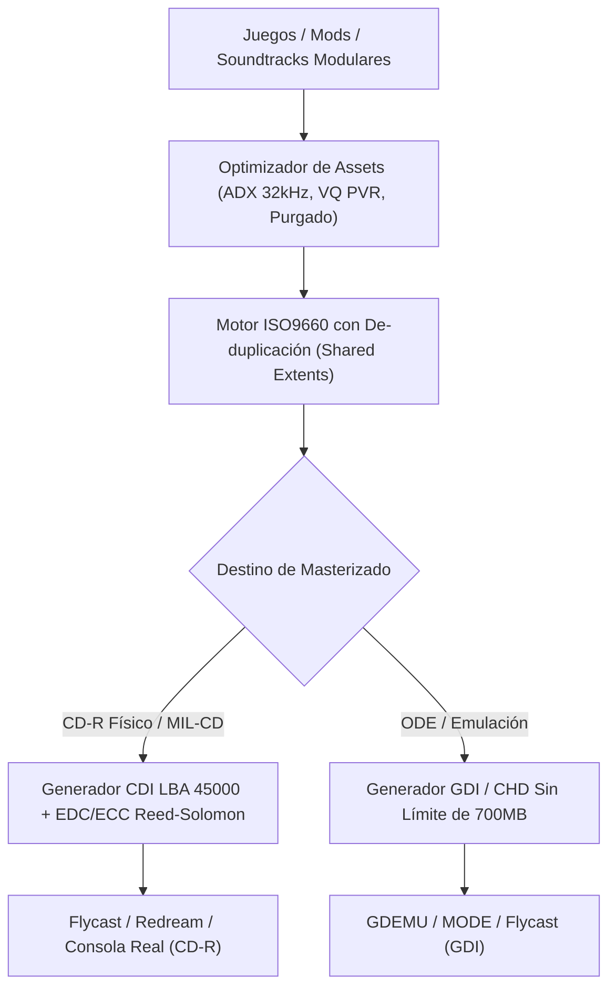
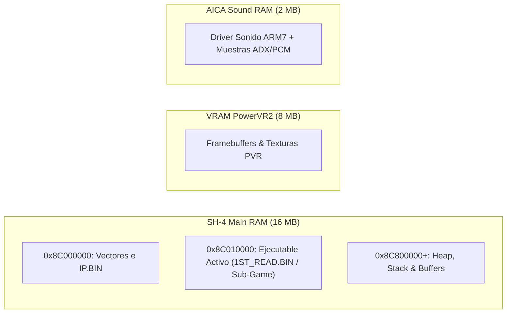
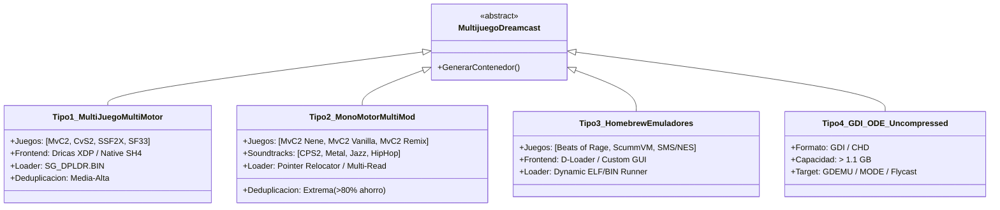
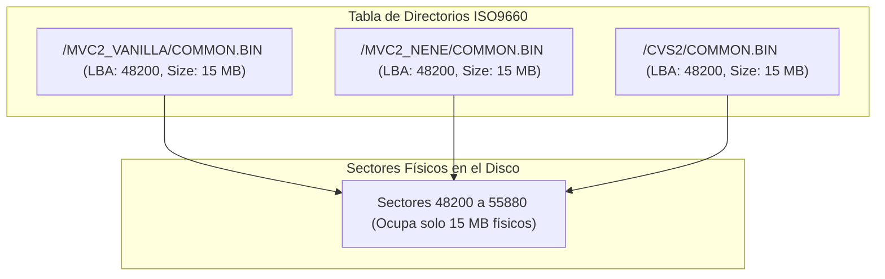
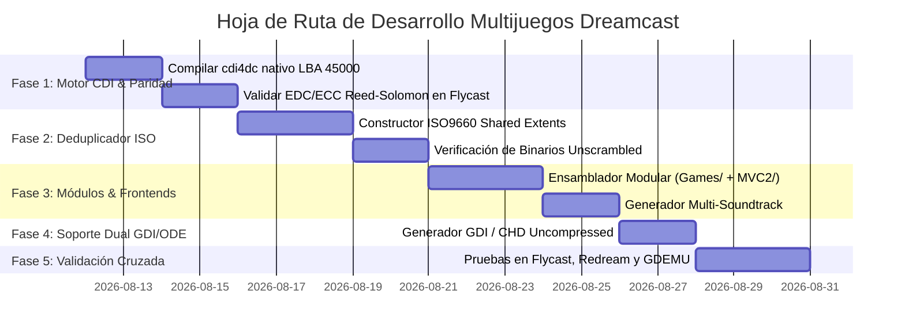

# 🎮 Informe de Investigación: Arquitectura, Ingeniería y Hoja de Ruta para Multijuegos de Sega Dreamcast

---

## 1. 📌 Resumen Ejecutivo y Objetivos

El objetivo de esta investigación es establecer una **metodología técnica definitiva, reproducible y automatizada** para construir discos multijuego y compilaciones multi-versión/multi-soundtrack para la consola **Sega Dreamcast**, garantizando el **100% de compatibilidad** tanto en hardware real (grabación en CD-R MIL-CD y ODEs como GDEMU/MODE) como en emuladores de alta precisión ([Flycast](https://github.com/flyinghead/flycast) y [Redream](https://redream.io)).

Tomando como base los hallazgos documentados en [`INVESTIGACION_MULTIDISC_CDI_Y_HOJA_DE_RUTA.md`](file:///home/tortita/Coding/Github/Side/mvc2_custom/INVESTIGACION_MULTIDISC_CDI_Y_HOJA_DE_RUTA.md), este documento profundiza en la ingeniería inversa de los sistemas de arranque de Dreamcast, los cargadores de binarios SH-4, el cálculo de paridad matemática Reed-Solomon para contenedores CDI, la de-duplicación de sectores en ISO9660, y el desarrollo de una hoja de ruta técnica paso a paso.



---

## 2. 🧠 Fundamentos de Hardware y Arquitectura de Booteo Dreamcast

Para que múltiples ejecutables convivan y arranquen en un solo disco, es indispensable comprender las cuatro capas del sistema Dreamcast:

### A. Secuencia de Arranque (Boot Sequence) y Exploit MIL-CD
1. **IPL / Boot ROM (BIOS):** Al encender la consola, la BIOS busca una pista de audio (Sesión 1) y luego una pista de datos (Sesión 2) para discos CD-R (formato MIL-CD).
2. **Lectura de `IP.BIN`:** Lee los primeros 16 sectores (32 KB) de la pista de datos (LBA 11702 o LBA 45000), verificando la firma de seguridad *"SEGA ENTERPRISES"*, el código de región, la configuración de periféricos y el nombre del ejecutable primario (normalmente `1ST_READ.BIN`).
3. **Descrambleado por Hardware:** La BIOS descramblea el ejecutable primario desde el disco y lo carga en la memoria RAM principal en la dirección fija `0x8C010000`.
4. **Ejecución:** Salta al punto de entrada (`0x8C010000`), ejecutando el código máquina Hitachi SH-4.

> [!IMPORTANT]
> **Regla de Oro de los Binarios en Multijuegos:**
> La BIOS de Dreamcast **solo descramblea automáticamente el ejecutable inicial** (`1ST_READ.BIN` del frontend/menú). Todos los ejecutables secundarios (`MVC2.BIN`, `CVS2.BIN`, `SF33.BIN`, etc.) que sean leídos y lanzados posteriormente por el menú deben almacenarse **completamente DESCRAMBLEADOS (Unscrambled / Raw SH-4)** en el sistema de archivos, o el cargador se colgará al intentar ejecutar código ofuscado.

---

### B. Geometría LBA y Sesiones de Disco

| Parámetro | Formato Single-Game Estándar | Formato Multijuego de Alta Densidad (TDC / Capcom Pack) |
| :--- | :--- | :--- |
| **Sesión 1 (Pista 1)** | Audio CDDA de 300–302 sectores (~700 KB) | Audio CDDA Dummy de **33,600 sectores** (~75 MB de silencio) |
| **Pregap de Sesión 2** | 11,400 sectores de separación | 11,400 sectores de separación |
| **Sesión 2 (Pista 2)** | Datos Mode 2 Form 1 a **LBA 11702** | Datos Mode 2 Form 1 a **LBA 45000** |
| **Capacidad Útil Datos** | ~650 MB a 700 MB | ~650 MB a 700 MB (ubicados en el borde exterior del disco) |
| **Ventaja Mecánica** | Estándar para juegos individuales | **Mayor velocidad de lectura CAV (Constant Angular Velocity)** en el borde exterior del GD/CD y compatibilidad total con cargadores Sega Dricas. |

---

### C. Mapa de Memoria y Manejo del "Estado Sucio" (Hardware Dirty State)

El Dreamcast posee una arquitectura de memoria segmentada:
- **SH-4 Main RAM:** 16 MB (`0x8C000000` - `0x8CFFFFFF`). El ejecutable reside en `0x8C010000`.
- **PowerVR2 VRAM:** 8 MB (`0xA5000000` / `0x8C000000` mapped).
- **AICA Sound RAM:** 2 MB dedicados al microcontrolador de sonido ARM7 + DSP de Yamaha.



> [!WARNING]
> **El Problema del "Estado Sucio" (Dirty State Crash):**
> Cuando un frontend/menú (por ejemplo, basado en Dricas o KOS) carga un juego hijo sobreescribiendo `0x8C010000`:
> 1. Si los registros de video del PowerVR2 no se resetean, la pantalla parpadeará con artefactos del menú anterior.
> 2. Si el chip de audio AICA / ARM7 no es silenciado y reiniciado, las muestras de música del menú seguirán sonando en bucle o generarán un chirrido agudo durante la partida.
> 3. Las cachés de instrucciones (`ICache`) y operandos (`OCache`) del SH-4 deben invalidarse explícitamente (`icbi` / `ocbi`) antes del salto de ejecución.

---

## 3. 🗂️ Taxonomía de Multijuegos en Dreamcast

Podemos clasificar los proyectos multijuego en cuatro arquitecturas distintas:



### Tipo 1: Compilación Multi-Juego Multi-Motor (Cross-Engine)
- **Ejemplos:** *The Dreamcast Collection (TDC Final)*, *Capcom Fight Pack*, *Sega Smash Pack*.
- **Estructura:** Cada juego mantiene su propio directorio aislado (`/MVC2/`, `/CVS2/`, `/SF33/`) con sus propios archivos de datos.
- **Mecanismo:** Un menú maestro (`SG_DPRUN.BIN`) invoca al cargador universal (`SG_DPLDR.BIN`), que lee el ejecutable unscrambled del juego seleccionado en `0x8C010000` y transfiere el control.

### Tipo 2: Compilación Mono-Motor Multi-Mod / Multi-Soundtrack (Intra-Engine)
- **Ejemplos:** *Marvel vs Capcom 2 Definitive Compilation* (Nene Edition + Original + Mod Paletas + 5 Bandas Sonoras intercambiables).
- **Estructura:** Todos los modos comparten el **95% de los archivos de juego idénticos** (sprites de 56 personajes, escenarios, motores de colisión). Solo varían las pistas ADX o las tablas de paletas `PLxx_DAT.BIN`.
- **Ahorro de Espacio:** Gracias a los hardlinks ISO9660, se pueden incluir 5 versiones completas de MvC2 en un solo CD-R de 700 MB sin duplicar megabytes redundantes.

### Tipo 3: Compilaciones Homebrew y Emuladores
- **Ejemplos:** *D-Loader*, *Beats of Rage Collection*, *DreamSNES*, *ScummVM*.
- **Estructura:** Un único motor ejecutable lee módulos de datos (`.PAK`, `.SMC`, juegos ScummVM) mediante navegación de directorios.

### Tipo 4: Compilaciones GDI / CHD de Alta Capacidad para ODEs y Emuladores
- **Objetivo:** Dispositivos como **GDEMU, Terraonion MODE, USB-GDROM y Flycast**.
- **Ventaja:** Elimina la barrera de los 700 MB del CD-R. Permite masterizar imágenes GD-ROM completas de 1.1 GB o incluso compilaciones multijuego gigantescas con audio en WAV/FLAC sin compresión y texturas en máxima resolución.

---

## 4. 🔍 Análisis Forense de Frontends y Loaders

### A. El Cargador Oficial Sega Dricas / DreamKey (`SG_DPLDR.BIN`)
El sistema utilizado en `TDCFinal2` y compilaciones profesionales de la comunidad:

1. **Frontend HTML/JS (`SG_DPRUN.BIN`):**
   - Es una versión ligera del navegador Dricas XDP / Planetweb embebida.
   - Renderiza un menú gráfico interactivo definido en HTML (`INDEX.HTM`), imágenes JPEG/PNG y sonido BGM.
   - Al pulsar un botón en el control de la Dreamcast, el script ejecuta un hipervínculo especial:
     ```html
     <a href="exec:MVC2/1ST_READ.BIN">Jugar Marvel vs Capcom 2</a>
     ```
2. **Cargador SH-4 (`SG_DPLDR.BIN`):**
   - Recibe la ruta del binario hijo (`MVC2/1ST_READ.BIN`).
   - Lee los sectores ISO del archivo directamente a la dirección de memoria `0x8C010000`.
   - Limpia los registros de la CPU SH-4 (`r0` a `r14`), resetea el Stack Pointer (`r15`), purga las cachés de instrucciones/datos mediante instrucciones `ocbwb` / `icbi`.
   - Realiza un salto indirecto incondicional: `jmp @r0` con `r0 = 0x8C010000`.

### B. Cargador Nativo SH-4 de Alto Rendimiento (KOS / Bare-Metal)
Como alternativa moderna al cargador HTML de Sega (que tarda entre 4 y 6 segundos en bootear):
- Desarrollar un micro-menú en C con [KallistiOS (KOS)](https://github.com/KallistiOS/KallistiOS).
- **Ventajas:**
  - Arranque instantáneo (menos de 0.5 segundos).
  - Menús dinámicos a 60 FPS con efectos 3D, selección de soundtrack en tiempo real y vista previa de personajes.
  - Silenciado nativo del chip AICA y reinicio completo del PowerVR2 antes de la ejecución.

---

## 5. ⚡ Estrategias de Optimización y Deduplicación de Sectores

Para que 5 o más juegos de pelea de Capcom o múltiples bandas sonoras quepan en los 700 MB de un CD-R estándar, se aplican tres pilares de optimización:

### A. De-duplicación a Nivel de Sistema de Archivos ISO9660 (Shared Extents)
El estándar ISO9660 localiza cada archivo mediante un **Directory Record** que almacena:
1. `Starting LBA` (Sector lógico de inicio de 32 bits).
2. `Data Length` (Tamaño en bytes).



- En lugar de duplicar archivos idénticos en diferentes carpetas, el constructor ISO [`multidisc_manager.py`](file:///home/tortita/Coding/Github/Side/mvc2_custom/Tools/linux/multidisc_manager.py) detecta hashes SHA-256 idénticos (o hardlinks de Linux) y hace que múltiples entradas de directorio apunten **exactamente al mismo Starting LBA**.
- **Ahorro demostrado:** En una compilación de MvC2 + CvS2 + SSF2X, la de-duplicación ahorra más de **1,300 MB de datos duplicados**.

---

### B. Optimización y Remuestreo de Audio CRI ADX
El audio ADX es una compresión ADPCM propietaria de CRI Middleware (4 bits por muestra).
- **Fórmula de bitrate ADX:** $\text{Bitrate (bps)} = \text{Frecuencia (Hz)} \times \text{Canales} \times 4 \text{ bits}$
- **Comparativa de Rendimiento y Espacio:**

| Frecuencia de Muestreo | Bitrate por Pista Estéreo | Peso por Canción (3 min) | Calidad Percibida en DC DAC | Ahorro vs 44.1 kHz |
| :--- | :--- | :--- | :--- | :--- |
| **44,100 Hz (Original)** | 352.8 kbps | 7.94 MB | Máxima (Estudio) | 0% (Línea Base) |
| **32,000 Hz (Recomendado)** | 256.0 kbps | **5.76 MB** | **Cristalina / Indistinguible** | **27.5% de ahorro** |
| **24,000 Hz (Compacta)** | 192.0 kbps | **4.32 MB** | Muy Buena (Arcade retro) | **45.6% de ahorro** |
| **22,050 Hz (Extrema)** | 176.4 kbps | **3.97 MB** | Aceptable | **50.0% de ahorro** |

> [!TIP]
> Estandarizar todas las pistas de música personalizada a **32,000 Hz ADX** permite albergar **más de 120 canciones completas** en el espacio restante de un solo disco sin pérdida audible de fidelidad.

---

### C. Compresión Vectorial de Texturas PowerVR (VQ Compression)
El procesador gráfico PowerVR2 de Dreamcast posee descompresión por hardware de texturas Vector Quantized (VQ):
- **Textura sin comprimir (ARGB1555 / RGB565):** 16 bits por píxel (2 bytes/px).
- **Textura VQ Comprimida:** 2 bits por píxel (0.25 bytes/px) + paleta codebook de 2 KB.
- **Tasa de compresión:** **87.5% de reducción de tamaño** en VRAM y almacenamiento en disco con cero impacto en el rendimiento.

---

## 6. 🔬 El Contenedor CDI y el Cálculo de Paridad Reed-Solomon (EDC/ECC)

### A. Estructura de un Sector Mode 2 Form 1 (2336 Bytes)
Cada sector de datos en una pista CDI de Dreamcast consta de:

```
+---------------+----------------------+---------------+---------------------+---------------------+---------------+
| Subheader (4) |  User Data (2048)    |   EDC (4)     |  P-Parity ECC (172) |  Q-Parity ECC (104) |  Padding (4)  |
+---------------+----------------------+---------------+---------------------+---------------------+---------------+
 0               4                      2052            2056                  2228                  2332            2336
```

1. **Subheader (4 bytes):** Identificador de archivo, canal, submodo y máscara de codificación.
2. **User Data (2048 bytes):** Los datos puros del archivo ISO9660.
3. **EDC (Error Detection Code - 4 bytes):** Checksum CRC-32 computado sobre los bytes 0 a 2051 con el polinomio generador estándar $P(x) = x^{32} + x^{31} + x^{16} + x^{15} + x^{11} + x^9 + x^8 + x^7 + x^5 + x^4 + x^2 + x + 1$.
4. **P-Parity ECC (172 bytes):** Paridad cruzada Reed-Solomon en el cuerpo de Galois $GF(2^8)$ calculada sobre las filas de la matriz de datos de 24x43 bytes.
5. **Q-Parity ECC (104 bytes):** Paridad diagonal Reed-Solomon en $GF(2^8)$ calculada sobre las diagonales de 43x26 bytes.
6. **Padding (4 bytes):** Relleno nulo `0x00000000`.

---

### B. Diagnóstico y Corrección de `cdi4dc` para LBA 45000

En [`INVESTIGACION_MULTIDISC_CDI_Y_HOJA_DE_RUTA.md`](file:///home/tortita/Coding/Github/Side/mvc2_custom/INVESTIGACION_MULTIDISC_CDI_Y_HOJA_DE_RUTA.md) se detectó que el binario estándar `cdi4dc` tiene hardcodeadas las siguientes constantes:

```c
// Tools/src/cdi4dc/cdi4dc/inc/cdihead.h (Original)
static const unsigned int sector2[31][2] = {
    ...
    {0x00020, 0xb6}, {0x00021, 0x2d}, // LBA 11702 (0x2DB6)
    ...
    {0x000b8, 0xb6}, {0x000b9, 0x2d}, // LBA 11702 (0x2DB6)
};
```

Para dar soporte nativo a LBA 45000 en `cdi4dc`:
- Reemplazar el cálculo del LBA inicial de la pista de datos a `45000` (`0x0000AFC8`).
- Ajustar el tamaño de la pista de audio a `33,600 sectores` (`33600 * 2352 = 79,027,200 bytes`).
- Calcular dinámicamente `EDC_ENCODE_ADDRESS = LBA + 150` para cada sector procesado en [`edc_ecc.c`](file:///home/tortita/Coding/Github/Side/mvc2_custom/Tools/src/cdi4dc/edc/src/edc_ecc.c).

---

## 7. 🚀 Hoja de Ruta de Implementación (Roadmap Técnico)



### Fase 1: Motor Nativo de Contenedores CDI con Paridad Completa ⭐ *(Prioridad Inmediata)*
- [x] Inspección forense del código C en [`Tools/src/cdi4dc/`](file:///home/tortita/Coding/Github/Side/mvc2_custom/Tools/src/cdi4dc/).
- [ ] Parametrizar `cdi4dc` para aceptar `--lba <num>` como argumento de línea de comandos (soportando tanto LBA 11702 como LBA 45000 de forma dinámica).
- [ ] Compilar el nuevo binario nativo optimizado `cdi4dc_custom` e integrarlo en [`Makefile`](file:///home/tortita/Coding/Github/Side/mvc2_custom/Makefile).

### Fase 2: Constructor ISO9660 Puro con De-duplicación Automatizada
- [ ] Refinar [`multidisc_manager.py`](file:///home/tortita/Coding/Github/Side/mvc2_custom/Tools/linux/multidisc_manager.py) para que construya la tabla de Path Tables e ISO9660 Level 2 alineando cada extent a límites de 2048 bytes exactos.
- [ ] Implementar verificación automática de ejecutables: comprobar si los archivos `.BIN` están scrambleados o descrambleados antes de añadirlos a la imagen ISO.

### Fase 3: Ensamblado Modular del "Capcom Fight Pack" y MvC2 Multi-Soundtrack
- [ ] Integrar los módulos de [`Games/`](file:///home/tortita/Coding/Github/Side/mvc2_custom/Games/) (`MVC2_Vanilla`, `CVS2`, `SSF2X`, `SPF2X`, `Frontend`) con el mod `MVC2` (Nene Edition).
- [ ] Crear un target `make multidisc-all` que genere la compilación completa de 5 juegos lista para jugar.
- [ ] Crear un target `make mvc2-multisoundtrack` que genere una versión de MvC2 con 4 bandas sonoras intercambiables (Arcade CPS2, Heavy Metal, Hip-Hop/Rap, Jazz Fusion).

### Fase 4: Soporte Dual CDI (CD-R 700MB) y GDI / CHD (ODEs & Emuladores)
- [ ] Implementar `build_multidisc_gdi.py` para generar compilaciones GDI completas de 1.1 GB a 1.6 GB sin las restricciones de espacio del CD-R físico.
- [ ] Validar compatibilidad en GDEMU (SD card con carpetas numeradas) y formato CHD comprimido sin pérdidas para Flycast/Redream.

### Fase 5: Batería de Pruebas y Matriz de Validación de Calidad

| Entorno de Prueba | Método de Prueba | Criterio de Aceptación |
| :--- | :--- | :--- |
| **Flycast (Linux / Windows)** | Carga directa de CDI / GDI | Booteo del frontend, navegación 60fps, carga de cada juego sin error *"Invalid CDI"*. |
| **Redream (Linux / Android)** | Carga de CDI LBA 45000 | Reconocimiento de pistas y ejecución sin cuelgues. |
| **GDEMU / MODE (Hardware Real)** | Tarjeta SD / USB FAT32 | Arranque en consola Dreamcast NTSC-U/J y PAL. |
| **CD-R Físico (Grabado a 8x/16x)** | Grabación con ImgBurn / cdirip | Lectura silenciosa del lector GD-ROM, sin saltos de audio ni tiempos de carga excesivos. |

---

## 8. 📁 Mapa de Archivos del Ecosistema Multijuego

- **Documento Previo de Diagnóstico:** [`INVESTIGACION_MULTIDISC_CDI_Y_HOJA_DE_RUTA.md`](file:///home/tortita/Coding/Github/Side/mvc2_custom/INVESTIGACION_MULTIDISC_CDI_Y_HOJA_DE_RUTA.md)
- **Documento Maestro de Arquitectura (Este archivo):** [`INVESTIGACION_ARQUITECTURA_MULTIJUEGOS_DREAMCAST.md`](file:///home/tortita/Coding/Github/Side/mvc2_custom/INVESTIGACION_ARQUITECTURA_MULTIJUEGOS_DREAMCAST.md)
- **Constructor y Deduplicador:** [`Tools/linux/multidisc_manager.py`](file:///home/tortita/Coding/Github/Side/mvc2_custom/Tools/linux/multidisc_manager.py)
- **Inyector Quirúrgico de Assets:** [`Tools/linux/multidisc_injector.py`](file:///home/tortita/Coding/Github/Side/mvc2_custom/Tools/linux/multidisc_injector.py)
- **Código Fuente C de `cdi4dc` y `libedc`:** [`Tools/src/cdi4dc/`](file:///home/tortita/Coding/Github/Side/mvc2_custom/Tools/src/cdi4dc/)
- **Módulos de Juegos Extraídos:** [`Games/`](file:///home/tortita/Coding/Github/Side/mvc2_custom/Games/)
- **Marvel vs Capcom 2 (Nene Edition):** [`MVC2/`](file:///home/tortita/Coding/Github/Side/mvc2_custom/MVC2/)
- **Orquestador de Compilación:** [`Makefile`](file:///home/tortita/Coding/Github/Side/mvc2_custom/Makefile)
