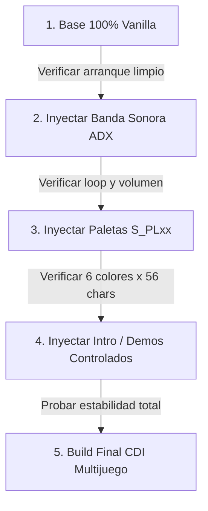

# Mapping Integral de Archivos de Marvel vs Capcom 2 (Dreamcast)

Este documento contiene el **mapeo completo, funcional y comparativo** de todos los archivos que componen el directorio raíz de **Marvel vs Capcom 2** en la Sega Dreamcast, comparando la versión actual modificada (`MVC2/`) frente a la versión limpia base (`Games/MVC2_Vanilla/`).

## 1. Diagnóstico de Inestabilidad y Crashes

Al comparar la versión actual `MVC2/` con la versión limpia `Games/MVC2_Vanilla/`, se identificaron las causas directas de los cuelgues e intro distorsionada:

1. **Inyección en `DM08CHR.BIN`, `DM08CAB.BIN`, `DM01TEX.BIN` y `DM02TEX.BIN` (Intro/Demos):** Estos archivos contienen las mallas 3D y texturas de la máquina arcade y personajes que se muestran durante el opening. Si los tamaños o punteros PVR no coinciden exactamente con lo esperado en memoria, la intro se corrompe visualmente o congela el juego.
2. **Alteración masiva de `PLxx_DAT.BIN` (56 personajes):** Prácticamente todos los archivos de datos de personajes tienen diferencias de tamaño respecto a Vanilla. Modificar los `DAT.BIN` sin recalcular tablas de animación/offsets suele provocar `Address Error` o bloqueos al cargar peleadores en el motor.
3. **Modificación de `SELTEX.BIN` (1.36 MB vs 1.59 MB):** La textura del menú de selección fue reducida o recomprimida, lo que puede causar fallos al dibujar el cursor o miniaturas.
4. **`1ST_READ.BIN` Patcher / Mods:** Existen ejecutables modificados (Jed unlock patch, alternancia de música) que deben alinearse exactamente con los assets presentes en el disco.

---
## 2. Mapa de Categorías y Estructura de Archivos

### Sistema & Ejecutables (10 archivos)

| Archivo | Estado | Tamaño MVC2 | Tamaño Vanilla | Función / Descripción |
| :--- | :---: | :---: | :---: | :--- |
| `1ST_READ.BIN` | **MODIFICADO (Tamaño)** | 1,811,728 B | 1,809,817 B | Ejecutable principal del juego (código SH-4 compilado). |
| `AICADRV.BIN` | Identico | 59,264 B | 59,264 B | Driver de sonido para el procesador Yamaha AICA / ARM7. |
| `DEBUG.BIN` | Identico | 3,232 B | 3,232 B | Rutinas de depuración interna de Capcom. |
| `DUMMY.BIN` | Solo Mod / Extra | 0 B | *(No existe)* | Archivo del sistema (DUMMY.BIN). |
| `ERR_MES.BIN` | **MODIFICADO (Tamaño)** | 3,376 B | 3,388 B | Tabla de textos y mensajes de error del sistema. |
| `FONT.BIN` | Identico | 73,792 B | 73,792 B | Tipografía y fuentes bitmap del juego. |
| `IP.BIN` | **MODIFICADO (Hash)** | 32,768 B | 32,768 B | Bootstrap del disco Dreamcast (VCON, metadatos de arranque y LBA). |
| `KEYBOARD.BIN` | Identico | 24,110 B | 24,110 B | Datos para el teclado virtual en pantalla. |
| `MAIGO.BIN` | **MODIFICADO (Hash)** | 14,856 B | 14,856 B | Cargadores auxiliares de Sega/Capcom. |
| `SG_DPLDR.BIN` | **MODIFICADO (Hash)** | 14,856 B | 14,856 B | Cargadores auxiliares de Sega/Capcom. |

### Audio & Música BGM (ADX / SE) (26 archivos)

| Archivo | Estado | Tamaño MVC2 | Tamaño Vanilla | Función / Descripción |
| :--- | :---: | :---: | :---: | :--- |
| `ADX_CAPL.BIN` | **MODIFICADO (Tamaño)** | 323,584 B | 55,926 B | Jingle del logotipo de Capcom. |
| `ADX_CONT.BIN` | Identico | 153,600 B | 153,600 B | BGM de la Cuenta Regresiva de Continuar. |
| `ADX_HERE.BIN` | **MODIFICADO (Tamaño)** | 337,920 B | 31,878 B | Jingle 'Here comes a new challenger'. |
| `ADX_MENU.BIN` | **MODIFICADO (Tamaño)** | 1,425,408 B | 399,360 B | BGM del Menú Principal. |
| `ADX_NETW.BIN` | Solo Vanilla | *(No existe)* | 933,888 B | BGM del Menú de Red. |
| `ADX_OPEN.BIN` | **MODIFICADO (Tamaño)** | 1,669,770 B | 434,178 B | BGM del Opening / Intro ('I wanna take you for a ride'). |
| `ADX_OVER.BIN` | Identico | 72,054 B | 72,054 B | Jingle de Game Over. |
| `ADX_RANK.BIN` | Identico | 393,216 B | 393,216 B | BGM del Ranking / High Scores. |
| `ADX_S000.BIN` | **MODIFICADO (Tamaño)** | 12,926,930 B | 763,904 B | BGM de Combate: Air Ship (River Stage). |
| `ADX_S010.BIN` | **MODIFICADO (Tamaño)** | 5,361,350 B | 1,142,784 B | BGM de Combate: Desert. |
| `ADX_S020.BIN` | **MODIFICADO (Tamaño)** | 23,279,090 B | 841,728 B | BGM de Combate: Factory. |
| `ADX_S030.BIN` | **MODIFICADO (Tamaño)** | 13,774,658 B | 903,168 B | BGM de Combate: Carnival. |
| `ADX_S040.BIN` | **MODIFICADO (Tamaño)** | 8,185,014 B | 714,752 B | BGM de Combate: Swamp. |
| `ADX_S050.BIN` | **MODIFICADO (Tamaño)** | 31,541,702 B | 565,248 B | BGM de Combate: Cave. |
| `ADX_S060.BIN` | **MODIFICADO (Tamaño)** | 30,724,394 B | 837,632 B | BGM de Combate: Clock Tower. |
| `ADX_S070.BIN` | **MODIFICADO (Tamaño)** | 12,369,722 B | 686,080 B | BGM de Combate: River. |
| `ADX_S080.BIN` | **MODIFICADO (Tamaño)** | 5,056,506 B | 325,632 B | BGM de Combate: Abyss 1. |
| `ADX_S090.BIN` | **MODIFICADO (Tamaño)** | 9,356,018 B | 325,632 B | BGM de Combate: Abyss 2. |
| `ADX_S0A0.BIN` | **MODIFICADO (Tamaño)** | 6,813,562 B | 325,632 B | BGM de Combate: Abyss 3. |
| `ADX_S0B0.BIN` | **MODIFICADO (Tamaño)** | 7,237,632 B | 1,226,752 B | BGM de Combate: Training Room. |
| `ADX_SELC.BIN` | **MODIFICADO (Tamaño)** | 9,488,106 B | 108,544 B | BGM de la Pantalla de Selección de Personajes. |
| `ADX_STAF.BIN` | Identico | 1,344,186 B | 1,344,186 B | BGM de los Créditos / Staff Roll. |
| `ADX_WINS.BIN` | **MODIFICADO (Tamaño)** | 2,074,624 B | 90,112 B | BGM de la Pantalla de Victoria. |
| `SE_COMN.BIN` | Identico | 931,284 B | 931,284 B | Banco de efectos de sonido (SE_COMN.BIN). |
| `SE_STAF.BIN` | Identico | 93,732 B | 93,732 B | Banco de efectos de sonido (SE_STAF.BIN). |
| `SE_SYUK.BIN` | Identico | 123,108 B | 123,108 B | Banco de efectos de sonido (SE_SYUK.BIN). |

### Paletas de Personajes (S_PLxx*.BIN) (354 archivos)

| Archivo | Estado | Tamaño MVC2 | Tamaño Vanilla | Función / Descripción |
| :--- | :---: | :---: | :---: | :--- |
| `S_PL00A.BIN` | Identico | 14,068 B | 14,068 B | Paleta de color LP (Botón X) para Ryu. |
| `S_PL00B.BIN` | Identico | 14,068 B | 14,068 B | Paleta de color HP (Botón Y) para Ryu. |
| `S_PL00C.BIN` | Identico | 14,068 B | 14,068 B | Paleta de color A1 (Assist 1) para Ryu. |
| `S_PL00D.BIN` | Identico | 14,068 B | 14,068 B | Paleta de color LK (Botón A) para Ryu. |
| `S_PL00E.BIN` | Identico | 14,068 B | 14,068 B | Paleta de color HK (Botón B) para Ryu. |
| `S_PL00F.BIN` | Identico | 14,068 B | 14,068 B | Paleta de color A2 (Assist 2) para Ryu. |
| `S_PL01A.BIN` | **MODIFICADO (Tamaño)** | 29,228 B | 29,148 B | Paleta de color LP (Botón X) para Zangief. |
| `S_PL01B.BIN` | **MODIFICADO (Tamaño)** | 29,228 B | 29,148 B | Paleta de color HP (Botón Y) para Zangief. |
| `S_PL01C.BIN` | **MODIFICADO (Tamaño)** | 29,228 B | 29,148 B | Paleta de color A1 (Assist 1) para Zangief. |
| `S_PL01D.BIN` | **MODIFICADO (Tamaño)** | 29,228 B | 29,148 B | Paleta de color LK (Botón A) para Zangief. |
| `S_PL01E.BIN` | **MODIFICADO (Tamaño)** | 29,228 B | 29,148 B | Paleta de color HK (Botón B) para Zangief. |
| `S_PL01F.BIN` | **MODIFICADO (Tamaño)** | 29,228 B | 29,148 B | Paleta de color A2 (Assist 2) para Zangief. |
| `S_PL02A.BIN` | Identico | 14,780 B | 14,780 B | Paleta de color LP (Botón X) para Guile. |
| `S_PL02B.BIN` | Identico | 14,780 B | 14,780 B | Paleta de color HP (Botón Y) para Guile. |
| `S_PL02C.BIN` | Identico | 14,780 B | 14,780 B | Paleta de color A1 (Assist 1) para Guile. |
| `S_PL02D.BIN` | Identico | 14,780 B | 14,780 B | Paleta de color LK (Botón A) para Guile. |
| `S_PL02E.BIN` | Identico | 14,780 B | 14,780 B | Paleta de color HK (Botón B) para Guile. |
| `S_PL02F.BIN` | Identico | 14,780 B | 14,780 B | Paleta de color A2 (Assist 2) para Guile. |
| `S_PL03A.BIN` | **MODIFICADO (Tamaño)** | 22,412 B | 22,292 B | Paleta de color LP (Botón X) para Chun-Li. |
| `S_PL03B.BIN` | **MODIFICADO (Tamaño)** | 22,412 B | 22,292 B | Paleta de color HP (Botón Y) para Chun-Li. |
| `S_PL03C.BIN` | **MODIFICADO (Tamaño)** | 22,412 B | 22,292 B | Paleta de color A1 (Assist 1) para Chun-Li. |
| `S_PL03D.BIN` | **MODIFICADO (Tamaño)** | 22,412 B | 22,292 B | Paleta de color LK (Botón A) para Chun-Li. |
| `S_PL03E.BIN` | **MODIFICADO (Tamaño)** | 22,412 B | 22,292 B | Paleta de color HK (Botón B) para Chun-Li. |
| `S_PL03F.BIN` | **MODIFICADO (Tamaño)** | 22,412 B | 22,292 B | Paleta de color A2 (Assist 2) para Chun-Li. |
| `S_PL04A.BIN` | Identico | 14,708 B | 14,708 B | Paleta de color LP (Botón X) para Dhalsim. |
| `S_PL04B.BIN` | Identico | 14,708 B | 14,708 B | Paleta de color HP (Botón Y) para Dhalsim. |
| `S_PL04C.BIN` | Identico | 14,708 B | 14,708 B | Paleta de color A1 (Assist 1) para Dhalsim. |
| `S_PL04D.BIN` | Identico | 14,708 B | 14,708 B | Paleta de color LK (Botón A) para Dhalsim. |
| `S_PL04E.BIN` | Identico | 14,708 B | 14,708 B | Paleta de color HK (Botón B) para Dhalsim. |
| `S_PL04F.BIN` | Identico | 14,708 B | 14,708 B | Paleta de color A2 (Assist 2) para Dhalsim. |
| `S_PL05A.BIN` | Identico | 24,856 B | 24,856 B | Paleta de color LP (Botón X) para Cammy. |
| `S_PL05B.BIN` | Identico | 24,856 B | 24,856 B | Paleta de color HP (Botón Y) para Cammy. |
| `S_PL05C.BIN` | Identico | 24,856 B | 24,856 B | Paleta de color A1 (Assist 1) para Cammy. |
| `S_PL05D.BIN` | Identico | 24,856 B | 24,856 B | Paleta de color LK (Botón A) para Cammy. |
| `S_PL05E.BIN` | Identico | 24,856 B | 24,856 B | Paleta de color HK (Botón B) para Cammy. |
| `S_PL05F.BIN` | Identico | 24,856 B | 24,856 B | Paleta de color A2 (Assist 2) para Cammy. |
| `S_PL06A.BIN` | **MODIFICADO (Tamaño)** | 16,668 B | 16,660 B | Paleta de color LP (Botón X) para Ken. |
| `S_PL06B.BIN` | **MODIFICADO (Tamaño)** | 16,668 B | 16,660 B | Paleta de color HP (Botón Y) para Ken. |
| `S_PL06C.BIN` | **MODIFICADO (Tamaño)** | 16,668 B | 16,660 B | Paleta de color A1 (Assist 1) para Ken. |
| `S_PL06D.BIN` | **MODIFICADO (Tamaño)** | 16,668 B | 16,660 B | Paleta de color LK (Botón A) para Ken. |
| `S_PL06E.BIN` | **MODIFICADO (Tamaño)** | 16,668 B | 16,660 B | Paleta de color HK (Botón B) para Ken. |
| `S_PL06F.BIN` | **MODIFICADO (Tamaño)** | 16,668 B | 16,660 B | Paleta de color A2 (Assist 2) para Ken. |
| `S_PL07A.BIN` | Identico | 21,348 B | 21,348 B | Paleta de color LP (Botón X) para Cyclops. |
| `S_PL07B.BIN` | Identico | 21,348 B | 21,348 B | Paleta de color HP (Botón Y) para Cyclops. |
| `S_PL07C.BIN` | Identico | 21,348 B | 21,348 B | Paleta de color A1 (Assist 1) para Cyclops. |
| `S_PL07D.BIN` | Identico | 21,348 B | 21,348 B | Paleta de color LK (Botón A) para Cyclops. |
| `S_PL07E.BIN` | Identico | 21,348 B | 21,348 B | Paleta de color HK (Botón B) para Cyclops. |
| `S_PL07F.BIN` | Identico | 21,348 B | 21,348 B | Paleta de color A2 (Assist 2) para Cyclops. |
| `S_PL08A.BIN` | Identico | 18,596 B | 18,596 B | Paleta de color LP (Botón X) para Wolverine (Claws). |
| `S_PL08B.BIN` | Identico | 18,596 B | 18,596 B | Paleta de color HP (Botón Y) para Wolverine (Claws). |
| `S_PL08C.BIN` | Identico | 18,596 B | 18,596 B | Paleta de color A1 (Assist 1) para Wolverine (Claws). |
| `S_PL08D.BIN` | Identico | 18,596 B | 18,596 B | Paleta de color LK (Botón A) para Wolverine (Claws). |
| `S_PL08E.BIN` | Identico | 18,596 B | 18,596 B | Paleta de color HK (Botón B) para Wolverine (Claws). |
| `S_PL08F.BIN` | Identico | 18,596 B | 18,596 B | Paleta de color A2 (Assist 2) para Wolverine (Claws). |
| `S_PL09A.BIN` | **MODIFICADO (Hash)** | 10,584 B | 10,584 B | Paleta de color LP (Botón X) para Wolverine (Bone). |
| `S_PL09B.BIN` | **MODIFICADO (Hash)** | 10,584 B | 10,584 B | Paleta de color HP (Botón Y) para Wolverine (Bone). |
| `S_PL09C.BIN` | **MODIFICADO (Hash)** | 10,584 B | 10,584 B | Paleta de color A1 (Assist 1) para Wolverine (Bone). |
| `S_PL09D.BIN` | **MODIFICADO (Hash)** | 10,584 B | 10,584 B | Paleta de color LK (Botón A) para Wolverine (Bone). |
| `S_PL09E.BIN` | **MODIFICADO (Hash)** | 10,584 B | 10,584 B | Paleta de color HK (Botón B) para Wolverine (Bone). |
| `S_PL09F.BIN` | **MODIFICADO (Hash)** | 10,584 B | 10,584 B | Paleta de color A2 (Assist 2) para Wolverine (Bone). |
| `S_PL0AA.BIN` | **MODIFICADO (Hash)** | 20,732 B | 20,732 B | Paleta de color LP (Botón X) para Storm. |
| `S_PL0AB.BIN` | **MODIFICADO (Hash)** | 20,732 B | 20,732 B | Paleta de color HP (Botón Y) para Storm. |
| `S_PL0AC.BIN` | **MODIFICADO (Hash)** | 20,732 B | 20,732 B | Paleta de color A1 (Assist 1) para Storm. |
| `S_PL0AD.BIN` | **MODIFICADO (Hash)** | 20,732 B | 20,732 B | Paleta de color LK (Botón A) para Storm. |
| `S_PL0AE.BIN` | **MODIFICADO (Hash)** | 20,732 B | 20,732 B | Paleta de color HK (Botón B) para Storm. |
| `S_PL0AF.BIN` | **MODIFICADO (Hash)** | 20,732 B | 20,732 B | Paleta de color A2 (Assist 2) para Storm. |
| `S_PL0BA.BIN` | Identico | 20,004 B | 20,004 B | Paleta de color LP (Botón X) para Rogue. |
| `S_PL0BB.BIN` | Identico | 20,004 B | 20,004 B | Paleta de color HP (Botón Y) para Rogue. |
| `S_PL0BC.BIN` | Identico | 20,004 B | 20,004 B | Paleta de color A1 (Assist 1) para Rogue. |
| `S_PL0BD.BIN` | Identico | 20,004 B | 20,004 B | Paleta de color LK (Botón A) para Rogue. |
| `S_PL0BE.BIN` | Identico | 20,004 B | 20,004 B | Paleta de color HK (Botón B) para Rogue. |
| `S_PL0BF.BIN` | Identico | 20,004 B | 20,004 B | Paleta de color A2 (Assist 2) para Rogue. |
| `S_PL0CA.BIN` | Identico | 20,760 B | 20,760 B | Paleta de color LP (Botón X) para Gambit. |
| `S_PL0CB.BIN` | Identico | 20,760 B | 20,760 B | Paleta de color HP (Botón Y) para Gambit. |
| `S_PL0CC.BIN` | Identico | 20,760 B | 20,760 B | Paleta de color A1 (Assist 1) para Gambit. |
| `S_PL0CD.BIN` | Identico | 20,760 B | 20,760 B | Paleta de color LK (Botón A) para Gambit. |
| `S_PL0CE.BIN` | Identico | 20,760 B | 20,760 B | Paleta de color HK (Botón B) para Gambit. |
| `S_PL0CF.BIN` | Identico | 20,760 B | 20,760 B | Paleta de color A2 (Assist 2) para Gambit. |
| `S_PL0DA.BIN` | Identico | 15,824 B | 15,824 B | Paleta de color LP (Botón X) para Marrow. |
| `S_PL0DB.BIN` | Identico | 15,824 B | 15,824 B | Paleta de color HP (Botón Y) para Marrow. |
| `S_PL0DC.BIN` | Identico | 15,824 B | 15,824 B | Paleta de color A1 (Assist 1) para Marrow. |
| `S_PL0DD.BIN` | Identico | 15,824 B | 15,824 B | Paleta de color LK (Botón A) para Marrow. |
| `S_PL0DE.BIN` | Identico | 15,824 B | 15,824 B | Paleta de color HK (Botón B) para Marrow. |
| `S_PL0DF.BIN` | Identico | 15,824 B | 15,824 B | Paleta de color A2 (Assist 2) para Marrow. |
| `S_PL0EA.BIN` | Identico | 13,588 B | 13,588 B | Paleta de color LP (Botón X) para Spiral. |
| `S_PL0EB.BIN` | Identico | 13,588 B | 13,588 B | Paleta de color HP (Botón Y) para Spiral. |
| `S_PL0EC.BIN` | Identico | 13,588 B | 13,588 B | Paleta de color A1 (Assist 1) para Spiral. |
| `S_PL0ED.BIN` | Identico | 13,588 B | 13,588 B | Paleta de color LK (Botón A) para Spiral. |
| `S_PL0EE.BIN` | Identico | 13,588 B | 13,588 B | Paleta de color HK (Botón B) para Spiral. |
| `S_PL0EF.BIN` | Identico | 13,588 B | 13,588 B | Paleta de color A2 (Assist 2) para Spiral. |
| `S_PL0FA.BIN` | Identico | 14,668 B | 14,668 B | Paleta de color LP (Botón X) para Silver Samurai. |
| `S_PL0FB.BIN` | Identico | 14,668 B | 14,668 B | Paleta de color HP (Botón Y) para Silver Samurai. |
| `S_PL0FC.BIN` | Identico | 14,668 B | 14,668 B | Paleta de color A1 (Assist 1) para Silver Samurai. |
| `S_PL0FD.BIN` | Identico | 14,668 B | 14,668 B | Paleta de color LK (Botón A) para Silver Samurai. |
| `S_PL0FE.BIN` | Identico | 14,668 B | 14,668 B | Paleta de color HK (Botón B) para Silver Samurai. |
| `S_PL0FF.BIN` | Identico | 14,668 B | 14,668 B | Paleta de color A2 (Assist 2) para Silver Samurai. |
| `S_PL10A.BIN` | Identico | 15,588 B | 15,588 B | Paleta de color LP (Botón X) para Omega Red. |
| `S_PL10B.BIN` | Identico | 15,588 B | 15,588 B | Paleta de color HP (Botón Y) para Omega Red. |
| `S_PL10C.BIN` | Identico | 15,588 B | 15,588 B | Paleta de color A1 (Assist 1) para Omega Red. |
| `S_PL10D.BIN` | Identico | 15,588 B | 15,588 B | Paleta de color LK (Botón A) para Omega Red. |
| `S_PL10E.BIN` | Identico | 15,588 B | 15,588 B | Paleta de color HK (Botón B) para Omega Red. |
| `S_PL10F.BIN` | Identico | 15,588 B | 15,588 B | Paleta de color A2 (Assist 2) para Omega Red. |
| `S_PL11A.BIN` | Identico | 20,196 B | 20,196 B | Paleta de color LP (Botón X) para Psylocke. |
| `S_PL11B.BIN` | Identico | 20,196 B | 20,196 B | Paleta de color HP (Botón Y) para Psylocke. |
| `S_PL11C.BIN` | Identico | 20,196 B | 20,196 B | Paleta de color A1 (Assist 1) para Psylocke. |
| `S_PL11D.BIN` | Identico | 20,196 B | 20,196 B | Paleta de color LK (Botón A) para Psylocke. |
| `S_PL11E.BIN` | Identico | 20,196 B | 20,196 B | Paleta de color HK (Botón B) para Psylocke. |
| `S_PL11F.BIN` | Identico | 20,196 B | 20,196 B | Paleta de color A2 (Assist 2) para Psylocke. |
| `S_PL12A.BIN` | Identico | 22,932 B | 22,932 B | Paleta de color LP (Botón X) para Sabretooth. |
| `S_PL12B.BIN` | Identico | 22,932 B | 22,932 B | Paleta de color HP (Botón Y) para Sabretooth. |
| `S_PL12C.BIN` | Identico | 22,932 B | 22,932 B | Paleta de color A1 (Assist 1) para Sabretooth. |
| `S_PL12D.BIN` | Identico | 22,932 B | 22,932 B | Paleta de color LK (Botón A) para Sabretooth. |
| `S_PL12E.BIN` | Identico | 22,932 B | 22,932 B | Paleta de color HK (Botón B) para Sabretooth. |
| `S_PL12F.BIN` | Identico | 22,932 B | 22,932 B | Paleta de color A2 (Assist 2) para Sabretooth. |
| `S_PL13A.BIN` | Identico | 19,208 B | 19,208 B | Paleta de color LP (Botón X) para Juggernaut. |
| `S_PL13B.BIN` | Identico | 19,208 B | 19,208 B | Paleta de color HP (Botón Y) para Juggernaut. |
| `S_PL13C.BIN` | Identico | 19,208 B | 19,208 B | Paleta de color A1 (Assist 1) para Juggernaut. |
| `S_PL13D.BIN` | Identico | 19,208 B | 19,208 B | Paleta de color LK (Botón A) para Juggernaut. |
| `S_PL13E.BIN` | Identico | 19,208 B | 19,208 B | Paleta de color HK (Botón B) para Juggernaut. |
| `S_PL13F.BIN` | Identico | 19,208 B | 19,208 B | Paleta de color A2 (Assist 2) para Juggernaut. |
| `S_PL14A.BIN` | **MODIFICADO (Hash)** | 25,984 B | 25,984 B | Paleta de color LP (Botón X) para Magneto. |
| `S_PL14B.BIN` | **MODIFICADO (Hash)** | 25,984 B | 25,984 B | Paleta de color HP (Botón Y) para Magneto. |
| `S_PL14C.BIN` | **MODIFICADO (Hash)** | 25,984 B | 25,984 B | Paleta de color A1 (Assist 1) para Magneto. |
| `S_PL14D.BIN` | **MODIFICADO (Hash)** | 25,984 B | 25,984 B | Paleta de color LK (Botón A) para Magneto. |
| `S_PL14E.BIN` | **MODIFICADO (Hash)** | 25,984 B | 25,984 B | Paleta de color HK (Botón B) para Magneto. |
| `S_PL14F.BIN` | **MODIFICADO (Hash)** | 25,984 B | 25,984 B | Paleta de color A2 (Assist 2) para Magneto. |
| `S_PL15A.BIN` | Identico | 12,056 B | 12,056 B | Paleta de color LP (Botón X) para Shuma-Gorath. |
| `S_PL15B.BIN` | Identico | 12,056 B | 12,056 B | Paleta de color HP (Botón Y) para Shuma-Gorath. |
| `S_PL15C.BIN` | Identico | 12,056 B | 12,056 B | Paleta de color A1 (Assist 1) para Shuma-Gorath. |
| `S_PL15D.BIN` | Identico | 12,056 B | 12,056 B | Paleta de color LK (Botón A) para Shuma-Gorath. |
| `S_PL15E.BIN` | Identico | 12,056 B | 12,056 B | Paleta de color HK (Botón B) para Shuma-Gorath. |
| `S_PL15F.BIN` | Identico | 12,056 B | 12,056 B | Paleta de color A2 (Assist 2) para Shuma-Gorath. |
| `S_PL16A.BIN` | Identico | 13,780 B | 13,780 B | Paleta de color LP (Botón X) para Blackheart. |
| `S_PL16B.BIN` | Identico | 13,780 B | 13,780 B | Paleta de color HP (Botón Y) para Blackheart. |
| `S_PL16C.BIN` | Identico | 13,780 B | 13,780 B | Paleta de color A1 (Assist 1) para Blackheart. |
| `S_PL16D.BIN` | Identico | 13,780 B | 13,780 B | Paleta de color LK (Botón A) para Blackheart. |
| `S_PL16E.BIN` | Identico | 13,780 B | 13,780 B | Paleta de color HK (Botón B) para Blackheart. |
| `S_PL16F.BIN` | Identico | 13,780 B | 13,780 B | Paleta de color A2 (Assist 2) para Blackheart. |
| `S_PL17A.BIN` | Identico | 14,412 B | 14,412 B | Paleta de color LP (Botón X) para Thanos. |
| `S_PL17B.BIN` | Identico | 14,412 B | 14,412 B | Paleta de color HP (Botón Y) para Thanos. |
| `S_PL17C.BIN` | Identico | 14,412 B | 14,412 B | Paleta de color A1 (Assist 1) para Thanos. |
| `S_PL17D.BIN` | Identico | 14,412 B | 14,412 B | Paleta de color LK (Botón A) para Thanos. |
| `S_PL17E.BIN` | Identico | 14,412 B | 14,412 B | Paleta de color HK (Botón B) para Thanos. |
| `S_PL17F.BIN` | Identico | 14,412 B | 14,412 B | Paleta de color A2 (Assist 2) para Thanos. |
| `S_PL18A.BIN` | Identico | 7,512 B | 7,512 B | Paleta de color LP (Botón X) para Ruby Heart. |
| `S_PL18B.BIN` | Identico | 7,512 B | 7,512 B | Paleta de color HP (Botón Y) para Ruby Heart. |
| `S_PL18C.BIN` | Identico | 7,512 B | 7,512 B | Paleta de color A1 (Assist 1) para Ruby Heart. |
| `S_PL18D.BIN` | Identico | 7,512 B | 7,512 B | Paleta de color LK (Botón A) para Ruby Heart. |
| `S_PL18E.BIN` | Identico | 7,512 B | 7,512 B | Paleta de color HK (Botón B) para Ruby Heart. |
| `S_PL18F.BIN` | Identico | 7,512 B | 7,512 B | Paleta de color A2 (Assist 2) para Ruby Heart. |
| `S_PL19A.BIN` | Identico | 6,564 B | 6,564 B | Paleta de color LP (Botón X) para Amingo. |
| `S_PL19B.BIN` | Identico | 6,564 B | 6,564 B | Paleta de color HP (Botón Y) para Amingo. |
| `S_PL19C.BIN` | Identico | 6,564 B | 6,564 B | Paleta de color A1 (Assist 1) para Amingo. |
| `S_PL19D.BIN` | Identico | 6,564 B | 6,564 B | Paleta de color LK (Botón A) para Amingo. |
| `S_PL19E.BIN` | Identico | 6,564 B | 6,564 B | Paleta de color HK (Botón B) para Amingo. |
| `S_PL19F.BIN` | Identico | 6,564 B | 6,564 B | Paleta de color A2 (Assist 2) para Amingo. |
| `S_PL1AA.BIN` | Identico | 12,960 B | 12,960 B | Paleta de color LP (Botón X) para SonSon. |
| `S_PL1AB.BIN` | Identico | 12,960 B | 12,960 B | Paleta de color HP (Botón Y) para SonSon. |
| `S_PL1AC.BIN` | Identico | 12,960 B | 12,960 B | Paleta de color A1 (Assist 1) para SonSon. |
| `S_PL1AD.BIN` | Identico | 12,960 B | 12,960 B | Paleta de color LK (Botón A) para SonSon. |
| `S_PL1AE.BIN` | Identico | 12,960 B | 12,960 B | Paleta de color HK (Botón B) para SonSon. |
| `S_PL1AF.BIN` | Identico | 12,960 B | 12,960 B | Paleta de color A2 (Assist 2) para SonSon. |
| `S_PL1BA.BIN` | Identico | 15,392 B | 15,392 B | Paleta de color LP (Botón X) para Tron Bonne. |
| `S_PL1BB.BIN` | Identico | 15,392 B | 15,392 B | Paleta de color HP (Botón Y) para Tron Bonne. |
| `S_PL1BC.BIN` | Identico | 15,392 B | 15,392 B | Paleta de color A1 (Assist 1) para Tron Bonne. |
| `S_PL1BD.BIN` | Identico | 15,392 B | 15,392 B | Paleta de color LK (Botón A) para Tron Bonne. |
| `S_PL1BE.BIN` | Identico | 15,392 B | 15,392 B | Paleta de color HK (Botón B) para Tron Bonne. |
| `S_PL1BF.BIN` | Identico | 15,392 B | 15,392 B | Paleta de color A2 (Assist 2) para Tron Bonne. |
| `S_PL1CA.BIN` | Identico | 25,532 B | 25,532 B | Paleta de color LP (Botón X) para Kobun / Servbot. |
| `S_PL1CB.BIN` | Identico | 25,532 B | 25,532 B | Paleta de color HP (Botón Y) para Kobun / Servbot. |
| `S_PL1CC.BIN` | Identico | 25,532 B | 25,532 B | Paleta de color A1 (Assist 1) para Kobun / Servbot. |
| `S_PL1CD.BIN` | Identico | 25,532 B | 25,532 B | Paleta de color LK (Botón A) para Kobun / Servbot. |
| `S_PL1CE.BIN` | Identico | 25,532 B | 25,532 B | Paleta de color HK (Botón B) para Kobun / Servbot. |
| `S_PL1CF.BIN` | Identico | 25,532 B | 25,532 B | Paleta de color A2 (Assist 2) para Kobun / Servbot. |
| `S_PL1DA.BIN` | Identico | 24,260 B | 24,260 B | Paleta de color LP (Botón X) para Roll. |
| `S_PL1DB.BIN` | Identico | 24,260 B | 24,260 B | Paleta de color HP (Botón Y) para Roll. |
| `S_PL1DC.BIN` | Identico | 24,260 B | 24,260 B | Paleta de color A1 (Assist 1) para Roll. |
| `S_PL1DD.BIN` | Identico | 24,260 B | 24,260 B | Paleta de color LK (Botón A) para Roll. |
| `S_PL1DE.BIN` | Identico | 24,260 B | 24,260 B | Paleta de color HK (Botón B) para Roll. |
| `S_PL1DF.BIN` | Identico | 24,260 B | 24,260 B | Paleta de color A2 (Assist 2) para Roll. |
| `S_PL1EA.BIN` | Identico | 18,684 B | 18,684 B | Paleta de color LP (Botón X) para Mega Man. |
| `S_PL1EB.BIN` | Identico | 18,684 B | 18,684 B | Paleta de color HP (Botón Y) para Mega Man. |
| `S_PL1EC.BIN` | Identico | 18,684 B | 18,684 B | Paleta de color A1 (Assist 1) para Mega Man. |
| `S_PL1ED.BIN` | Identico | 18,684 B | 18,684 B | Paleta de color LK (Botón A) para Mega Man. |
| `S_PL1EE.BIN` | Identico | 18,684 B | 18,684 B | Paleta de color HK (Botón B) para Mega Man. |
| `S_PL1EF.BIN` | Identico | 18,684 B | 18,684 B | Paleta de color A2 (Assist 2) para Mega Man. |
| `S_PL1FA.BIN` | **MODIFICADO (Tamaño)** | 17,616 B | 17,608 B | Paleta de color LP (Botón X) para Servbot. |
| `S_PL1FB.BIN` | **MODIFICADO (Tamaño)** | 17,616 B | 17,608 B | Paleta de color HP (Botón Y) para Servbot. |
| `S_PL1FC.BIN` | **MODIFICADO (Tamaño)** | 17,616 B | 17,608 B | Paleta de color A1 (Assist 1) para Servbot. |
| `S_PL1FD.BIN` | **MODIFICADO (Tamaño)** | 17,616 B | 17,608 B | Paleta de color LK (Botón A) para Servbot. |
| `S_PL1FE.BIN` | **MODIFICADO (Tamaño)** | 17,616 B | 17,608 B | Paleta de color HK (Botón B) para Servbot. |
| `S_PL1FF.BIN` | **MODIFICADO (Tamaño)** | 17,616 B | 17,608 B | Paleta de color A2 (Assist 2) para Servbot. |
| `S_PL20A.BIN` | Identico | 19,060 B | 19,060 B | Paleta de color LP (Botón X) para Jin. |
| `S_PL20B.BIN` | Identico | 19,060 B | 19,060 B | Paleta de color HP (Botón Y) para Jin. |
| `S_PL20C.BIN` | Identico | 19,060 B | 19,060 B | Paleta de color A1 (Assist 1) para Jin. |
| `S_PL20D.BIN` | Identico | 19,060 B | 19,060 B | Paleta de color LK (Botón A) para Jin. |
| `S_PL20E.BIN` | Identico | 19,060 B | 19,060 B | Paleta de color HK (Botón B) para Jin. |
| `S_PL20F.BIN` | Identico | 19,060 B | 19,060 B | Paleta de color A2 (Assist 2) para Jin. |
| `S_PL21A.BIN` | Identico | 13,600 B | 13,600 B | Paleta de color LP (Botón X) para Captain Commando. |
| `S_PL21B.BIN` | Identico | 13,600 B | 13,600 B | Paleta de color HP (Botón Y) para Captain Commando. |
| `S_PL21C.BIN` | Identico | 13,600 B | 13,600 B | Paleta de color A1 (Assist 1) para Captain Commando. |
| `S_PL21D.BIN` | Identico | 13,600 B | 13,600 B | Paleta de color LK (Botón A) para Captain Commando. |
| `S_PL21E.BIN` | Identico | 13,600 B | 13,600 B | Paleta de color HK (Botón B) para Captain Commando. |
| `S_PL21F.BIN` | Identico | 13,600 B | 13,600 B | Paleta de color A2 (Assist 2) para Captain Commando. |
| `S_PL22A.BIN` | Identico | 21,476 B | 21,476 B | Paleta de color LP (Botón X) para Hayato. |
| `S_PL22B.BIN` | Identico | 21,476 B | 21,476 B | Paleta de color HP (Botón Y) para Hayato. |
| `S_PL22C.BIN` | Identico | 21,476 B | 21,476 B | Paleta de color A1 (Assist 1) para Hayato. |
| `S_PL22D.BIN` | Identico | 21,476 B | 21,476 B | Paleta de color LK (Botón A) para Hayato. |
| `S_PL22E.BIN` | Identico | 21,476 B | 21,476 B | Paleta de color HK (Botón B) para Hayato. |
| `S_PL22F.BIN` | Identico | 21,476 B | 21,476 B | Paleta de color A2 (Assist 2) para Hayato. |
| `S_PL23A.BIN` | Identico | 17,404 B | 17,404 B | Paleta de color LP (Botón X) para Strider Hiryu. |
| `S_PL23B.BIN` | Identico | 17,404 B | 17,404 B | Paleta de color HP (Botón Y) para Strider Hiryu. |
| `S_PL23C.BIN` | Identico | 17,404 B | 17,404 B | Paleta de color A1 (Assist 1) para Strider Hiryu. |
| `S_PL23D.BIN` | Identico | 17,404 B | 17,404 B | Paleta de color LK (Botón A) para Strider Hiryu. |
| `S_PL23E.BIN` | Identico | 17,404 B | 17,404 B | Paleta de color HK (Botón B) para Strider Hiryu. |
| `S_PL23F.BIN` | Identico | 17,404 B | 17,404 B | Paleta de color A2 (Assist 2) para Strider Hiryu. |
| `S_PL24A.BIN` | **MODIFICADO (Tamaño)** | 23,352 B | 23,320 B | Paleta de color LP (Botón X) para Morrigan. |
| `S_PL24B.BIN` | **MODIFICADO (Tamaño)** | 23,352 B | 23,320 B | Paleta de color HP (Botón Y) para Morrigan. |
| `S_PL24C.BIN` | **MODIFICADO (Tamaño)** | 23,352 B | 23,320 B | Paleta de color A1 (Assist 1) para Morrigan. |
| `S_PL24D.BIN` | **MODIFICADO (Tamaño)** | 23,352 B | 23,320 B | Paleta de color LK (Botón A) para Morrigan. |
| `S_PL24E.BIN` | **MODIFICADO (Tamaño)** | 23,352 B | 23,320 B | Paleta de color HK (Botón B) para Morrigan. |
| `S_PL24F.BIN` | **MODIFICADO (Tamaño)** | 23,352 B | 23,320 B | Paleta de color A2 (Assist 2) para Morrigan. |
| `S_PL25A.BIN` | Identico | 16,648 B | 16,648 B | Paleta de color LP (Botón X) para Felicia. |
| `S_PL25B.BIN` | Identico | 16,648 B | 16,648 B | Paleta de color HP (Botón Y) para Felicia. |
| `S_PL25C.BIN` | Identico | 16,648 B | 16,648 B | Paleta de color A1 (Assist 1) para Felicia. |
| `S_PL25D.BIN` | Identico | 16,648 B | 16,648 B | Paleta de color LK (Botón A) para Felicia. |
| `S_PL25E.BIN` | Identico | 16,648 B | 16,648 B | Paleta de color HK (Botón B) para Felicia. |
| `S_PL25F.BIN` | Identico | 16,648 B | 16,648 B | Paleta de color A2 (Assist 2) para Felicia. |
| `S_PL26A.BIN` | Identico | 20,528 B | 20,528 B | Paleta de color LP (Botón X) para Anakaris. |
| `S_PL26B.BIN` | Identico | 20,528 B | 20,528 B | Paleta de color HP (Botón Y) para Anakaris. |
| `S_PL26C.BIN` | Identico | 20,528 B | 20,528 B | Paleta de color A1 (Assist 1) para Anakaris. |
| `S_PL26D.BIN` | Identico | 20,528 B | 20,528 B | Paleta de color LK (Botón A) para Anakaris. |
| `S_PL26E.BIN` | Identico | 20,528 B | 20,528 B | Paleta de color HK (Botón B) para Anakaris. |
| `S_PL26F.BIN` | Identico | 20,528 B | 20,528 B | Paleta de color A2 (Assist 2) para Anakaris. |
| `S_PL27A.BIN` | Identico | 16,148 B | 16,148 B | Paleta de color LP (Botón X) para BB Hood. |
| `S_PL27B.BIN` | Identico | 16,148 B | 16,148 B | Paleta de color HP (Botón Y) para BB Hood. |
| `S_PL27C.BIN` | Identico | 16,148 B | 16,148 B | Paleta de color A1 (Assist 1) para BB Hood. |
| `S_PL27D.BIN` | Identico | 16,148 B | 16,148 B | Paleta de color LK (Botón A) para BB Hood. |
| `S_PL27E.BIN` | Identico | 16,148 B | 16,148 B | Paleta de color HK (Botón B) para BB Hood. |
| `S_PL27F.BIN` | Identico | 16,148 B | 16,148 B | Paleta de color A2 (Assist 2) para BB Hood. |
| `S_PL28A.BIN` | Identico | 15,204 B | 15,204 B | Paleta de color LP (Botón X) para B.B. Hood. |
| `S_PL28B.BIN` | Identico | 15,204 B | 15,204 B | Paleta de color HP (Botón Y) para B.B. Hood. |
| `S_PL28C.BIN` | Identico | 15,204 B | 15,204 B | Paleta de color A1 (Assist 1) para B.B. Hood. |
| `S_PL28D.BIN` | Identico | 15,204 B | 15,204 B | Paleta de color LK (Botón A) para B.B. Hood. |
| `S_PL28E.BIN` | Identico | 15,204 B | 15,204 B | Paleta de color HK (Botón B) para B.B. Hood. |
| `S_PL28F.BIN` | Identico | 15,204 B | 15,204 B | Paleta de color A2 (Assist 2) para B.B. Hood. |
| `S_PL29A.BIN` | Identico | 9,096 B | 9,096 B | Paleta de color LP (Botón X) para Iceman. |
| `S_PL29B.BIN` | Identico | 9,096 B | 9,096 B | Paleta de color HP (Botón Y) para Iceman. |
| `S_PL29C.BIN` | Identico | 9,096 B | 9,096 B | Paleta de color A1 (Assist 1) para Iceman. |
| `S_PL29D.BIN` | Identico | 9,096 B | 9,096 B | Paleta de color LK (Botón A) para Iceman. |
| `S_PL29E.BIN` | Identico | 9,096 B | 9,096 B | Paleta de color HK (Botón B) para Iceman. |
| `S_PL29F.BIN` | Identico | 9,096 B | 9,096 B | Paleta de color A2 (Assist 2) para Iceman. |
| `S_PL2AA.BIN` | Identico | 10,710 B | 10,710 B | Paleta de color LP (Botón X) para Hulk. |
| `S_PL2AB.BIN` | Identico | 10,710 B | 10,710 B | Paleta de color HP (Botón Y) para Hulk. |
| `S_PL2AC.BIN` | Identico | 10,710 B | 10,710 B | Paleta de color A1 (Assist 1) para Hulk. |
| `S_PL2AD.BIN` | Identico | 10,710 B | 10,710 B | Paleta de color LK (Botón A) para Hulk. |
| `S_PL2AE.BIN` | Identico | 10,710 B | 10,710 B | Paleta de color HK (Botón B) para Hulk. |
| `S_PL2AF.BIN` | Identico | 10,710 B | 10,710 B | Paleta de color A2 (Assist 2) para Hulk. |
| `S_PL2BA.BIN` | Identico | 14,252 B | 14,252 B | Paleta de color LP (Botón X) para Captain America. |
| `S_PL2BB.BIN` | Identico | 14,252 B | 14,252 B | Paleta de color HP (Botón Y) para Captain America. |
| `S_PL2BC.BIN` | Identico | 14,252 B | 14,252 B | Paleta de color A1 (Assist 1) para Captain America. |
| `S_PL2BD.BIN` | Identico | 14,252 B | 14,252 B | Paleta de color LK (Botón A) para Captain America. |
| `S_PL2BE.BIN` | Identico | 14,252 B | 14,252 B | Paleta de color HK (Botón B) para Captain America. |
| `S_PL2BF.BIN` | Identico | 14,252 B | 14,252 B | Paleta de color A2 (Assist 2) para Captain America. |
| `S_PL2CA.BIN` | Identico | 9,484 B | 9,484 B | Paleta de color LP (Botón X) para Iron Man. |
| `S_PL2CB.BIN` | Identico | 9,484 B | 9,484 B | Paleta de color HP (Botón Y) para Iron Man. |
| `S_PL2CC.BIN` | Identico | 9,484 B | 9,484 B | Paleta de color A1 (Assist 1) para Iron Man. |
| `S_PL2CD.BIN` | Identico | 9,484 B | 9,484 B | Paleta de color LK (Botón A) para Iron Man. |
| `S_PL2CE.BIN` | Identico | 9,484 B | 9,484 B | Paleta de color HK (Botón B) para Iron Man. |
| `S_PL2CF.BIN` | Identico | 9,484 B | 9,484 B | Paleta de color A2 (Assist 2) para Iron Man. |
| `S_PL2DA.BIN` | Identico | 14,832 B | 14,832 B | Paleta de color LP (Botón X) para War Machine. |
| `S_PL2DB.BIN` | Identico | 14,832 B | 14,832 B | Paleta de color HP (Botón Y) para War Machine. |
| `S_PL2DC.BIN` | Identico | 14,832 B | 14,832 B | Paleta de color A1 (Assist 1) para War Machine. |
| `S_PL2DD.BIN` | Identico | 14,832 B | 14,832 B | Paleta de color LK (Botón A) para War Machine. |
| `S_PL2DE.BIN` | Identico | 14,832 B | 14,832 B | Paleta de color HK (Botón B) para War Machine. |
| `S_PL2DF.BIN` | Identico | 14,832 B | 14,832 B | Paleta de color A2 (Assist 2) para War Machine. |
| `S_PL2EA.BIN` | Identico | 14,448 B | 14,448 B | Paleta de color LP (Botón X) para Spider-Man. |
| `S_PL2EB.BIN` | Identico | 14,448 B | 14,448 B | Paleta de color HP (Botón Y) para Spider-Man. |
| `S_PL2EC.BIN` | Identico | 14,448 B | 14,448 B | Paleta de color A1 (Assist 1) para Spider-Man. |
| `S_PL2ED.BIN` | Identico | 14,448 B | 14,448 B | Paleta de color LK (Botón A) para Spider-Man. |
| `S_PL2EE.BIN` | Identico | 14,448 B | 14,448 B | Paleta de color HK (Botón B) para Spider-Man. |
| `S_PL2EF.BIN` | Identico | 14,448 B | 14,448 B | Paleta de color A2 (Assist 2) para Spider-Man. |
| `S_PL2FA.BIN` | Identico | 14,408 B | 14,408 B | Paleta de color LP (Botón X) para Cable. |
| `S_PL2FB.BIN` | Identico | 14,408 B | 14,408 B | Paleta de color HP (Botón Y) para Cable. |
| `S_PL2FC.BIN` | Identico | 14,408 B | 14,408 B | Paleta de color A1 (Assist 1) para Cable. |
| `S_PL2FD.BIN` | Identico | 14,408 B | 14,408 B | Paleta de color LK (Botón A) para Cable. |
| `S_PL2FE.BIN` | Identico | 14,408 B | 14,408 B | Paleta de color HK (Botón B) para Cable. |
| `S_PL2FF.BIN` | Identico | 14,408 B | 14,408 B | Paleta de color A2 (Assist 2) para Cable. |
| `S_PL30A.BIN` | Identico | 13,984 B | 13,984 B | Paleta de color LP (Botón X) para Doctor Doom. |
| `S_PL30B.BIN` | Identico | 13,984 B | 13,984 B | Paleta de color HP (Botón Y) para Doctor Doom. |
| `S_PL30C.BIN` | Identico | 13,984 B | 13,984 B | Paleta de color A1 (Assist 1) para Doctor Doom. |
| `S_PL30D.BIN` | Identico | 13,984 B | 13,984 B | Paleta de color LK (Botón A) para Doctor Doom. |
| `S_PL30E.BIN` | Identico | 13,984 B | 13,984 B | Paleta de color HK (Botón B) para Doctor Doom. |
| `S_PL30F.BIN` | Identico | 13,984 B | 13,984 B | Paleta de color A2 (Assist 2) para Doctor Doom. |
| `S_PL31A.BIN` | Identico | 16,140 B | 16,140 B | Paleta de color LP (Botón X) para Colossus. |
| `S_PL31B.BIN` | Identico | 16,140 B | 16,140 B | Paleta de color HP (Botón Y) para Colossus. |
| `S_PL31C.BIN` | Identico | 16,140 B | 16,140 B | Paleta de color A1 (Assist 1) para Colossus. |
| `S_PL31D.BIN` | Identico | 16,140 B | 16,140 B | Paleta de color LK (Botón A) para Colossus. |
| `S_PL31E.BIN` | Identico | 16,140 B | 16,140 B | Paleta de color HK (Botón B) para Colossus. |
| `S_PL31F.BIN` | Identico | 16,140 B | 16,140 B | Paleta de color A2 (Assist 2) para Colossus. |
| `S_PL32A.BIN` | Identico | 15,172 B | 15,172 B | Paleta de color LP (Botón X) para Sentinel. |
| `S_PL32B.BIN` | Identico | 15,172 B | 15,172 B | Paleta de color HP (Botón Y) para Sentinel. |
| `S_PL32C.BIN` | Identico | 15,172 B | 15,172 B | Paleta de color A1 (Assist 1) para Sentinel. |
| `S_PL32D.BIN` | Identico | 15,172 B | 15,172 B | Paleta de color LK (Botón A) para Sentinel. |
| `S_PL32E.BIN` | Identico | 15,172 B | 15,172 B | Paleta de color HK (Botón B) para Sentinel. |
| `S_PL32F.BIN` | Identico | 15,172 B | 15,172 B | Paleta de color A2 (Assist 2) para Sentinel. |
| `S_PL33A.BIN` | Identico | 12,936 B | 12,936 B | Paleta de color LP (Botón X) para Spiral / Abyss. |
| `S_PL33B.BIN` | Identico | 12,936 B | 12,936 B | Paleta de color HP (Botón Y) para Spiral / Abyss. |
| `S_PL33C.BIN` | Identico | 12,936 B | 12,936 B | Paleta de color A1 (Assist 1) para Spiral / Abyss. |
| `S_PL33D.BIN` | Identico | 12,936 B | 12,936 B | Paleta de color LK (Botón A) para Spiral / Abyss. |
| `S_PL33E.BIN` | Identico | 12,936 B | 12,936 B | Paleta de color HK (Botón B) para Spiral / Abyss. |
| `S_PL33F.BIN` | Identico | 12,936 B | 12,936 B | Paleta de color A2 (Assist 2) para Spiral / Abyss. |
| `S_PL34A.BIN` | Identico | 12,312 B | 12,312 B | Paleta de color LP (Botón X) para Dan. |
| `S_PL34B.BIN` | Identico | 12,312 B | 12,312 B | Paleta de color HP (Botón Y) para Dan. |
| `S_PL34C.BIN` | Identico | 12,312 B | 12,312 B | Paleta de color A1 (Assist 1) para Dan. |
| `S_PL34D.BIN` | Identico | 12,312 B | 12,312 B | Paleta de color LK (Botón A) para Dan. |
| `S_PL34E.BIN` | Identico | 12,312 B | 12,312 B | Paleta de color HK (Botón B) para Dan. |
| `S_PL34F.BIN` | Identico | 12,312 B | 12,312 B | Paleta de color A2 (Assist 2) para Dan. |
| `S_PL35A.BIN` | Identico | 11,008 B | 11,008 B | Paleta de color LP (Botón X) para Sakura. |
| `S_PL35B.BIN` | Identico | 11,008 B | 11,008 B | Paleta de color HP (Botón Y) para Sakura. |
| `S_PL35C.BIN` | Identico | 11,008 B | 11,008 B | Paleta de color A1 (Assist 1) para Sakura. |
| `S_PL35D.BIN` | Identico | 11,008 B | 11,008 B | Paleta de color LK (Botón A) para Sakura. |
| `S_PL35E.BIN` | Identico | 11,008 B | 11,008 B | Paleta de color HK (Botón B) para Sakura. |
| `S_PL35F.BIN` | Identico | 11,008 B | 11,008 B | Paleta de color A2 (Assist 2) para Sakura. |
| `S_PL36A.BIN` | Identico | 9,678 B | 9,678 B | Paleta de color LP (Botón X) para Akuma (Gouki). |
| `S_PL36B.BIN` | Identico | 9,678 B | 9,678 B | Paleta de color HP (Botón Y) para Akuma (Gouki). |
| `S_PL36C.BIN` | Identico | 9,678 B | 9,678 B | Paleta de color A1 (Assist 1) para Akuma (Gouki). |
| `S_PL36D.BIN` | Identico | 9,678 B | 9,678 B | Paleta de color LK (Botón A) para Akuma (Gouki). |
| `S_PL36E.BIN` | Identico | 9,678 B | 9,678 B | Paleta de color HK (Botón B) para Akuma (Gouki). |
| `S_PL36F.BIN` | Identico | 9,678 B | 9,678 B | Paleta de color A2 (Assist 2) para Akuma (Gouki). |
| `S_PL37A.BIN` | **MODIFICADO (Tamaño)** | 22,412 B | 22,400 B | Paleta de color LP (Botón X) para Charlie (Nash). |
| `S_PL37B.BIN` | **MODIFICADO (Tamaño)** | 22,412 B | 22,400 B | Paleta de color HP (Botón Y) para Charlie (Nash). |
| `S_PL37C.BIN` | **MODIFICADO (Tamaño)** | 22,412 B | 22,400 B | Paleta de color A1 (Assist 1) para Charlie (Nash). |
| `S_PL37D.BIN` | **MODIFICADO (Tamaño)** | 22,412 B | 22,400 B | Paleta de color LK (Botón A) para Charlie (Nash). |
| `S_PL37E.BIN` | **MODIFICADO (Tamaño)** | 22,412 B | 22,400 B | Paleta de color HK (Botón B) para Charlie (Nash). |
| `S_PL37F.BIN` | **MODIFICADO (Tamaño)** | 22,412 B | 22,400 B | Paleta de color A2 (Assist 2) para Charlie (Nash). |
| `S_PL38A.BIN` | Identico | 13,428 B | 13,428 B | Paleta de color LP (Botón X) para M. Bison (Vega). |
| `S_PL38B.BIN` | Identico | 13,428 B | 13,428 B | Paleta de color HP (Botón Y) para M. Bison (Vega). |
| `S_PL38C.BIN` | Identico | 13,428 B | 13,428 B | Paleta de color A1 (Assist 1) para M. Bison (Vega). |
| `S_PL38D.BIN` | Identico | 13,428 B | 13,428 B | Paleta de color LK (Botón A) para M. Bison (Vega). |
| `S_PL38E.BIN` | Identico | 13,428 B | 13,428 B | Paleta de color HK (Botón B) para M. Bison (Vega). |
| `S_PL38F.BIN` | Identico | 13,428 B | 13,428 B | Paleta de color A2 (Assist 2) para M. Bison (Vega). |
| `S_PL39A.BIN` | Identico | 21,856 B | 21,856 B | Paleta de color LP (Botón X) para Jill Valentine. |
| `S_PL39B.BIN` | Identico | 21,856 B | 21,856 B | Paleta de color HP (Botón Y) para Jill Valentine. |
| `S_PL39C.BIN` | Identico | 21,856 B | 21,856 B | Paleta de color A1 (Assist 1) para Jill Valentine. |
| `S_PL39D.BIN` | Identico | 21,856 B | 21,856 B | Paleta de color LK (Botón A) para Jill Valentine. |
| `S_PL39E.BIN` | Identico | 21,856 B | 21,856 B | Paleta de color HK (Botón B) para Jill Valentine. |
| `S_PL39F.BIN` | Identico | 21,856 B | 21,856 B | Paleta de color A2 (Assist 2) para Jill Valentine. |
| `S_PL3AA.BIN` | Identico | 13,690 B | 13,690 B | Paleta de color LP (Botón X) para Servbot Extra / Abyss. |
| `S_PL3AB.BIN` | Identico | 13,690 B | 13,690 B | Paleta de color HP (Botón Y) para Servbot Extra / Abyss. |
| `S_PL3AC.BIN` | Identico | 13,690 B | 13,690 B | Paleta de color A1 (Assist 1) para Servbot Extra / Abyss. |
| `S_PL3AD.BIN` | Identico | 13,690 B | 13,690 B | Paleta de color LK (Botón A) para Servbot Extra / Abyss. |
| `S_PL3AE.BIN` | Identico | 13,690 B | 13,690 B | Paleta de color HK (Botón B) para Servbot Extra / Abyss. |
| `S_PL3AF.BIN` | Identico | 13,690 B | 13,690 B | Paleta de color A2 (Assist 2) para Servbot Extra / Abyss. |

### Intro, Demos & Modelos 3D (DMxx*.BIN) (47 archivos)

| Archivo | Estado | Tamaño MVC2 | Tamaño Vanilla | Función / Descripción |
| :--- | :---: | :---: | :---: | :--- |
| `DM00POL.BIN` | Identico | 91,368 B | 91,368 B | Asset de Intro / Demo / Malla 3D (DM00POL.BIN). |
| `DM00TEX.BIN` | **MODIFICADO (Hash)** | 122,880 B | 122,880 B | Asset de Intro / Demo / Malla 3D (DM00TEX.BIN). |
| `DM01POL.BIN` | Identico | 124,328 B | 124,328 B | Asset de Intro / Demo / Malla 3D (DM01POL.BIN). |
| `DM01TEX.BIN` | **MODIFICADO (Hash)** | 1,499,136 B | 1,499,136 B | Asset de Intro / Demo / Malla 3D (DM01TEX.BIN). |
| `DM02POL.BIN` | Identico | 48,128 B | 48,128 B | Asset de Intro / Demo / Malla 3D (DM02POL.BIN). |
| `DM02TEX.BIN` | **MODIFICADO (Hash)** | 262,144 B | 262,144 B | Asset de Intro / Demo / Malla 3D (DM02TEX.BIN). |
| `DM03POL.BIN` | Identico | 304 B | 304 B | Asset de Intro / Demo / Malla 3D (DM03POL.BIN). |
| `DM03TEX.BIN` | Identico | 131,072 B | 131,072 B | Asset de Intro / Demo / Malla 3D (DM03TEX.BIN). |
| `DM04POL.BIN` | Identico | 5,992 B | 5,992 B | Asset de Intro / Demo / Malla 3D (DM04POL.BIN). |
| `DM04TEX.BIN` | Identico | 32,768 B | 32,768 B | Asset de Intro / Demo / Malla 3D (DM04TEX.BIN). |
| `DM05POL.BIN` | Identico | 43,440 B | 43,440 B | Asset de Intro / Demo / Malla 3D (DM05POL.BIN). |
| `DM05TEX.BIN` | **MODIFICADO (Hash)** | 480,640 B | 480,640 B | Asset de Intro / Demo / Malla 3D (DM05TEX.BIN). |
| `DM05TEX.mn.BIN` | Solo Mod / Extra | 480,640 B | *(No existe)* | Asset de Intro / Demo / Malla 3D (DM05TEX.MN.BIN). |
| `DM06POL.BIN` | Identico | 73,720 B | 73,720 B | Asset de Intro / Demo / Malla 3D (DM06POL.BIN). |
| `DM06TEX.BIN` | Identico | 164,738 B | 164,738 B | Asset de Intro / Demo / Malla 3D (DM06TEX.BIN). |
| `DM07POL.BIN` | Identico | 177,520 B | 177,520 B | Asset de Intro / Demo / Malla 3D (DM07POL.BIN). |
| `DM07TEX.BIN` | **MODIFICADO (Hash)** | 1,047,936 B | 1,047,936 B | Asset de Intro / Demo / Malla 3D (DM07TEX.BIN). |
| `DM08CAB.BIN` | **MODIFICADO (Hash)** | 1,048,576 B | 1,048,576 B | Asset de Intro / Demo / Malla 3D (DM08CAB.BIN). |
| `DM08CAB_backup.BIN` | Solo Mod / Extra | 1,048,576 B | *(No existe)* | Asset de Intro / Demo / Malla 3D (DM08CAB_BACKUP.BIN). |
| `DM08CHR.BIN` | **MODIFICADO (Tamaño)** | 2,031,424 B | 2,031,456 B | Asset de Intro / Demo / Malla 3D (DM08CHR.BIN). |
| `DM08POL.BIN` | Identico | 158,408 B | 158,408 B | Asset de Intro / Demo / Malla 3D (DM08POL.BIN). |
| `DM08TEX.BIN` | **MODIFICADO (Hash)** | 748,224 B | 748,224 B | Asset de Intro / Demo / Malla 3D (DM08TEX.BIN). |
| `DM08TEX.mn.BIN` | Solo Mod / Extra | 748,224 B | *(No existe)* | Asset de Intro / Demo / Malla 3D (DM08TEX.MN.BIN). |
| `DM09POL.BIN` | Identico | 81,568 B | 81,568 B | Asset de Intro / Demo / Malla 3D (DM09POL.BIN). |
| `DM09TEX.BIN` | Identico | 262,144 B | 262,144 B | Asset de Intro / Demo / Malla 3D (DM09TEX.BIN). |
| `DM0APOL.BIN` | Identico | 2,936 B | 2,936 B | Asset de Intro / Demo / Malla 3D (DM0APOL.BIN). |
| `DM0ATEX.BIN` | Identico | 299,960 B | 299,960 B | Asset de Intro / Demo / Malla 3D (DM0ATEX.BIN). |
| `DM0BPOL.BIN` | Identico | 50,760 B | 50,760 B | Asset de Intro / Demo / Malla 3D (DM0BPOL.BIN). |
| `DM0BTEX.BIN` | Identico | 90,112 B | 90,112 B | Asset de Intro / Demo / Malla 3D (DM0BTEX.BIN). |
| `DM0CPOL.BIN` | Identico | 189,528 B | 189,528 B | Asset de Intro / Demo / Malla 3D (DM0CPOL.BIN). |
| `DM0CTEX.BIN` | Identico | 1,669,120 B | 1,669,120 B | Asset de Intro / Demo / Malla 3D (DM0CTEX.BIN). |
| `DM0DPOL.BIN` | Identico | 354,264 B | 354,264 B | Asset de Intro / Demo / Malla 3D (DM0DPOL.BIN). |
| `DM0DTEX.BIN` | Identico | 1,813,504 B | 1,813,504 B | Asset de Intro / Demo / Malla 3D (DM0DTEX.BIN). |
| `DM0EPOL.BIN` | Identico | 2,936 B | 2,936 B | Asset de Intro / Demo / Malla 3D (DM0EPOL.BIN). |
| `DM0ETEX.BIN` | Identico | 9,610 B | 9,610 B | Asset de Intro / Demo / Malla 3D (DM0ETEX.BIN). |
| `DM0FPOL.BIN` | Identico | 254,144 B | 254,144 B | Asset de Intro / Demo / Malla 3D (DM0FPOL.BIN). |
| `DM0FTEX.BIN` | Identico | 1,519,616 B | 1,519,616 B | Asset de Intro / Demo / Malla 3D (DM0FTEX.BIN). |
| `DM10POL.BIN` | Identico | 68,512 B | 68,512 B | Asset de Intro / Demo / Malla 3D (DM10POL.BIN). |
| `DM10TEX.BIN` | Identico | 565,248 B | 565,248 B | Asset de Intro / Demo / Malla 3D (DM10TEX.BIN). |
| `DM11POL.BIN` | Identico | 18,712 B | 18,712 B | Asset de Intro / Demo / Malla 3D (DM11POL.BIN). |
| `DM11TEX.BIN` | Identico | 262,144 B | 262,144 B | Asset de Intro / Demo / Malla 3D (DM11TEX.BIN). |
| `DM12POL.BIN` | Identico | 15,520 B | 15,520 B | Asset de Intro / Demo / Malla 3D (DM12POL.BIN). |
| `DM12TEX.BIN` | Identico | 131,072 B | 131,072 B | Asset de Intro / Demo / Malla 3D (DM12TEX.BIN). |
| `DM13POL.BIN` | Identico | 116,208 B | 116,208 B | Asset de Intro / Demo / Malla 3D (DM13POL.BIN). |
| `DM13TEX.BIN` | Identico | 197,506 B | 197,506 B | Asset de Intro / Demo / Malla 3D (DM13TEX.BIN). |
| `DM14POL.BIN` | Identico | 95,544 B | 95,544 B | Asset de Intro / Demo / Malla 3D (DM14POL.BIN). |
| `DM14TEX.BIN` | Identico | 164,738 B | 164,738 B | Asset de Intro / Demo / Malla 3D (DM14TEX.BIN). |

### Interfaz, Menús & Pantallas (UI) (16 archivos)

| Archivo | Estado | Tamaño MVC2 | Tamaño Vanilla | Función / Descripción |
| :--- | :---: | :---: | :---: | :--- |
| `0GDTEX.PVR` | Identico | 174,796 B | 174,796 B | Textura del GD-ROM / pantalla de información. |
| `ASK.BIN` | Identico | 637,872 B | 637,872 B | Diálogos de confirmación del sistema. |
| `EFKYPOL.BIN` | Identico | 155,344 B | 155,344 B | Mallas poligonales 3D de efectos comunes (brillos, chispas, beams). |
| `EFKYTEX.BIN` | Identico | 374,784 B | 374,784 B | Texturas de efectos comunes de combate. |
| `ENDDCTEX.BIN` | Identico | 1,443,262 B | 1,443,262 B | Ilustraciones y texturas de la pantalla de ending. |
| `ENDNMTEX.BIN` | Identico | 1,475,408 B | 1,475,408 B | Ilustraciones y texturas de la pantalla de ending. |
| `NOWLOAD0.BIN` | Identico | 86,278 B | 86,278 B | Gráficos de la pantalla de carga (Carga 0). |
| `NOWLOAD1.BIN` | Identico | 77,380 B | 77,380 B | Gráficos de la pantalla de carga (Carga 1). |
| `NOWLOAD2.BIN` | Identico | 75,108 B | 75,108 B | Gráficos de la pantalla de carga (Carga 2). |
| `NOWLOAD3.BIN` | Identico | 79,962 B | 79,962 B | Gráficos de la pantalla de carga (Carga 3). |
| `SELSTG.BIN` | **MODIFICADO (Tamaño)** | 522,740 B | 432,634 B | Datos y gráficos de la pantalla de selección de escenario. |
| `SELTEX.BIN` | **MODIFICADO (Tamaño)** | 1,369,890 B | 1,591,990 B | Texturas de la pantalla de selección de personajes (retratos, cursores). |
| `SELTEX.mn.BIN` | Solo Mod / Extra | 1,364,768 B | *(No existe)* | Archivo del sistema (SELTEX.mn.BIN). |
| `SELVMJ.BIN` | Identico | 131,072 B | 131,072 B | Interfaz de guardado y selección de VMU. |
| `SELVMU.BIN` | Identico | 131,072 B | 131,072 B | Interfaz de guardado y selección de VMU. |
| `VS4.BIN` | Identico | 28,007 B | 28,007 B | Pantalla de versus / presentación previa al combate. |

### Escenarios de Combate (STGxx*.BIN) (40 archivos)

| Archivo | Estado | Tamaño MVC2 | Tamaño Vanilla | Función / Descripción |
| :--- | :---: | :---: | :---: | :--- |
| `S18RM04.BIN` | Identico | 827,648 B | 827,648 B | Malla / textura complementaria de escenario (S18RM04.BIN). |
| `S20RM04.BIN` | Identico | 905,728 B | 905,728 B | Malla / textura complementaria de escenario (S20RM04.BIN). |
| `S24RM04.BIN` | Identico | 1,249,280 B | 1,249,280 B | Malla / textura complementaria de escenario (S24RM04.BIN). |
| `S26RM04.BIN` | Identico | 1,545,984 B | 1,545,984 B | Malla / textura complementaria de escenario (S26RM04.BIN). |
| `STG00POL.BIN` | Identico | 173,976 B | 173,976 B | Malla 3D (Polígonos) del escenario: Air Ship (River Stage). |
| `STG00TEX.BIN` | Identico | 1,671,168 B | 1,671,168 B | Texturas PVR del escenario: Air Ship (River Stage). |
| `STG00TEX.backup.BIN` | Solo Mod / Extra | 1,097,728 B | *(No existe)* | Texturas PVR del escenario: Air Ship (River Stage). |
| `STG00TEX.mn.BIN` | Solo Mod / Extra | 1,097,728 B | *(No existe)* | Texturas PVR del escenario: Air Ship (River Stage). |
| `STG01POL.BIN` | Identico | 116,384 B | 116,384 B | Malla 3D (Polígonos) del escenario: Desert. |
| `STG01TEX.BIN` | **MODIFICADO (Hash)** | 1,671,168 B | 1,671,168 B | Texturas PVR del escenario: Desert. |
| `STG02POL.BIN` | Identico | 168,592 B | 168,592 B | Malla 3D (Polígonos) del escenario: Factory. |
| `STG02TEX.BIN` | Identico | 1,654,784 B | 1,654,784 B | Texturas PVR del escenario: Factory. |
| `STG03POL.BIN` | Identico | 194,008 B | 194,008 B | Malla 3D (Polígonos) del escenario: Carnival. |
| `STG03TEX.BIN` | Identico | 1,605,632 B | 1,605,632 B | Texturas PVR del escenario: Carnival. |
| `STG04POL.BIN` | Identico | 190,120 B | 190,120 B | Malla 3D (Polígonos) del escenario: Swamp. |
| `STG04TEX.BIN` | Identico | 1,654,784 B | 1,654,784 B | Texturas PVR del escenario: Swamp. |
| `STG05POL.BIN` | Identico | 126,712 B | 126,712 B | Malla 3D (Polígonos) del escenario: Cave. |
| `STG05TEX.BIN` | Identico | 1,558,528 B | 1,558,528 B | Texturas PVR del escenario: Cave. |
| `STG06POL.BIN` | Identico | 186,928 B | 186,928 B | Malla 3D (Polígonos) del escenario: Clock Tower. |
| `STG06TEX.BIN` | Identico | 1,671,168 B | 1,671,168 B | Texturas PVR del escenario: Clock Tower. |
| `STG07POL.BIN` | Identico | 168,320 B | 168,320 B | Malla 3D (Polígonos) del escenario: River. |
| `STG07TEX.BIN` | Identico | 1,638,400 B | 1,638,400 B | Texturas PVR del escenario: River. |
| `STG08POL.BIN` | Identico | 183,464 B | 183,464 B | Malla 3D (Polígonos) del escenario: Abyss 1. |
| `STG08TEX.BIN` | Identico | 1,671,168 B | 1,671,168 B | Texturas PVR del escenario: Abyss 1. |
| `STG09POL.BIN` | Identico | 166,928 B | 166,928 B | Malla 3D (Polígonos) del escenario: Abyss 2. |
| `STG09TEX.BIN` | Identico | 1,574,912 B | 1,574,912 B | Texturas PVR del escenario: Abyss 2. |
| `STG0APOL.BIN` | Identico | 116,384 B | 116,384 B | Malla 3D (Polígonos) del escenario: Abyss 3. |
| `STG0ATEX.BIN` | Identico | 1,671,168 B | 1,671,168 B | Texturas PVR del escenario: Abyss 3. |
| `STG0BPOL.BIN` | Identico | 162,480 B | 162,480 B | Malla 3D (Polígonos) del escenario: Training Room. |
| `STG0BTEX.BIN` | Identico | 1,064,960 B | 1,064,960 B | Texturas PVR del escenario: Training Room. |
| `STG0CPOL.BIN` | Identico | 192,208 B | 192,208 B | Malla 3D (Polígonos) del escenario: Alt Stage C. |
| `STG0CTEX.BIN` | Identico | 1,605,632 B | 1,605,632 B | Texturas PVR del escenario: Alt Stage C. |
| `STG0DPOL.BIN` | Identico | 173,120 B | 173,120 B | Malla 3D (Polígonos) del escenario: Alt Stage D. |
| `STG0DTEX.BIN` | Identico | 1,507,328 B | 1,507,328 B | Texturas PVR del escenario: Alt Stage D. |
| `STG0EPOL.BIN` | Identico | 122,568 B | 122,568 B | Malla 3D (Polígonos) del escenario: Alt Stage E. |
| `STG0ETEX.BIN` | Identico | 1,558,528 B | 1,558,528 B | Texturas PVR del escenario: Alt Stage E. |
| `STG0FPOL.BIN` | Identico | 188,672 B | 188,672 B | Malla 3D (Polígonos) del escenario: Alt Stage F. |
| `STG0FTEX.BIN` | Identico | 1,671,168 B | 1,671,168 B | Texturas PVR del escenario: Alt Stage F. |
| `STG10POL.BIN` | Identico | 170,720 B | 170,720 B | Malla 3D (Polígonos) del escenario: Alt Stage 10. |
| `STG10TEX.BIN` | **MODIFICADO (Hash)** | 1,441,792 B | 1,441,792 B | Texturas PVR del escenario: Alt Stage 10. |

### Datos & Sprites de Personajes (PLxx_DAT.BIN) (59 archivos)

| Archivo | Estado | Tamaño MVC2 | Tamaño Vanilla | Función / Descripción |
| :--- | :---: | :---: | :---: | :--- |
| `PL00_DAT.BIN` | **MODIFICADO (Tamaño)** | 561,792 B | 557,408 B | Sprites y datos de animación/colisión de Ryu. |
| `PL01_DAT.BIN` | **MODIFICADO (Tamaño)** | 934,592 B | 926,400 B | Sprites y datos de animación/colisión de Zangief. |
| `PL02_DAT.BIN` | **MODIFICADO (Tamaño)** | 645,312 B | 640,928 B | Sprites y datos de animación/colisión de Guile. |
| `PL03_DAT.BIN` | **MODIFICADO (Tamaño)** | 870,496 B | 857,952 B | Sprites y datos de animación/colisión de Chun-Li. |
| `PL04_DAT.BIN` | **MODIFICADO (Tamaño)** | 1,201,920 B | 1,196,800 B | Sprites y datos de animación/colisión de Dhalsim. |
| `PL05_DAT.BIN` | **MODIFICADO (Tamaño)** | 936,288 B | 931,904 B | Sprites y datos de animación/colisión de Cammy. |
| `PL06_DAT.BIN` | **MODIFICADO (Tamaño)** | 1,007,584 B | 997,088 B | Sprites y datos de animación/colisión de Ken. |
| `PL07_DAT.BIN` | **MODIFICADO (Tamaño)** | 1,075,872 B | 1,071,200 B | Sprites y datos de animación/colisión de Cyclops. |
| `PL08_DAT.BIN` | **MODIFICADO (Tamaño)** | 1,105,920 B | 1,101,504 B | Sprites y datos de animación/colisión de Wolverine (Claws). |
| `PL09_DAT.BIN` | **MODIFICADO (Tamaño)** | 1,017,888 B | 1,007,904 B | Sprites y datos de animación/colisión de Wolverine (Bone). |
| `PL0A_DAT.BIN` | **MODIFICADO (Tamaño)** | 999,168 B | 994,272 B | Sprites y datos de animación/colisión de Storm. |
| `PL0B_DAT.BIN` | **MODIFICADO (Tamaño)** | 1,046,208 B | 1,041,248 B | Sprites y datos de animación/colisión de Rogue. |
| `PL0C_DAT.BIN` | **MODIFICADO (Tamaño)** | 963,680 B | 951,136 B | Sprites y datos de animación/colisión de Gambit. |
| `PL0D_DAT.BIN` | **MODIFICADO (Tamaño)** | 1,196,064 B | 1,191,648 B | Sprites y datos de animación/colisión de Marrow. |
| `PL0E_DAT.BIN` | **MODIFICADO (Tamaño)** | 1,245,984 B | 1,241,600 B | Sprites y datos de animación/colisión de Spiral. |
| `PL0F_DAT.BIN` | **MODIFICADO (Tamaño)** | 1,186,080 B | 1,167,392 B | Sprites y datos de animación/colisión de Silver Samurai. |
| `PL10_DAT.BIN` | **MODIFICADO (Tamaño)** | 1,195,904 B | 1,191,136 B | Sprites y datos de animación/colisión de Omega Red. |
| `PL11_DAT.BIN` | **MODIFICADO (Tamaño)** | 946,368 B | 941,920 B | Sprites y datos de animación/colisión de Psylocke. |
| `PL12_DAT.BIN` | **MODIFICADO (Tamaño)** | 1,090,176 B | 1,085,344 B | Sprites y datos de animación/colisión de Sabretooth. |
| `PL13_DAT.BIN` | **MODIFICADO (Tamaño)** | 1,137,952 B | 1,132,992 B | Sprites y datos de animación/colisión de Juggernaut. |
| `PL14_DAT.BIN` | **MODIFICADO (Tamaño)** | 1,208,768 B | 1,202,112 B | Sprites y datos de animación/colisión de Magneto. |
| `PL15_DAT.BIN` | **MODIFICADO (Tamaño)** | 1,191,968 B | 1,187,520 B | Sprites y datos de animación/colisión de Shuma-Gorath. |
| `PL16_DAT.BIN` | **MODIFICADO (Tamaño)** | 1,045,792 B | 1,041,408 B | Sprites y datos de animación/colisión de Blackheart. |
| `PL17_DAT.BIN` | **MODIFICADO (Tamaño)** | 1,143,744 B | 1,139,360 B | Sprites y datos de animación/colisión de Thanos. |
| `PL18_DAT.BIN` | **MODIFICADO (Tamaño)** | 994,336 B | 989,952 B | Sprites y datos de animación/colisión de Ruby Heart. |
| `PL19_DAT.BIN` | **MODIFICADO (Tamaño)** | 605,760 B | 601,376 B | Sprites y datos de animación/colisión de Amingo. |
| `PL1A_DAT.BIN` | **MODIFICADO (Tamaño)** | 928,096 B | 923,712 B | Sprites y datos de animación/colisión de SonSon. |
| `PL1B_DAT.BIN` | **MODIFICADO (Tamaño)** | 572,896 B | 568,512 B | Sprites y datos de animación/colisión de Tron Bonne. |
| `PL1C_DAT.BIN` | **MODIFICADO (Tamaño)** | 716,544 B | 667,648 B | Sprites y datos de animación/colisión de Kobun / Servbot. |
| `PL1D_DAT.BIN` | **MODIFICADO (Tamaño)** | 572,448 B | 523,552 B | Sprites y datos de animación/colisión de Roll. |
| `PL1E_DAT.BIN` | **MODIFICADO (Tamaño)** | 590,720 B | 586,336 B | Sprites y datos de animación/colisión de Mega Man. |
| `PL1F_DAT.BIN` | **MODIFICADO (Tamaño)** | 1,211,936 B | 1,206,144 B | Sprites y datos de animación/colisión de Servbot. |
| `PL20_DAT.BIN` | **MODIFICADO (Tamaño)** | 1,255,136 B | 1,250,752 B | Sprites y datos de animación/colisión de Jin. |
| `PL21_DAT.BIN` | **MODIFICADO (Tamaño)** | 489,504 B | 485,120 B | Sprites y datos de animación/colisión de Captain Commando. |
| `PL22_DAT.BIN` | **MODIFICADO (Tamaño)** | 870,624 B | 864,480 B | Sprites y datos de animación/colisión de Hayato. |
| `PL23_DAT.BIN` | **MODIFICADO (Tamaño)** | 358,176 B | 353,792 B | Sprites y datos de animación/colisión de Strider Hiryu. |
| `PL24_DAT.BIN` | **MODIFICADO (Tamaño)** | 706,976 B | 697,504 B | Sprites y datos de animación/colisión de Morrigan. |
| `PL25_DAT.BIN` | **MODIFICADO (Tamaño)** | 795,904 B | 788,992 B | Sprites y datos de animación/colisión de Felicia. |
| `PL26_DAT.BIN` | **MODIFICADO (Tamaño)** | 582,816 B | 577,440 B | Sprites y datos de animación/colisión de Anakaris. |
| `PL27_DAT.BIN` | **MODIFICADO (Tamaño)** | 595,968 B | 589,056 B | Sprites y datos de animación/colisión de BB Hood. |
| `PL28_DAT.BIN` | **MODIFICADO (Tamaño)** | 1,007,616 B | 1,000,704 B | Sprites y datos de animación/colisión de B.B. Hood. |
| `PL29_DAT.BIN` | **MODIFICADO (Tamaño)** | 1,278,560 B | 1,269,088 B | Sprites y datos de animación/colisión de Iceman. |
| `PL2A_DAT.BIN` | **MODIFICADO (Tamaño)** | 1,164,288 B | 1,157,888 B | Sprites y datos de animación/colisión de Hulk. |
| `PL2B_DAT.BIN` | **MODIFICADO (Tamaño)** | 1,095,808 B | 1,091,424 B | Sprites y datos de animación/colisión de Captain America. |
| `PL2C_DAT.BIN` | **MODIFICADO (Tamaño)** | 1,200,512 B | 1,196,096 B | Sprites y datos de animación/colisión de Iron Man. |
| `PL2D_DAT.BIN` | **MODIFICADO (Tamaño)** | 1,031,072 B | 1,001,888 B | Sprites y datos de animación/colisión de War Machine. |
| `PL2E_DAT.BIN` | **MODIFICADO (Tamaño)** | 1,101,824 B | 1,093,376 B | Sprites y datos de animación/colisión de Spider-Man. |
| `PL2F_DAT.BIN` | **MODIFICADO (Tamaño)** | 1,220,544 B | 1,212,096 B | Sprites y datos de animación/colisión de Cable. |
| `PL30_DAT.BIN` | **MODIFICADO (Tamaño)** | 1,089,088 B | 1,082,656 B | Sprites y datos de animación/colisión de Doctor Doom. |
| `PL31_DAT.BIN` | **MODIFICADO (Tamaño)** | 1,198,464 B | 1,178,688 B | Sprites y datos de animación/colisión de Colossus. |
| `PL32_DAT.BIN` | **MODIFICADO (Tamaño)** | 1,284,288 B | 1,263,552 B | Sprites y datos de animación/colisión de Sentinel. |
| `PL33_DAT.BIN` | **MODIFICADO (Tamaño)** | 1,111,552 B | 1,107,104 B | Sprites y datos de animación/colisión de Spiral / Abyss. |
| `PL34_DAT.BIN` | **MODIFICADO (Tamaño)** | 1,248,224 B | 1,243,296 B | Sprites y datos de animación/colisión de Dan. |
| `PL35_DAT.BIN` | **MODIFICADO (Tamaño)** | 1,266,784 B | 1,259,360 B | Sprites y datos de animación/colisión de Sakura. |
| `PL36_DAT.BIN` | **MODIFICADO (Tamaño)** | 1,014,912 B | 1,009,760 B | Sprites y datos de animación/colisión de Akuma (Gouki). |
| `PL37_DAT.BIN` | **MODIFICADO (Tamaño)** | 998,848 B | 983,712 B | Sprites y datos de animación/colisión de Charlie (Nash). |
| `PL38_DAT.BIN` | **MODIFICADO (Tamaño)** | 1,030,688 B | 1,025,152 B | Sprites y datos de animación/colisión de M. Bison (Vega). |
| `PL39_DAT.BIN` | **MODIFICADO (Tamaño)** | 1,096,320 B | 1,091,648 B | Sprites y datos de animación/colisión de Jill Valentine. |
| `PL3A_DAT.BIN` | **MODIFICADO (Tamaño)** | 471,872 B | 464,448 B | Sprites y datos de animación/colisión de Servbot Extra / Abyss. |

### Iconos, Voces & Retratos (PLxx_FAC/VOI/WIN.BIN) (174 archivos)

| Archivo | Estado | Tamaño MVC2 | Tamaño Vanilla | Función / Descripción |
| :--- | :---: | :---: | :---: | :--- |
| `PL00_FAC.BIN` | Identico | 25,772 B | 25,772 B | Icono y retrato de barra de vida de Ryu. |
| `PL00_VOI.BIN` | Identico | 84,168 B | 84,168 B | Muestras de voz y efectos vocales de Ryu. |
| `PL00_WIN.BIN` | Identico | 31,082 B | 31,082 B | Retrato / ilustración de victoria de Ryu. |
| `PL01_FAC.BIN` | Identico | 27,468 B | 27,468 B | Icono y retrato de barra de vida de Zangief. |
| `PL01_VOI.BIN` | Identico | 130,340 B | 130,340 B | Muestras de voz y efectos vocales de Zangief. |
| `PL01_WIN.BIN` | Identico | 33,618 B | 33,618 B | Retrato / ilustración de victoria de Zangief. |
| `PL02_FAC.BIN` | Identico | 25,996 B | 25,996 B | Icono y retrato de barra de vida de Guile. |
| `PL02_VOI.BIN` | Identico | 150,100 B | 150,100 B | Muestras de voz y efectos vocales de Guile. |
| `PL02_WIN.BIN` | Identico | 35,038 B | 35,038 B | Retrato / ilustración de victoria de Guile. |
| `PL03_FAC.BIN` | Identico | 27,148 B | 27,148 B | Icono y retrato de barra de vida de Chun-Li. |
| `PL03_VOI.BIN` | Identico | 153,412 B | 153,412 B | Muestras de voz y efectos vocales de Chun-Li. |
| `PL03_WIN.BIN` | Identico | 41,806 B | 41,806 B | Retrato / ilustración de victoria de Chun-Li. |
| `PL04_FAC.BIN` | Identico | 26,476 B | 26,476 B | Icono y retrato de barra de vida de Dhalsim. |
| `PL04_VOI.BIN` | Identico | 110,700 B | 110,700 B | Muestras de voz y efectos vocales de Dhalsim. |
| `PL04_WIN.BIN` | Identico | 39,096 B | 39,096 B | Retrato / ilustración de victoria de Dhalsim. |
| `PL05_FAC.BIN` | Identico | 26,028 B | 26,028 B | Icono y retrato de barra de vida de Cammy. |
| `PL05_VOI.BIN` | Identico | 108,704 B | 108,704 B | Muestras de voz y efectos vocales de Cammy. |
| `PL05_WIN.BIN` | Identico | 35,758 B | 35,758 B | Retrato / ilustración de victoria de Cammy. |
| `PL06_FAC.BIN` | Identico | 26,508 B | 26,508 B | Icono y retrato de barra de vida de Ken. |
| `PL06_VOI.BIN` | Identico | 152,896 B | 152,896 B | Muestras de voz y efectos vocales de Ken. |
| `PL06_WIN.BIN` | Identico | 33,912 B | 33,912 B | Retrato / ilustración de victoria de Ken. |
| `PL07_FAC.BIN` | Identico | 25,228 B | 25,228 B | Icono y retrato de barra de vida de Cyclops. |
| `PL07_VOI.BIN` | Identico | 98,092 B | 98,092 B | Muestras de voz y efectos vocales de Cyclops. |
| `PL07_WIN.BIN` | Identico | 27,876 B | 27,876 B | Retrato / ilustración de victoria de Cyclops. |
| `PL08_FAC.BIN` | Identico | 27,148 B | 27,148 B | Icono y retrato de barra de vida de Wolverine (Claws). |
| `PL08_VOI.BIN` | Identico | 151,828 B | 151,828 B | Muestras de voz y efectos vocales de Wolverine (Claws). |
| `PL08_WIN.BIN` | Identico | 34,378 B | 34,378 B | Retrato / ilustración de victoria de Wolverine (Claws). |
| `PL09_FAC.BIN` | Identico | 27,532 B | 27,532 B | Icono y retrato de barra de vida de Wolverine (Bone). |
| `PL09_VOI.BIN` | Identico | 137,336 B | 137,336 B | Muestras de voz y efectos vocales de Wolverine (Bone). |
| `PL09_WIN.BIN` | Identico | 40,484 B | 40,484 B | Retrato / ilustración de victoria de Wolverine (Bone). |
| `PL0A_FAC.BIN` | Identico | 26,796 B | 26,796 B | Icono y retrato de barra de vida de Storm. |
| `PL0A_VOI.BIN` | Identico | 141,556 B | 141,556 B | Muestras de voz y efectos vocales de Storm. |
| `PL0A_WIN.BIN` | Identico | 30,630 B | 30,630 B | Retrato / ilustración de victoria de Storm. |
| `PL0B_FAC.BIN` | Identico | 26,540 B | 26,540 B | Icono y retrato de barra de vida de Rogue. |
| `PL0B_VOI.BIN` | Identico | 100,184 B | 100,184 B | Muestras de voz y efectos vocales de Rogue. |
| `PL0B_WIN.BIN` | Identico | 37,866 B | 37,866 B | Retrato / ilustración de victoria de Rogue. |
| `PL0C_FAC.BIN` | Identico | 26,956 B | 26,956 B | Icono y retrato de barra de vida de Gambit. |
| `PL0C_VOI.BIN` | Identico | 143,988 B | 143,988 B | Muestras de voz y efectos vocales de Gambit. |
| `PL0C_WIN.BIN` | Identico | 31,364 B | 31,364 B | Retrato / ilustración de victoria de Gambit. |
| `PL0D_FAC.BIN` | Identico | 25,900 B | 25,900 B | Icono y retrato de barra de vida de Marrow. |
| `PL0D_VOI.BIN` | Identico | 74,628 B | 74,628 B | Muestras de voz y efectos vocales de Marrow. |
| `PL0D_WIN.BIN` | Identico | 33,736 B | 33,736 B | Retrato / ilustración de victoria de Marrow. |
| `PL0E_FAC.BIN` | Identico | 26,860 B | 26,860 B | Icono y retrato de barra de vida de Spiral. |
| `PL0E_VOI.BIN` | Identico | 146,388 B | 146,388 B | Muestras de voz y efectos vocales de Spiral. |
| `PL0E_WIN.BIN` | Identico | 41,668 B | 41,668 B | Retrato / ilustración de victoria de Spiral. |
| `PL0F_FAC.BIN` | Identico | 26,988 B | 26,988 B | Icono y retrato de barra de vida de Silver Samurai. |
| `PL0F_VOI.BIN` | Identico | 147,896 B | 147,896 B | Muestras de voz y efectos vocales de Silver Samurai. |
| `PL0F_WIN.BIN` | Identico | 37,764 B | 37,764 B | Retrato / ilustración de victoria de Silver Samurai. |
| `PL10_FAC.BIN` | Identico | 29,072 B | 29,072 B | Icono y retrato de barra de vida de Omega Red. |
| `PL10_VOI.BIN` | Identico | 154,836 B | 154,836 B | Muestras de voz y efectos vocales de Omega Red. |
| `PL10_WIN.BIN` | Identico | 29,940 B | 29,940 B | Retrato / ilustración de victoria de Omega Red. |
| `PL11_FAC.BIN` | Identico | 26,796 B | 26,796 B | Icono y retrato de barra de vida de Psylocke. |
| `PL11_VOI.BIN` | Identico | 153,980 B | 153,980 B | Muestras de voz y efectos vocales de Psylocke. |
| `PL11_WIN.BIN` | Identico | 22,196 B | 22,196 B | Retrato / ilustración de victoria de Psylocke. |
| `PL12_FAC.BIN` | Identico | 26,508 B | 26,508 B | Icono y retrato de barra de vida de Sabretooth. |
| `PL12_VOI.BIN` | Identico | 146,632 B | 146,632 B | Muestras de voz y efectos vocales de Sabretooth. |
| `PL12_WIN.BIN` | Identico | 31,874 B | 31,874 B | Retrato / ilustración de victoria de Sabretooth. |
| `PL13_FAC.BIN` | Identico | 27,596 B | 27,596 B | Icono y retrato de barra de vida de Juggernaut. |
| `PL13_VOI.BIN` | Identico | 153,944 B | 153,944 B | Muestras de voz y efectos vocales de Juggernaut. |
| `PL13_WIN.BIN` | Identico | 40,526 B | 40,526 B | Retrato / ilustración de victoria de Juggernaut. |
| `PL14_FAC.BIN` | Identico | 26,284 B | 26,284 B | Icono y retrato de barra de vida de Magneto. |
| `PL14_VOI.BIN` | Identico | 151,216 B | 151,216 B | Muestras de voz y efectos vocales de Magneto. |
| `PL14_WIN.BIN` | Identico | 31,454 B | 31,454 B | Retrato / ilustración de victoria de Magneto. |
| `PL15_FAC.BIN` | Identico | 26,956 B | 26,956 B | Icono y retrato de barra de vida de Shuma-Gorath. |
| `PL15_VOI.BIN` | Identico | 152,612 B | 152,612 B | Muestras de voz y efectos vocales de Shuma-Gorath. |
| `PL15_WIN.BIN` | Identico | 50,058 B | 50,058 B | Retrato / ilustración de victoria de Shuma-Gorath. |
| `PL16_FAC.BIN` | Identico | 26,476 B | 26,476 B | Icono y retrato de barra de vida de Blackheart. |
| `PL16_VOI.BIN` | Identico | 155,328 B | 155,328 B | Muestras de voz y efectos vocales de Blackheart. |
| `PL16_WIN.BIN` | Identico | 33,304 B | 33,304 B | Retrato / ilustración de victoria de Blackheart. |
| `PL17_FAC.BIN` | Identico | 26,988 B | 26,988 B | Icono y retrato de barra de vida de Thanos. |
| `PL17_VOI.BIN` | Identico | 136,320 B | 136,320 B | Muestras de voz y efectos vocales de Thanos. |
| `PL17_WIN.BIN` | Identico | 43,620 B | 43,620 B | Retrato / ilustración de victoria de Thanos. |
| `PL18_FAC.BIN` | Identico | 25,740 B | 25,740 B | Icono y retrato de barra de vida de Ruby Heart. |
| `PL18_VOI.BIN` | Identico | 151,576 B | 151,576 B | Muestras de voz y efectos vocales de Ruby Heart. |
| `PL19_FAC.BIN` | Identico | 25,740 B | 25,740 B | Icono y retrato de barra de vida de Amingo. |
| `PL19_VOI.BIN` | Identico | 153,636 B | 153,636 B | Muestras de voz y efectos vocales de Amingo. |
| `PL1A_FAC.BIN` | Identico | 25,740 B | 25,740 B | Icono y retrato de barra de vida de SonSon. |
| `PL1A_VOI.BIN` | Identico | 147,948 B | 147,948 B | Muestras de voz y efectos vocales de SonSon. |
| `PL1B_FAC.BIN` | Identico | 27,724 B | 27,724 B | Icono y retrato de barra de vida de Tron Bonne. |
| `PL1B_VOI.BIN` | Identico | 155,332 B | 155,332 B | Muestras de voz y efectos vocales de Tron Bonne. |
| `PL1B_WIN.BIN` | Identico | 33,682 B | 33,682 B | Retrato / ilustración de victoria de Tron Bonne. |
| `PL1C_FAC.BIN` | Identico | 30,960 B | 30,960 B | Icono y retrato de barra de vida de Kobun / Servbot. |
| `PL1C_VOI.BIN` | Identico | 155,044 B | 155,044 B | Muestras de voz y efectos vocales de Kobun / Servbot. |
| `PL1C_WIN.BIN` | Identico | 25,904 B | 25,904 B | Retrato / ilustración de victoria de Kobun / Servbot. |
| `PL1D_FAC.BIN` | Identico | 25,196 B | 25,196 B | Icono y retrato de barra de vida de Roll. |
| `PL1D_VOI.BIN` | Identico | 153,700 B | 153,700 B | Muestras de voz y efectos vocales de Roll. |
| `PL1D_WIN.BIN` | Identico | 20,502 B | 20,502 B | Retrato / ilustración de victoria de Roll. |
| `PL1E_FAC.BIN` | Identico | 29,872 B | 29,872 B | Icono y retrato de barra de vida de Mega Man. |
| `PL1E_VOI.BIN` | Identico | 145,696 B | 145,696 B | Muestras de voz y efectos vocales de Mega Man. |
| `PL1E_WIN.BIN` | Identico | 24,988 B | 24,988 B | Retrato / ilustración de victoria de Mega Man. |
| `PL1F_FAC.BIN` | Identico | 30,096 B | 30,096 B | Icono y retrato de barra de vida de Servbot. |
| `PL1F_VOI.BIN` | Identico | 154,436 B | 154,436 B | Muestras de voz y efectos vocales de Servbot. |
| `PL1F_WIN.BIN` | Identico | 26,942 B | 26,942 B | Retrato / ilustración de victoria de Servbot. |
| `PL20_FAC.BIN` | Identico | 27,724 B | 27,724 B | Icono y retrato de barra de vida de Jin. |
| `PL20_VOI.BIN` | Identico | 152,224 B | 152,224 B | Muestras de voz y efectos vocales de Jin. |
| `PL20_WIN.BIN` | Identico | 37,654 B | 37,654 B | Retrato / ilustración de victoria de Jin. |
| `PL21_FAC.BIN` | Identico | 31,568 B | 31,568 B | Icono y retrato de barra de vida de Captain Commando. |
| `PL21_VOI.BIN` | Identico | 61,384 B | 61,384 B | Muestras de voz y efectos vocales de Captain Commando. |
| `PL21_WIN.BIN` | Identico | 23,258 B | 23,258 B | Retrato / ilustración de victoria de Captain Commando. |
| `PL22_FAC.BIN` | Identico | 26,284 B | 26,284 B | Icono y retrato de barra de vida de Hayato. |
| `PL22_VOI.BIN` | Identico | 147,632 B | 147,632 B | Muestras de voz y efectos vocales de Hayato. |
| `PL22_WIN.BIN` | Identico | 24,854 B | 24,854 B | Retrato / ilustración de victoria de Hayato. |
| `PL23_FAC.BIN` | Identico | 26,188 B | 26,188 B | Icono y retrato de barra de vida de Strider Hiryu. |
| `PL23_VOI.BIN` | Identico | 147,676 B | 147,676 B | Muestras de voz y efectos vocales de Strider Hiryu. |
| `PL23_WIN.BIN` | Identico | 37,772 B | 37,772 B | Retrato / ilustración de victoria de Strider Hiryu. |
| `PL24_FAC.BIN` | Identico | 27,020 B | 27,020 B | Icono y retrato de barra de vida de Morrigan. |
| `PL24_VOI.BIN` | Identico | 146,260 B | 146,260 B | Muestras de voz y efectos vocales de Morrigan. |
| `PL24_WIN.BIN` | Identico | 26,582 B | 26,582 B | Retrato / ilustración de victoria de Morrigan. |
| `PL25_FAC.BIN` | Identico | 25,772 B | 25,772 B | Icono y retrato de barra de vida de Felicia. |
| `PL25_VOI.BIN` | Identico | 148,500 B | 148,500 B | Muestras de voz y efectos vocales de Felicia. |
| `PL25_WIN.BIN` | Identico | 27,314 B | 27,314 B | Retrato / ilustración de victoria de Felicia. |
| `PL26_FAC.BIN` | Identico | 31,088 B | 31,088 B | Icono y retrato de barra de vida de Anakaris. |
| `PL26_VOI.BIN` | Identico | 147,544 B | 147,544 B | Muestras de voz y efectos vocales de Anakaris. |
| `PL26_WIN.BIN` | Identico | 35,550 B | 35,550 B | Retrato / ilustración de victoria de Anakaris. |
| `PL27_FAC.BIN` | Identico | 25,932 B | 25,932 B | Icono y retrato de barra de vida de BB Hood. |
| `PL27_VOI.BIN` | Identico | 140,796 B | 140,796 B | Muestras de voz y efectos vocales de BB Hood. |
| `PL27_WIN.BIN` | Identico | 32,208 B | 32,208 B | Retrato / ilustración de victoria de BB Hood. |
| `PL28_FAC.BIN` | Identico | 26,476 B | 26,476 B | Icono y retrato de barra de vida de B.B. Hood. |
| `PL28_VOI.BIN` | Identico | 133,876 B | 133,876 B | Muestras de voz y efectos vocales de B.B. Hood. |
| `PL28_WIN.BIN` | Identico | 31,008 B | 31,008 B | Retrato / ilustración de victoria de B.B. Hood. |
| `PL29_FAC.BIN` | Identico | 25,836 B | 25,836 B | Icono y retrato de barra de vida de Iceman. |
| `PL29_VOI.BIN` | Identico | 99,760 B | 99,760 B | Muestras de voz y efectos vocales de Iceman. |
| `PL29_WIN.BIN` | Identico | 35,422 B | 35,422 B | Retrato / ilustración de victoria de Iceman. |
| `PL2A_FAC.BIN` | Identico | 28,652 B | 28,652 B | Icono y retrato de barra de vida de Hulk. |
| `PL2A_VOI.BIN` | Identico | 131,088 B | 131,088 B | Muestras de voz y efectos vocales de Hulk. |
| `PL2A_WIN.BIN` | Identico | 48,550 B | 48,550 B | Retrato / ilustración de victoria de Hulk. |
| `PL2B_FAC.BIN` | Identico | 27,148 B | 27,148 B | Icono y retrato de barra de vida de Captain America. |
| `PL2B_VOI.BIN` | Identico | 109,064 B | 109,064 B | Muestras de voz y efectos vocales de Captain America. |
| `PL2B_WIN.BIN` | Identico | 42,928 B | 42,928 B | Retrato / ilustración de victoria de Captain America. |
| `PL2C_FAC.BIN` | Identico | 27,052 B | 27,052 B | Icono y retrato de barra de vida de Iron Man. |
| `PL2C_VOI.BIN` | Identico | 130,132 B | 130,132 B | Muestras de voz y efectos vocales de Iron Man. |
| `PL2C_WIN.BIN` | Identico | 43,404 B | 43,404 B | Retrato / ilustración de victoria de Iron Man. |
| `PL2D_FAC.BIN` | Identico | 27,628 B | 27,628 B | Icono y retrato de barra de vida de War Machine. |
| `PL2D_VOI.BIN` | Identico | 109,016 B | 109,016 B | Muestras de voz y efectos vocales de War Machine. |
| `PL2D_WIN.BIN` | Identico | 42,854 B | 42,854 B | Retrato / ilustración de victoria de War Machine. |
| `PL2E_FAC.BIN` | Identico | 25,324 B | 25,324 B | Icono y retrato de barra de vida de Spider-Man. |
| `PL2E_VOI.BIN` | Identico | 125,052 B | 125,052 B | Muestras de voz y efectos vocales de Spider-Man. |
| `PL2E_WIN.BIN` | Identico | 40,508 B | 40,508 B | Retrato / ilustración de victoria de Spider-Man. |
| `PL2F_FAC.BIN` | Identico | 29,196 B | 29,196 B | Icono y retrato de barra de vida de Cable. |
| `PL2F_VOI.BIN` | Identico | 87,964 B | 87,964 B | Muestras de voz y efectos vocales de Cable. |
| `PL2F_WIN.BIN` | Identico | 53,670 B | 53,670 B | Retrato / ilustración de victoria de Cable. |
| `PL30_FAC.BIN` | Identico | 28,428 B | 28,428 B | Icono y retrato de barra de vida de Doctor Doom. |
| `PL30_VOI.BIN` | Identico | 152,792 B | 152,792 B | Muestras de voz y efectos vocales de Doctor Doom. |
| `PL30_WIN.BIN` | Identico | 52,824 B | 52,824 B | Retrato / ilustración de victoria de Doctor Doom. |
| `PL31_FAC.BIN` | Identico | 28,492 B | 28,492 B | Icono y retrato de barra de vida de Colossus. |
| `PL31_VOI.BIN` | Identico | 120,400 B | 120,400 B | Muestras de voz y efectos vocales de Colossus. |
| `PL31_WIN.BIN` | Identico | 49,106 B | 49,106 B | Retrato / ilustración de victoria de Colossus. |
| `PL32_FAC.BIN` | Identico | 26,892 B | 26,892 B | Icono y retrato de barra de vida de Sentinel. |
| `PL32_VOI.BIN` | Identico | 85,192 B | 85,192 B | Muestras de voz y efectos vocales de Sentinel. |
| `PL32_WIN.BIN` | Identico | 42,874 B | 42,874 B | Retrato / ilustración de victoria de Sentinel. |
| `PL33_FAC.BIN` | Identico | 28,332 B | 28,332 B | Icono y retrato de barra de vida de Spiral / Abyss. |
| `PL33_VOI.BIN` | Identico | 94,700 B | 94,700 B | Muestras de voz y efectos vocales de Spiral / Abyss. |
| `PL33_WIN.BIN` | Identico | 46,982 B | 46,982 B | Retrato / ilustración de victoria de Spiral / Abyss. |
| `PL34_FAC.BIN` | Identico | 26,220 B | 26,220 B | Icono y retrato de barra de vida de Dan. |
| `PL34_VOI.BIN` | Identico | 130,816 B | 130,816 B | Muestras de voz y efectos vocales de Dan. |
| `PL34_WIN.BIN` | Identico | 46,060 B | 46,060 B | Retrato / ilustración de victoria de Dan. |
| `PL35_FAC.BIN` | Identico | 28,364 B | 28,364 B | Icono y retrato de barra de vida de Sakura. |
| `PL35_VOI.BIN` | Identico | 146,860 B | 146,860 B | Muestras de voz y efectos vocales de Sakura. |
| `PL35_WIN.BIN` | Identico | 38,896 B | 38,896 B | Retrato / ilustración de victoria de Sakura. |
| `PL36_FAC.BIN` | Identico | 26,892 B | 26,892 B | Icono y retrato de barra de vida de Akuma (Gouki). |
| `PL36_VOI.BIN` | Identico | 141,700 B | 141,700 B | Muestras de voz y efectos vocales de Akuma (Gouki). |
| `PL36_WIN.BIN` | Identico | 40,836 B | 40,836 B | Retrato / ilustración de victoria de Akuma (Gouki). |
| `PL37_FAC.BIN` | Identico | 28,044 B | 28,044 B | Icono y retrato de barra de vida de Charlie (Nash). |
| `PL37_VOI.BIN` | Identico | 147,944 B | 147,944 B | Muestras de voz y efectos vocales de Charlie (Nash). |
| `PL37_WIN.BIN` | Identico | 40,638 B | 40,638 B | Retrato / ilustración de victoria de Charlie (Nash). |
| `PL38_FAC.BIN` | Identico | 26,828 B | 26,828 B | Icono y retrato de barra de vida de M. Bison (Vega). |
| `PL38_VOI.BIN` | Identico | 148,300 B | 148,300 B | Muestras de voz y efectos vocales de M. Bison (Vega). |
| `PL38_WIN.BIN` | Identico | 41,782 B | 41,782 B | Retrato / ilustración de victoria de M. Bison (Vega). |
| `PL39_FAC.BIN` | **MODIFICADO (Tamaño)** | 23,052 B | 26,220 B | Icono y retrato de barra de vida de Jill Valentine. |
| `PL39_VOI.BIN` | Identico | 98,092 B | 98,092 B | Muestras de voz y efectos vocales de Jill Valentine. |
| `PL39_WIN.BIN` | Identico | 35,326 B | 35,326 B | Retrato / ilustración de victoria de Jill Valentine. |
| `PL3A_FAC.BIN` | Identico | 30,512 B | 30,512 B | Icono y retrato de barra de vida de Servbot Extra / Abyss. |
| `PL3A_VOI.BIN` | Identico | 155,416 B | 155,416 B | Muestras de voz y efectos vocales de Servbot Extra / Abyss. |
| `PL3A_WIN.BIN` | Identico | 30,450 B | 30,450 B | Retrato / ilustración de victoria de Servbot Extra / Abyss. |

### Dream Passport & Subdirectorios de Red (49 archivos)

| Archivo | Estado | Tamaño MVC2 | Tamaño Vanilla | Función / Descripción |
| :--- | :---: | :---: | :---: | :--- |
| `2_DP.BIN` | **MODIFICADO (Hash)** | 3,623,364 B | 3,623,364 B | Ejecutable del navegador Dream Passport para funciones de red. |
| `DP2.INI` | **MODIFICADO (Tamaño)** | 1,981 B | 2,047 B | Configuración de arranque del navegador de red. |
| `DPETC/CHAT.DPS` | **MODIFICADO (Tamaño)** | 17,893 B | 18,267 B | Archivo del sistema (DPETC/CHAT.DPS). |
| `DPETC/DP2.DPS` | **MODIFICADO (Tamaño)** | 101,073 B | 102,507 B | Archivo del sistema (DPETC/DP2.DPS). |
| `DPETC/DP2SOUND.MLT` | Identico | 1,743,840 B | 1,743,840 B | Archivo del sistema (DPETC/DP2SOUND.MLT). |
| `DPETC/MANATEE.DRV` | Identico | 36,064 B | 36,064 B | Archivo del sistema (DPETC/MANATEE.DRV). |
| `DPETC/MESSAGE.INI` | **MODIFICADO (Tamaño)** | 38,530 B | 39,631 B | Archivo del sistema (DPETC/MESSAGE.INI). |
| `DPETC/SOFTKEY.DPS` | **MODIFICADO (Tamaño)** | 244,931 B | 248,221 B | Archivo del sistema (DPETC/SOFTKEY.DPS). |
| `DPETC/VMS.DPS` | **MODIFICADO (Tamaño)** | 7,025 B | 7,151 B | Archivo del sistema (DPETC/VMS.DPS). |
| `DPETC/VOICE.AFS` | Solo Mod / Extra | 19,390,464 B | *(No existe)* | Archivo del sistema (DPETC/VOICE.AFS). |
| `DPFONT/S18RM04P.DAT` | Identico | 702,720 B | 702,720 B | Archivo del sistema (DPFONT/S18RM04P.DAT). |
| `DPFONT/S20RM04P.DAT` | Identico | 780,800 B | 780,800 B | Archivo del sistema (DPFONT/S20RM04P.DAT). |
| `DPFONT/S24RM04P.DAT` | Identico | 1,124,352 B | 1,124,352 B | Archivo del sistema (DPFONT/S24RM04P.DAT). |
| `DPFONT/S26RM04P.DAT` | Identico | 1,421,056 B | 1,421,056 B | Archivo del sistema (DPFONT/S26RM04P.DAT). |
| `DPSS/MINITITL.GIF` | Solo Mod / Extra | 5,391 B | *(No existe)* | Archivo del sistema (DPSS/MINITITL.GIF). |
| `DPSS/MINITITLE.GIF` | Solo Vanilla | *(No existe)* | 5,391 B | Archivo del sistema (DPSS/MINITITLE.GIF). |
| `DPTEX/C_M_S.PVR` | Identico | 524,320 B | 524,320 B | Archivo del sistema (DPTEX/C_M_S.PVR). |
| `DPTEX/JYOUCYU0.PVR` | Identico | 524,320 B | 524,320 B | Archivo del sistema (DPTEX/JYOUCYU0.PVR). |
| `DPTEX/JYOUCYU1.PVR` | Identico | 67,616 B | 67,616 B | Archivo del sistema (DPTEX/JYOUCYU1.PVR). |
| `DPTEX/OPTION01.PVR` | Identico | 67,616 B | 67,616 B | Archivo del sistema (DPTEX/OPTION01.PVR). |
| `DPTEX/OPTION02.PVR` | Identico | 67,616 B | 67,616 B | Archivo del sistema (DPTEX/OPTION02.PVR). |
| `DPTEX/SKB_BASE.PVR` | Identico | 67,616 B | 67,616 B | Archivo del sistema (DPTEX/SKB_BASE.PVR). |
| `DPTEX/SKB_EISU.PVR` | Identico | 67,616 B | 67,616 B | Archivo del sistema (DPTEX/SKB_EISU.PVR). |
| `DPTEX/SKB_KANA.PVR` | Identico | 67,616 B | 67,616 B | Archivo del sistema (DPTEX/SKB_KANA.PVR). |
| `DPTEX/SKB_V102.PVR` | Identico | 67,616 B | 67,616 B | Archivo del sistema (DPTEX/SKB_V102.PVR). |
| `DPTEX/SU_ICO2.PVR` | Identico | 524,320 B | 524,320 B | Archivo del sistema (DPTEX/SU_ICO2.PVR). |
| `DPTEX/SU_ICON.PVR` | Identico | 524,320 B | 524,320 B | Archivo del sistema (DPTEX/SU_ICON.PVR). |
| `DPTEX/TAG_SU.PVR` | Identico | 67,616 B | 67,616 B | Archivo del sistema (DPTEX/TAG_SU.PVR). |
| `DPTEX/VMSPART2.PVR` | Identico | 524,320 B | 524,320 B | Archivo del sistema (DPTEX/VMSPART2.PVR). |
| `DPTEX/VMSPARTS.PVR` | Identico | 524,320 B | 524,320 B | Archivo del sistema (DPTEX/VMSPARTS.PVR). |
| `DPTEX/WALLP000.PVR` | Solo Mod / Extra | 131,104 B | *(No existe)* | Archivo del sistema (DPTEX/WALLP000.PVR). |
| `DPTEX/WALLPAPE.PVR` | Solo Mod / Extra | 131,104 B | *(No existe)* | Archivo del sistema (DPTEX/WALLPAPE.PVR). |
| `DPTEX/WALLPAPER.PVR` | Solo Vanilla | *(No existe)* | 131,104 B | Archivo del sistema (DPTEX/WALLPAPER.PVR). |
| `DPTEX/WALLPAPER3.PVR` | Solo Vanilla | *(No existe)* | 131,104 B | Archivo del sistema (DPTEX/WALLPAPER3.PVR). |
| `DPTEX/WARNING0.PVR` | Identico | 524,320 B | 524,320 B | Archivo del sistema (DPTEX/WARNING0.PVR). |
| `DPTEX/WARNING1.PVR` | Identico | 131,104 B | 131,104 B | Archivo del sistema (DPTEX/WARNING1.PVR). |
| `DPTEX/WARNING2.PVR` | Identico | 131,104 B | 131,104 B | Archivo del sistema (DPTEX/WARNING2.PVR). |
| `DPWWW/ENTRA000.GIF` | Solo Mod / Extra | 7,381 B | *(No existe)* | Archivo del sistema (DPWWW/ENTRA000.GIF). |
| `DPWWW/ENTRANCE.GIF` | Solo Mod / Extra | 14,852 B | *(No existe)* | Archivo del sistema (DPWWW/ENTRANCE.GIF). |
| `DPWWW/ENTRANCE01.GIF` | Solo Vanilla | *(No existe)* | 14,852 B | Archivo del sistema (DPWWW/ENTRANCE01.GIF). |
| `DPWWW/ENTRANCE02.GIF` | Solo Vanilla | *(No existe)* | 7,381 B | Archivo del sistema (DPWWW/ENTRANCE02.GIF). |
| `DPWWW/HAIKEI3.GIF` | Identico | 5,762 B | 5,762 B | Archivo del sistema (DPWWW/HAIKEI3.GIF). |
| `DPWWW/INDEX.HTM` | **MODIFICADO (Tamaño)** | 1,417 B | 1,466 B | Archivo del sistema (DPWWW/INDEX.HTM). |
| `DPWWW/S_KOU000.GIF` | Solo Mod / Extra | 9,981 B | *(No existe)* | Archivo del sistema (DPWWW/S_KOU000.GIF). |
| `DPWWW/S_KOUMOK.GIF` | Solo Mod / Extra | 7,209 B | *(No existe)* | Archivo del sistema (DPWWW/S_KOUMOK.GIF). |
| `DPWWW/S_KOUMOKU11.GIF` | Solo Vanilla | *(No existe)* | 7,209 B | Archivo del sistema (DPWWW/S_KOUMOKU11.GIF). |
| `DPWWW/S_KOUMOKU8.GIF` | Solo Vanilla | *(No existe)* | 9,981 B | Archivo del sistema (DPWWW/S_KOUMOKU8.GIF). |
| `DPWWW/TITLE.GIF` | Identico | 13,787 B | 13,787 B | Archivo del sistema (DPWWW/TITLE.GIF). |
| `DPWWW/WALL_01.GIF` | Identico | 20,601 B | 20,601 B | Archivo del sistema (DPWWW/WALL_01.GIF). |

### Archivos Temporales / Modding Extras (10 archivos)

| Archivo | Estado | Tamaño MVC2 | Tamaño Vanilla | Función / Descripción |
| :--- | :---: | :---: | :---: | :--- |
| `!MVC2MODS.BIN` | Solo Mod / Extra | 5,936 B | *(No existe)* | Archivo del sistema (!MVC2MODS.BIN). |
| `!MVC2MODS.txt` | Solo Mod / Extra | 469 B | *(No existe)* | Archivo del sistema (!MVC2MODS.txt). |
| `DM05TEX.mn.BIN` | Solo Mod / Extra | 480,640 B | *(No existe)* | Asset de Intro / Demo / Malla 3D (DM05TEX.MN.BIN). |
| `DM08TEX.mn.BIN` | Solo Mod / Extra | 748,224 B | *(No existe)* | Asset de Intro / Demo / Malla 3D (DM08TEX.MN.BIN). |
| `SELTEX.mn.BIN` | Solo Mod / Extra | 1,364,768 B | *(No existe)* | Archivo del sistema (SELTEX.mn.BIN). |
| `STG00TEX.backup.BIN` | Solo Mod / Extra | 1,097,728 B | *(No existe)* | Texturas PVR del escenario: Air Ship (River Stage). |
| `STG00TEX.mn.BIN` | Solo Mod / Extra | 1,097,728 B | *(No existe)* | Texturas PVR del escenario: Air Ship (River Stage). |
| `_MVC2MODS.BIN` | Solo Mod / Extra | 5,892 B | *(No existe)* | Archivo del sistema (_MVC2MODS.BIN). |
| `_MVC2MODS.TXT` | Solo Mod / Extra | 342 B | *(No existe)* | Archivo del sistema (_MVC2MODS.TXT). |
| `text.txt` | Solo Mod / Extra | 184,806 B | *(No existe)* | Archivo del sistema (text.txt). |

---
## 3. Plan Estratégico de Reconstrucción por Capas Limpias

Para eliminar todos los crashes y anomalías visuales manteniendo intactas **tus modificaciones deseadas**, la reconstrucción debe realizarse en las siguientes etapas controladas:

### Capa 0: Núcleo Base 100% Vanilla
- Reemplazar todos los `PLxx_DAT.BIN`, `DMxx*.BIN`, `SELTEX.BIN`, `SELSTG.BIN`, `STGxx*.BIN` por sus versiones originales de `Games/MVC2_Vanilla/`.
- Garantiza que no existan offsets rotos en memoria ni fallos en decodificación de texturas PVR.

### Capa 1: Música Personalizada (`ADX_*.BIN`)
- Los archivos ADX son independientes del motor gráfico y no alteran la memoria de ejecución si están codificados a 22050 Hz / 44100 Hz con loops válidos.
- Inyectar los tracks deseados para escenarios (`ADX_S000` a `ADX_S0B0`), selección (`ADX_SELC`), menús (`ADX_MENU`) y victoria (`ADX_WINS`).

### Capa 2: Paletas de Personajes (`S_PLxx[A-F].BIN`)
- Los archivos `S_PL*.BIN` son tablas de color fijas (16/256 colores) para cada botón.
- Inyectar las paletas personalizadas respetando el tamaño y estructura exacta del peleador correspondiente.

### Capa 3: Intro y Menú de Selección
- Probar individualmente las texturas de la pantalla de selección (`SELTEX.BIN`) y los assets de intro (`DM01TEX.BIN`, `DM02TEX.BIN`, `DM08CHR.BIN`) asegurando que utilicen compresión Twiddled/VQ válida sin desbordar el búfer de VRAM.
