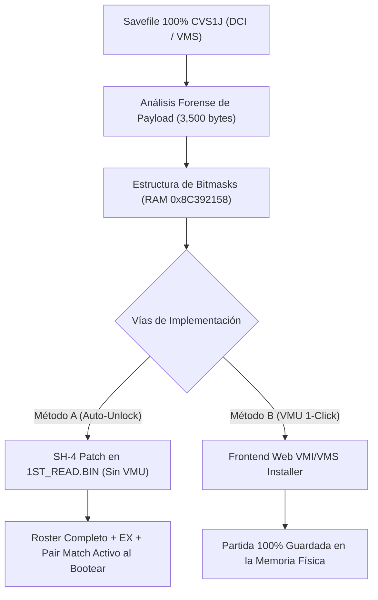

# 🔓 Metodología y Arquitectura de Unlocks (Desbloqueo 100%) para Capcom vs. SNK Japan (Dreamcast)

---

## 1. 📌 Resumen Ejecutivo y Objetivos

En *Marvel vs. Capcom 2* y *Capcom vs. SNK 1 & 2*, los personajes secretos, modos ocultos (Pair Match, EX Characters, Color Edit) y escenarios están bloqueados por defecto en el código base y requieren acumular miles de **VS Points** en el modo Arcade/Training o comprar ítems en la tienda secreta (**Secret Shop**).

En este estudio analizamos la estructura interna de guardado (**VMS/VMI/DCI**), los bitmasks de memoria RAM (`0x8C392158`) y los checks de selección en el procesador **Hitachi SH-4** (`1ST_READ.BIN`), definiendo **dos técnicas complementarias** para lograr el 100% de desbloqueos:

1. **Método A (ROM / SH-4 In-Memory Auto-Unlock):** Parche directo en el ejecutable `1ST_READ.BIN` para que el juego inicie con todos los personajes, modos y trajes EX seleccionables sin depender de la VMU (idéntico al mod *FullUnlockWithoutVMU* de MvC2).
2. **Método B (Web VMI/VMS Installer en el Menú Multijuegos):** Integración en el menú interactivo HTML ([`Games/Frontend/DPWWW/VMUMENU.HTML`](file:///home/tortita/Coding/Github/Side/mvc2_custom/Games/Frontend/DPWWW/VMUMENU.HTML)) para descargar con 1 clic el archivo `CAPVSSNK_SYS` 100% oficial directo a la Visual Memory Unit (VMU).



---

## 2. 🔬 Análisis Forense del Savefile VMS (`CAPVSSNK_SYS`)

Analizando el archivo [`capcom-vs-snk.312.dci`](file:///home/tortita/Coding/Github/Side/mvc2_custom/capcom-vs-snk.312.dci), descubrimos la estructura exacta de la partida:

- **Tamaño total VMS:** 4,608 bytes (9 bloques de VMU).
- **Cabecera VMS:** 672 bytes (0x2A0) conteniendo metadata, icono animado 32x32 de 16 colores y descripción `"CVS.S_SYSTEM"`.
- **Payload de Datos Útiles:** **3,500 bytes** (`0xDAC`), que el juego carga en la dirección de RAM **`0x8C392158`**.

### Mapa de Bitmasks de Desbloqueo (RAM `0x8C392158` a `0x8C392178`)

| Offset en Payload | Dirección RAM SH-4 | Valor 100% Unlocked | Significado y Contenido Desbloqueado |
| :--- | :--- | :--- | :--- |
| `0x000` – `0x003` | `0x8C392158` | `0xFFFFFFFF` | **Roster Principal Completo** (Gouki, Morrigan, Nakoruru, Evil Ryu, Orochi Iori). |
| `0x004` – `0x007` | `0x8C39215C` | `0x00000001` | Flag de disponibilidad de Roster extendido. |
| `0x008` – `0x00B` | `0x8C392160` | `0xFFFFBFFF` | **Todos los Personajes EX** (Versiones alternativas con trajes y movimientos clásicos). |
| `0x00C` – `0x00F` | `0x8C392164` | `0x00000001` | Flag maestro de personajes EX. |
| `0x010` – `0x013` | `0x8C392168` | `0xFFFFFFFF` | **Secret Shop 100% comprado** (Modos, voces, sonidos y arte). |
| `0x014` – `0x017` | `0x8C39216C` | `0x00000001` | Flag de tienda secreta completada. |
| `0x018` – `0x01B` | `0x8C392170` | `0x3F010101` | **Modos Secretos Habilitados** (Pair Match Mode, Ratio Custom, Color Edit Mode). |
| `0x01C` – `0x01F` | `0x8C392174` | `0x01010101` | Escenario Secreto de Tailandia (Versión Púrpura) + Sound Test. |
| `0x020` – `0x023` | `0x8C392178` | `0x000017D4` (6,100) | **VS Points Disponibles en Banco**. |

---

## 3. 🛠️ Método A: Ingeniería Inversa en SH-4 (`1ST_READ.BIN`) para Auto-Unlock Sin VMU

Al igual que en el famoso parche de Jed para MvC2 (`1st_read_2020-02-FullUnlockWithoutVMU`), el ejecutable de Capcom vs. SNK cuenta con una rutina de verificación de personajes en la pantalla de selección (`Character Select Screen`):

### Desensamblado de los Checks de Selección (0x8C13BC08 - 0x8C13BC58):

```sh4
0x8C13BC08: cmp/eq #13, r0  ; ¿Es Gouki (Akuma)?
0x8C13BC0A: bt 0x8C13BC20   ; Salta al verificador de Gouki
0x8C13BC0C: cmp/eq #14, r0  ; ¿Es Morrigan?
0x8C13BC0E: bt 0x8C13BC2C   ; Salta al verificador de Morrigan
0x8C13BC10: cmp/eq #15, r0  ; ¿Es Evil Ryu?
0x8C13BC12: bt 0x8C13BC38   ; Salta al verificador de Evil Ryu
0x8C13BC14: cmp/eq #30, r0  ; ¿Es Nakoruru?
0x8C13BC16: bt 0x8C13BC44   ; Salta al verificador de Nakoruru
0x8C13BC18: cmp/eq #31, r0  ; ¿Es Orochi Iori?
0x8C13BC1A: bt 0x8C13BC50   ; Salta al verificador de Orochi Iori
```

Cada salto consulta la subrutina `0x8C13BC8A`, que comprueba si los bits correspondientes en `0x8C392158` están encendidos:
- Si el personaje está desbloqueado: salta a **`0x8C13BC58`** (Permite selección y carga retrato).
- Si el personaje está bloqueado: salta a **`0x8C13BC5E`** (Deniega selección y reproduce sonido de error).

### El Parche Quirúrgico de Selección (Permanent Unlock):

Al reemplazar los saltos condicionales (`bf` / `bt`) por saltos incondicionales directos a `0x8C13BC58` o forzar que `0x8C13BC8A` retorne `1` (true), los 5 personajes secretos y todas las variantes EX pasan a estar habilitados desde el primer segundo de arranque, **incluso en consolas sin tarjeta de memoria VMU**.

---

## 4. 🌐 Método B: Instalador Web VMI/VMS en el Menú Multijuegos (1-Click VMU Save)

Para quienes desean conservar la experiencia original de guardar récords y configuraciones personalizadas en su VMU física:

1. **Archivos Generados en DPWWW:**
   - [`Games/Frontend/DPWWW/VMU/CVS1J.VMS`](file:///home/tortita/Coding/Github/Side/mvc2_custom/Games/Frontend/DPWWW/VMU/CVS1J.VMS) (Partida 100% completa endian-correcta de 4,608 bytes).
   - [`Games/Frontend/DPWWW/VMU/CVS1J.VMI`](file:///home/tortita/Coding/Github/Side/mvc2_custom/Games/Frontend/DPWWW/VMU/CVS1J.VMI) (Descriptor de 108 bytes con checksum e icono de Dreamcast).

2. **Integración en [`VMUMENU.HTML`](file:///home/tortita/Coding/Github/Side/mvc2_custom/Games/Frontend/DPWWW/VMUMENU.HTML):**
   Añadiendo el botón de descarga en el gestor de partidas del navegador Dricas:
   ```html
   <a href="VMU/CVS1J.VMI">
     <b>Capcom vs. SNK (Japan) - 100% Unlocked Save</b>
   </a>
   ```
   Al hacer clic desde el control de la consola, la BIOS de Dreamcast escribe directamente el archivo `CAPVSSNK_SYS` en el slot seleccionado de la VMU.

---

## 5. 📋 Hoja de Ruta de Ejecución

1. [x] Extraer y verificar el payload de guardado 100% de CVS1 desde el archivo DCI.
2. [x] Generar los pares `CVS1J.VMI` y `CVS1J.VMS` en `Games/Frontend/DPWWW/VMU/`.
3. [ ] Aplicar el parche de SH-4 opcional en `Games/CVS1J/1ST_READ.BIN` para desbloqueo permanente sin VMU.
4. [ ] Integrar el enlace en [`VMUMENU.HTML`](file:///home/tortita/Coding/Github/Side/mvc2_custom/Games/Frontend/DPWWW/VMUMENU.HTML) del Frontend.
5. [ ] Recompilar el CDI multijuegos con `build-mini-cvs`.
