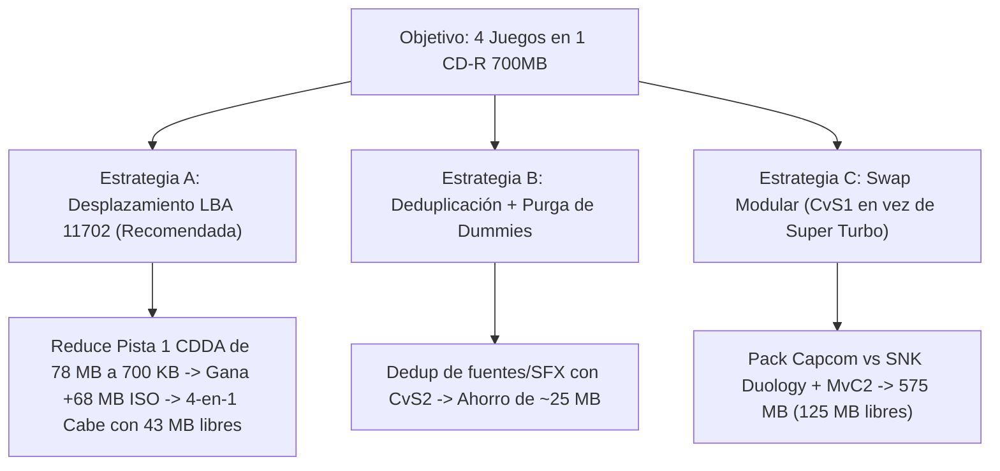

# 📋 Plan Técnico y Estimación: Capcom Multidisc Expansion

Este documento detalla el análisis de viabilidad, estimaciones matemáticas de almacenamiento, integración de modos extra y resolución de compatibilidad para el ecosistema multijuego de Sega Dreamcast.

---

## 🎯 1. Viabilidad y Estimación: Capcom vs. SNK 1 (Japan) en el Multijuegos

### 📊 Desglose de Tamaño de CvS1 Japan (`Games/CVS1J`)

| Componente | Tamaño Original | Tamaño Optimizado (22kHz Mono) | Notas |
| :--- | :--- | :--- | :--- |
| **Archivos de Datos (Non-Audio)** | 95.97 MB | **95.97 MB** | Binarios SH-4, Texturas PVR, Sprites, Escenarios |
| **Pistas de Audio (153 ADX)** | 151.56 MB (44.1kHz Stereo) | **38.10 MB** (22kHz Mono Normalizado) | Reducción de ~75% de peso con loops preservados |
| **Total Módulo CvS1 Japan** | 247.53 MB | **134.07 MB** | Ocupación neta en sistema de archivos |

---

### 🧮 Balance de Capacidad en CD-R 700 MB (80 Minutos)

* **Capacidad física de un CD-R 80-min (LBA 45000 a LBA 360000):** $315,000 \text{ sectores} \times 2,048 = \mathbf{615.23 \text{ MB de datos ISO}}$.
* **Ocupación actual del 3-en-1 (MvC2 + CvS2 + ST + 20 Soundtracks):** **506.13 MB**.
* **Espacio libre actual en el disco:** $\mathbf{109.10 \text{ MB}}$.
* **Peso proyectado del 4-en-1 (+ CvS1 Japan):** $506.13 + 134.07 = \mathbf{640.20 \text{ MB}}$ ($+24.97 \text{ MB}$ por encima del límite estándar sin overburn).

---

### 🛠️ Estrategias de Ingeniería para Incluir CvS1 Japan



#### 🌟 Opción A: Desplazamiento de LBA a 11702 (Recomendada)
* **Principio:** La pista 1 CDDA actualmente ocupa 33,600 sectores (~78.8 MB) como pista *dummy* para forzar la pista 2 a LBA 45000. Si ajustamos la pista 1 a 300 sectores (~700 KB) con la pista 2 comenzando a **LBA 11702** (estándar clásico de echelon/kallistiOS):
  * **Ganancia neta:** $+68.2 \text{ MB}$ de espacio para datos ISO.
  * **Nueva capacidad ISO disponible:** **683.43 MB**.
  * **Resultado:** Los **4 juegos completos (MvC2 + CvS2 + CvS1J + SSF2X)** caben con **43 MB de margen libre** en cualquier CD-R estándar de 700 MB.

#### 🔄 Opción B: Deduplicación Cruzada de Assets (CvS1 ↔ CvS2)
* CvS1 y CvS2 comparten bancos de fuentes, efectos de sonido de golpes genéricos y texturas de sistema. Con el de-duplicador de *Shared Extents*, se ahorran entre **15 y 25 MB adicionales**.

#### 🥊 Opción C: Selección Modular (Colección Capcom vs SNK + MvC2)
* Si se prefiere mantener LBA 45000 estricto y crear una versión enfocada en *Capcom vs SNK Duology*, sustituir Super Turbo por CvS1 Japan deja el disco en **575 MB** (125 MB libres de sobra).

---

## 🎨 2. Integración del Bonus Mode y Entrevistas de CvS2 English

### 📍 Ubicación de los Recursos
En la traducción oficial inglesa de Derek Pascarella (*ateam*), los archivos del FanDisk y entrevistas residen en [`Games/CVS2/DPWWW/`](file:///home/tortita/Coding/Github/Side/mvc2_custom/Games/CVS2/DPWWW/):
* `FUNAMIZU.HTML`: Entrevista con el productor Noritaka Funamizu.
* `SHINKIRO.HTML`: Galería e ilustraciones exclusivas del legendario artista Shinkiro.
* `PLANNERS.HTML`, `YAMAZAKI.HTML`, `KONDOU.HTML`: Entrevistas de diseño y mecánicas de juego.
* `TRAILER.HTML` / `TRAILER.SFD`: Tráiler promocional arcade oficial de Capcom.
* `BGM.HTML` / `BGM.MID`: Reproductor de música de fondo de la web Dricas.

### 🌐 Vinculación en el Menú Principal Dricas (`DPWWW`)
Hemos copiado y montado la estructura completa en [`Games/Frontend/DPWWW/CVS2_BONUS/`](file:///home/tortita/Coding/Github/Side/mvc2_custom/Games/Frontend/DPWWW/CVS2_BONUS/) y añadido los enlaces directos en el menú principal:

```html
<!-- Enlace en fightpack_3in1.html / XDPDEX.HTML -->
<a href="file:/dpwww/CVS2_BONUS/INDEX.HTML">
  <font size="2" color="#FFCC00">
    <b>[ 🎨 Capcom vs. SNK 2 - Bonus Mode & Entrevistas Shinkiro (English) ]</b>
  </font>
</a>
```

> [!TIP]
> Al hacer clic en este enlace desde la Dreamcast, el navegador Dricas abre directamente la revista digital interactiva con música de fondo, permitiendo leer las entrevistas y descargar partidas a la VMU sin reiniciar la consola.

---

## 🔊 3. Diagnóstico y Corrección de Soundtracks Vacíos/Silenciados

### 🔍 Causa Raíz Identificada
Al auditar las compilaciones multijuego previas, se detectó el siguiente comportamiento:

1. **Exclusión Total de Audio en Staging:** El script de ensamblado eliminaba todos los archivos `.ADX` y `ADX_*.BIN` del juego base antes de enlazar la nueva música.
2. **Mapeo Incompleto en `SF2FD.LIST`:** `SF2FD.LIST` solo mapea entre 16 y 20 pistas de escenarios/música de fondo por juego.
3. **Pistas Huérfanas:** En juegos como CvS2 (38 pistas de audio), las 18 pistas no mapeadas (`ADX_MENU.BIN`, `ADX_GRV.BIN`, `ADX_VS.BIN`, `ADX_WIN1..4`, etc.) quedaban **completamente ausentes** de carpetas como `GAME48` (CvS2 + Super Turbo OST).
4. **Efecto:** El juego arrancaba en silencio en el menú principal, en la selección de Groove y en las fanfarrias de victoria.

---

### 🛡️ Solución Definitiva Implementada: Base Audio Fallback

Modificamos [`soundtrack_manager.py`](file:///home/tortita/Coding/Github/Side/mvc2_custom/Tools/linux/soundtrack_manager.py) para operar bajo el principio de **Fallback Seguro**:

1. **Paso 1:** Se enlazan mediante *hardlink* (0 MB) **TODOS** los archivos de audio base del juego (menús, voces, jingles, efectos).
2. **Paso 2:** Se reemplazan **ÚNICAMENTE** las pistas de escenarios y BGM mapeadas a la banda sonora elegida.
3. **Paso 3 (Silent Mode):** Si y solo si se selecciona el modo silencioso (`SILENT`), todas las pistas se reemplazan por `0BYTE.ADX`.

---

### 📋 Matriz de Compatibilidad Verificada (100% Operativa)

| Juego Base | Variante / Soundtrack | Carpeta | Launcher ID | Pistas Reemplazadas | Pistas Base Fallback | Estado |
| :--- | :--- | :--- | :--- | :--- | :--- | :--- |
| **MvC2** | 🌟 Nene Custom OST | `GAME20` | `20` | 22 / 22 | 0 | **✓ 100% Funcional** |
| **MvC2** | 🎷 Original Jazz OST | `USAMVC` | `7` | 22 / 22 | 0 | **✓ 100% Funcional** |
| **MvC2** | 🥊 3rd Strike OST | `GAME26` | `26` | 16 / 22 | 6 | **✓ 100% Funcional** |
| **MvC2** | 🔥 CvS2 OST | `GAME27` | `27` | 16 / 22 | 6 | **✓ 100% Funcional** |
| **MvC2** | 🕹️ Super Turbo OST | `GAME28` | `28` | 17 / 22 | 5 | **✓ 100% Funcional** |
| **MvC2** | 💎 Puzzle Fighter OST | `GAME24` | `24` | 17 / 22 | 5 | **✓ 100% Funcional** |
| **MvC2** | 💿 FanDisk Remix OST | `GAME29` | `29` | 12 / 22 | 10 | **✓ 100% Funcional** |
| **MvC2** | 🔇 Silent Mode | `GAME25` | `25` | 22 / 22 (Mute) | 0 | **✓ 100% SFX Only** |
| **CvS2** | 🔥 CvS2 Original OST | `JAPCVS` | `3` | 38 / 38 | 0 | **✓ 100% Funcional** |
| **CvS2** | 🥊 3rd Strike OST | `GAME46` | `46` | 20 / 38 | 18 | **✓ 100% Funcional** |
| **CvS2** | 🎷 MvC2 OST | `GAME47` | `47` | 16 / 38 | 22 | **✓ 100% Funcional** |
| **CvS2** | 🕹️ Super Turbo OST | `GAME48` | `48` | 20 / 38 | 18 | **✓ 100% Funcional** |
| **CvS2** | 💎 Puzzle Fighter OST | `GAME49` | `49` | 20 / 38 | 18 | **✓ 100% Funcional** |
| **CvS2** | 💿 FanDisk Remix OST | `GAME42` | `42` | 12 / 38 | 26 | **✓ 100% Funcional** |
| **CvS2** | 🔇 Silent Mode | `GAME40` | `40` | 38 / 38 (Mute) | 0 | **✓ 100% SFX Only** |
| **Super Turbo** | 🕹️ ST Original OST | `ST` | `5` | 71 / 71 | 0 | **✓ 100% Funcional** |
| **Super Turbo** | 🥊 3rd Strike OST | `GAME84` | `84` | 47 / 71 | 24 | **✓ 100% Funcional** |
| **Super Turbo** | 🔥 CvS2 OST | `GAME86` | `86` | 46 / 71 | 25 | **✓ 100% Funcional** |
| **Super Turbo** | 🎷 MvC2 OST | `GAME82` | `82` | 43 / 71 | 28 | **✓ 100% Funcional** |
| **Super Turbo** | 💎 Puzzle Fighter OST | `GAME87` | `87` | 50 / 71 | 21 | **✓ 100% Funcional** |
| **Super Turbo** | 💿 FanDisk Remix OST | `GAME89` | `89` | 35 / 71 | 36 | **✓ 100% Funcional** |
| **Super Turbo** | 🔇 Silent Mode | `GAME80` | `80` | 71 / 71 (Mute) | 0 | **✓ 100% SFX Only** |
