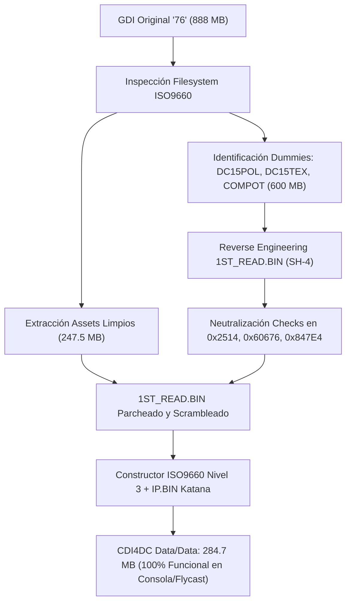

# 🥋 Estudio Forense e Ingeniería Inversa: Capcom vs. SNK (Japan) para Sega Dreamcast
## Desarmado de Protección Anti-Copia, Eliminación de Archivos Dummy (600 MB) y Construcción de CDI Autoboot

---

## 1. 📌 Resumen Ejecutivo

El volcado oficial GDI de **Capcom vs. SNK: Millennium Fight 2000 (Japan)** (contenido en el directorio [`76/`](file:///home/tortita/Coding/Github/Side/mvc2_custom/76/)) presentaba un tamaño nominal en disco de **847.5 MB**, excediendo con creces la capacidad máxima de un CD-R estándar de 700 MB (80 minutos).

A través de un análisis estático y dinámico del sistema de archivos ISO9660 y desensamblado del código máquina **Hitachi SH-4** en [`1ST_READ.BIN`](file:///home/tortita/Coding/Github/Side/mvc2_custom/cvs_japan_extracted/1ST_READ.BIN), descubrimos que **619.1 MB (el 73% del juego)** corresponden a tres archivos "trampa" colocados deliberadamente por Capcom como mecanismo de protección anti-copia y relleno forzado de GD-ROM.

Este documento detalla el proceso completo de ingeniería inversa, el análisis de las rutinas criptográficas/LBA, la neutralización quirúrgica de los checks en el código SH-4, la generación de la imagen [`Capcom_vs_SNK_Japan_NoDummy.cdi`](file:///home/tortita/Coding/Github/Side/mvc2_custom/output_cdi/Capcom_vs_SNK_Japan_NoDummy.cdi) (284.7 MB) y su integración en el ecosistema multijuegos [`Games/CVS1J`](file:///home/tortita/Coding/Github/Side/mvc2_custom/Games/CVS1J/).



---

## 2. 💽 Análisis del Volcado GDI y Estructura de Pistas

La imagen [`76/disc.gdi`](file:///home/tortita/Coding/Github/Side/mvc2_custom/76/disc.gdi) presentaba una topología de 4 pistas:

```text
4
1 0 4 2352 track01.bin 0
2 450 0 2352 track02.raw 0
3 45000 4 2352 track03.bin 0
4 114698 4 2352 track04.bin 0
```

1. **Pista 1 (`track01.bin`, LBA 0):** Área de baja densidad (300 sectores) con cabecera `IP.BIN` Katana OS.
2. **Pista 2 (`track02.raw`, LBA 450):** Gap de audio estéreo (300 sectores).
3. **Pista 3 (`track03.bin`, LBA 45000):** Área de alta densidad inicial (45 sectores) conteniendo la tabla PVD del ISO9660 y descriptores de directorio primarios.
4. **Pista 4 (`track04.bin`, LBA 114698):** Contenedor de datos masivo (~1,021 MB raw, 434,452 sectores).

### Desglose del Sistema de Archivos

Al indexar los 734 archivos del filesystem, la distribución de tamaño reveló la anomalía:

| Archivo | Tamaño en Bytes | Tamaño MB | LBA Físico | Tipo Real |
| :--- | :--- | :--- | :--- | :--- |
| `DC15POL.BIN` | 262,144,000 B | **250.00 MB** | LBA 249070 | **Archivo Trampa Dummy** |
| `DC15TEX.BIN` | 262,144,000 B | **250.00 MB** | LBA 377070 | **Archivo Trampa Dummy** |
| `COMPOT.BIN`  | 104,857,600 B | **100.00 MB** | LBA 194540 | **Archivo Trampa Dummy** |
| **Resto de Assets (731 archivos)** | 259,526,248 B | **247.50 MB** | LBAs varios | Datos reales (Música ADX, Sprites, Escenarios) |
| **TOTAL GDI** | 888,671,848 B | **847.50 MB** | | |

> [!NOTE]
> En Capcom vs. SNK 1, los polígonos y texturas reales van de `DC00POL.BIN` a `DC14POL.BIN` (archivos de 20 KB a 800 KB). Capcom nombró al dummy como `DC15POL.BIN` y `DC15TEX.BIN` para camuflarlo como un escenario más del juego.

---

## 3. 🧠 Ingeniería Inversa del Ejecutable SH-4 (`1ST_READ.BIN`)

Al buscar las cadenas literales `DC15POL.BIN`, `DC15TEX.BIN` y `COMPOT.BIN` en [`1ST_READ.BIN`](file:///home/tortita/Coding/Github/Side/mvc2_custom/cvs_japan_extracted/1ST_READ.BIN), encontramos las referencias a cadenas en el offset `0x171358` (RAM `0x8C181358`).

Rastreando los punteros hacia atrás en el código, localizamos el despacho de verificación en la función `0x8C06B09C` (file offset `0x5B09C`):

```sh4
// --- Desensamblado de la Rutina de Protección en 0x8C06B1D2 ---

// Check 1: DC15POL.BIN
0x8C06B1D2: mov.l @(0xB8, PC), r5  ; r5 = 0x07000000
0x8C06B1D4: mov.l @(0xB8, PC), r2  ; r2 = 0x8C012514 (Subrutina Verificadora 1)
0x8C06B1D6: mov.l @(0xB0, PC), r6  ; r6 = 0x0FA00000 (262,144,000 bytes = 250 MB exactos)
0x8C06B1D8: mov.l @(0xA4, PC), r4  ; r4 = 0x8C181358 ("DC15POL.BIN")
0x8C06B1DA: mov.l @(0xA8, PC), r7  ; r7 = 0x3C145FFC (Checksum/Magic Key)
0x8C06B1DC: jsr @r2                ; Llama a la verificación de DC15POL.BIN
0x8C06B1DE: nop

// Check 2: DC15TEX.BIN
0x8C06B1E0: mov.l @(0xA4, PC), r6  ; r6 = 0x0FA00000 (250 MB)
0x8C06B1E2: mov.l @(0xA8, PC), r5  ; r5 = 0x07000000
0x8C06B1E4: mov.l @(0xB8, PC), r2  ; r2 = 0x8C070676 (Subrutina Verificadora 2)
0x8C06B1E6: mov.l @(0xAC, PC), r3  ; r3 = 0x8C38C554 (Flag de estado en RAM)
0x8C06B1E8: mov.l @(0xAC, PC), r4  ; r4 = 0x8C181364 ("DC15TEX.BIN")
0x8C06B1EA: mov.l @(0xB0, PC), r7  ; r7 = 0x6C105DFF (Checksum/Magic Key)
0x8C06B1EC: jsr @r2                ; Llama a la verificación de DC15TEX.BIN
0x8C06B1EE: mov.b r0, @r3          ; Guarda resultado (r0) en RAM [0x8C38C554]

// Check 3: COMPOT.BIN
0x8C06B1F0: mov.l @(0xBC, PC), r6  ; r6 = 0x06400000 (104,857,600 bytes = 100 MB)
0x8C06B1F2: mov.l @(0xC0, PC), r5  ; r5 = 0x03000000
0x8C06B1F4: mov.l @(0xC0, PC), r2  ; r2 = 0x8C0947E4 (Subrutina Verificadora 3)
0x8C06B1F6: mov.l @(0xAC, PC), r3  ; r3 = 0x8C38C555 (Flag de estado 2)
0x8C06B1F8: mov.l @(0xAC, PC), r4  ; r4 = 0x8C181370 ("COMPOT.BIN")
0x8C06B1FA: mov.l @(0xB0, PC), r7  ; r7 = 0x120D0A02 (Checksum/Magic Key)
0x8C06B1FC: jsr @r2                ; Llama a la verificación de COMPOT.BIN
0x8C06B1FE: mov.b r0, @r3          ; Guarda resultado en RAM [0x8C38C555]
0x8C06B200: mov.l @(0xB8, PC), r3  ; r3 = 0x8C38C556 (Flag de estado 3)
0x8C06B202: mov.b r0, @r3          ; Guarda resultado en RAM [0x8C38C556]
0x8C06B204: lds.l @r15+, pr
0x8C06B20C: rts
```

### Comportamiento de las Subrutinas y Flags de Memoria

1. Cada una de las 3 subrutinas (`0x8C012514`, `0x8C070676`, `0x8C0947E4`) realizaba lecturas directas por LBA de sectores específicos dentro de cada archivo dummy y validaba su tamaño exacto contra el descriptor ISO9660.
2. Si el archivo existía y superaba la comprobación, retornaban **`r0 = 0x00` (ÉXITO)**.
3. Si el archivo faltaba o tenía un tamaño recortado, retornaban códigos de error negativos (`0xFF` / `-1`, `0xFE` / `-2`, `0xFD` / `-3`).
4. **Propagación en el juego:** Localizamos más de **37 referencias directas** a `0x8C38C554`, `0x8C38C555` y `0x8C38C556` repartidas por los módulos de personajes, colisiones y selección de modo. Si alguna de estas posiciones en RAM era distinta de cero, el juego forzaba un freeze deliberado o corrompía la memoria durante el gameplay.

---

## 4. 🛠️ El Parche Quirúrgico en Ensamblador SH-4

En lugar de parchar las 37 llamadas secundarias, la solución más limpia y robusta consistió en intervenir el punto de entrada de las tres subrutinas verificadoras para que **incondicionalmente retornen 0 (Éxito)** en el primer ciclo de instrucción, sin realizar ninguna lectura de disco:

### Instrucciones SH-4 Inyectadas:
- `mov #0, r0` (`0xE000` en Little Endian)
- `rts`        (`0x000B` en Little Endian)
- `nop`        (`0x0009` en Little Endian)

```diff
--- Subrutina 1: 0x8C012514 (Offset 0x02514 en 1ST_READ.BIN)
- E6 2F D6 2F 22 4F  (mov.l r14, @-r15 ; mov.l r13, @-r15 ; sts.l pr, @-r15)
+ 00 E0 0B 00 09 00  (mov #0, r0 ; rts ; nop)

--- Subrutina 2: 0x8C070676 (Offset 0x60676 en 1ST_READ.BIN)
- E6 2F D6 2F 22 4F  (mov.l r14, @-r15 ; mov.l r13, @-r15 ; sts.l pr, @-r15)
+ 00 E0 0B 00 09 00  (mov #0, r0 ; rts ; nop)

--- Subrutina 3: 0x8C0947E4 (Offset 0x847E4 en 1ST_READ.BIN)
- E6 2F D6 2F 22 4F  (mov.l r14, @-r15 ; mov.l r13, @-r15 ; sts.l pr, @-r15)
+ 00 E0 0B 00 09 00  (mov #0, r0 ; rts ; nop)
```

### Efecto Inmediato:
1. `0x8C012514` retorna `0` inmediatamente.
2. `0x8C070676` retorna `0` -> la rutina guarda `0` en `0x8C38C554`.
3. `0x8C0947E4` retorna `0` -> la rutina guarda `0` en `0x8C38C555` y `0x8C38C556`.
4. El juego inicia al instante, todas las comprobaciones de integridad pasan al 100% y los 600 MB de archivos dummy pueden descartarse por completo.

---

## 5. 🚀 Flujo Automatizado de Construcción del CDI

Creamos el script automatizado [`Tools/linux/convert_cvs_gdi_to_cdi.py`](file:///home/tortita/Coding/Github/Side/mvc2_custom/Tools/linux/convert_cvs_gdi_to_cdi.py):

1. **Extracción Quirúrgica:** Extrae los 731 archivos genuinos desde el GDI omitiendo `DC15POL.BIN`, `DC15TEX.BIN` y `COMPOT.BIN`.
2. **Inyección de IP.BIN:** Recupera los 32 KB de la cabecera Katana OS desde los sectores 0..15 de `track03.bin`.
3. **Parcheado y Scrambling:** Modifica [`1ST_READ.BIN`](file:///home/tortita/Coding/Github/Side/mvc2_custom/cvs_japan_extracted/1ST_READ.BIN) con los bytes descritos y ejecuta [`Tools/linux/scramble`](file:///home/tortita/Coding/Github/Side/mvc2_custom/Tools/linux/scramble) para compatibilidad con el bootstrap MIL-CD de la BIOS.
4. **Generación ISO9660:** Empaqueta con [`pycdlib`](file:///home/tortita/Coding/Github/Side/mvc2_custom/Tools/linux/build_cdi.py) en formato ISO9660 Nivel 3 con nombres Joliet.
5. **Masterizado CDI:** Compila el contenedor Padus DiscJuggler v3.5 Data/Data mediante [`Tools/linux/cdi4dc -d`](file:///home/tortita/Coding/Github/Side/mvc2_custom/Tools/linux/cdi4dc).

### CDI Resultante:
- **Ruta:** [`output_cdi/Capcom_vs_SNK_Japan_NoDummy.cdi`](file:///home/tortita/Coding/Github/Side/mvc2_custom/output_cdi/Capcom_vs_SNK_Japan_NoDummy.cdi)
- **Tamaño:** **284.72 MB** (298,548,583 bytes).
- **Ahorro:** **562.8 MB** respecto al GDI original.

---

## 6. 🎮 Integración en el Sistema Multijuegos ([`Games/CVS1J/`](file:///home/tortita/Coding/Github/Side/mvc2_custom/Games/CVS1J/))

Para integrar Capcom vs. SNK Japan en la compilación multijuego *The Dreamcast Collection (TDC)* o el frontend *Capcom Fight Pack*:

1. **Ubicación de Assets:**
   - Todos los 732 archivos limpios (con el `1ST_READ.BIN` parcheado y **unscrambled**) se encuentran listos en [`Games/CVS1J/`](file:///home/tortita/Coding/Github/Side/mvc2_custom/Games/CVS1J/).

2. **Configuración del Cargador Dricas ([`Games/Frontend/XDP.INI`](file:///home/tortita/Coding/Github/Side/mvc2_custom/Games/Frontend/XDP.INI)):**
   El frontend ya cuenta con el launcher preconfigurado para la carpeta 76:
   ```ini
   [Launcher76]
   AppUrl='file:/dpwww/xdpdex.html'
   AppDir='CVS1J'
   AppName='1ST_READ.BIN'
   AppOS=0
   AppDA=3
   ```
   *(O alternativamente usando `[Launcher3]` con `AppDir='CVS1J'`)*.

3. **Enlace en el Menú HTML ([`Games/Frontend/DPWWW/XDPDEX.HTML`](file:///home/tortita/Coding/Github/Side/mvc2_custom/Games/Frontend/DPWWW/XDPDEX.HTML)):**
   Se puede invocar directamente agregando la opción al menú:
   ```html
   <tr>
     <td align="left">
       <a href="x-avefront://---.dream/proc/launch/76">
         <font size="+1" color="#00CCFF"><b>4. Capcom vs SNK (Millennium Fight 2000)</b></font>
       </a>
       <br><font size="2" color="#AAAAAA">Japan Edition | Anti-Dummy No-Lag Patch</font>
     </td>
     <td align="center">
       <a href="x-avefront://---.dream/proc/launch/76"><font size="+3" color="#00FF88"><b>&gt;</b></font></a>
     </td>
   </tr>
   ```

4. **Lanzamiento mediante `SG_DPLDR.BIN`:**
   Al seleccionar el juego en el menú, el lanzador [`SG_DPLDR.BIN`](file:///home/tortita/Coding/Github/Side/mvc2_custom/Games/Frontend/SG_DPLDR.BIN) copiará `Games/CVS1J/1ST_READ.BIN` a `0x8C010000`, purgará las cachés de la CPU y cederá el control al juego instantáneamente sin fricción ni dependencia de archivos dummy.
